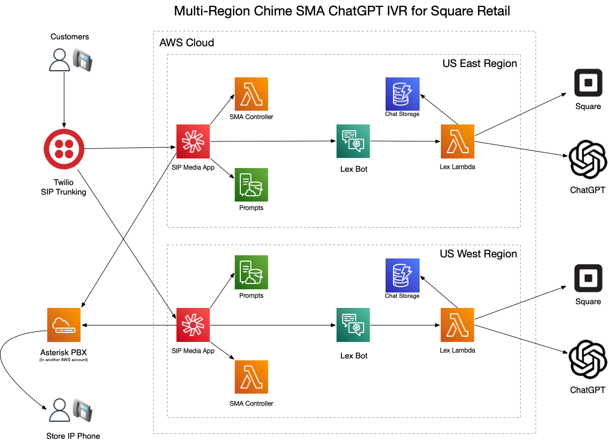

# Amazon Chime SMA ChatGPT IVR for Square Retail

## Background

This project is a [SIP Media Application](https://docs.aws.amazon.com/chime-sdk/latest/ag/use-sip-apps.html) and makes use of the 
[Java Chime SMA Flow Library](https://github.com/docwho2/java-chime-voicesdk-sma) to deliver a [ChatGPT](https://openai.com/chatgpt) voice bot IVR application. The IVR application is integrated with the [Square API](https://developer.squareup.com/us/en) to allow callers to ask questions about products 
and business hours, transfer to employee cell phones, etc.

## Use Case

[Copper Fox Gifts](https://www.copperfoxgifts.com) is a retail store located in a small town in MN. The goal is to handle the majority of calls without human intervention. Here's a breakdown of the types of calls they receive:

- **Over 50% of the calls**: "Are you open now?" This is a typical question in resort-type towns where store hours change seasonally and frequently. Many visitors prefer to call ahead to ensure the store is open before they head out.
  - A common follow-up to this is: "What are your hours today?"
  
- **45% of the calls**: "Do you have XYZ product?" Queries range from mittens, hats, and gummy bears to shorts, candles, and more.

- **The remaining calls**: These are primarily from vendors who are coordinating with a specific individual at the store and wish to speak with them directly.


## Solution Summary

The goal is to introduce a "Store Virtual Assistant" powered by [OpenAI ChatGPT](https://openai.com/chatgpt) that can not only answer store-specific queries but also address any general questions the caller might have.
- Utilize [ChatGPT Function Calls](https://platform.openai.com/docs/guides/gpt/function-calling) to facilitate Square API calls, enabling access to inventory, employee details, and store hours.
  - Further leverage function calls so that the model can determine when a call should be transferred or concluded.
- Employ strategic prompting to prime the model with pertinent store information and to guide interactions with callers.
- Ensure a robust and dependable solution that is deployed across multiple regions within AWS and is entirely cloud-based.

**Features:**
- Callers are consistently greeted and informed about the store's operational status (open or closed).
- Store hours are ascertained in real-time via a Square API call.
- Product category and individual item searches are also driven by Square API calls.
  - Callers can inquire about product categories or specific items in stock.
- Engaging with store employees or the primary store line.
  - Callers can request to connect with specific employees, with the information sourced from a Square API call (Team Member list).
  - If the caller simply wishes to speak to a representative, the model is preloaded with a default number to redirect the call.
    - During transfers to the main line, this process is optimized to use SIP directly connecting to the store's [Asterisk PBX](https://www.asterisk.org).


## High Level Components



## Call Flow Details

### SMA Controller

The [ChimeSMA](ChimeSMA/src/main/java/cloud/cleo/chimesma/squareup/ChimeSMA.java) controller controls the call at a high level.  Callers are greeted and told whether the store is open or closed.

```Java
protected Action getInitialAction() {

        // Play open or closed prompt based on Square Hours  
        final var openClosed = PlayAudioAction.builder()
                .withKeyF(f -> squareHours.isOpen() ? "open.wav" : "closed.wav") // This is always in english
                .withNextAction(MAIN_MENU)
                .withErrorAction(MAIN_MENU)
                .build();

        // Start with a welcome message
        final var welcome = PlayAudioAction.builder()
                .withKey("welcome.wav") // This is always in english
                .withNextAction(openClosed)
                .withErrorAction(openClosed)
                .build();

        return welcome;
    }
```

Control is then handed off to a Lex Bot which is backed by ChatGPT to handle the interaction until a terminating event happens.

```Java
final var lexBotEN = StartBotConversationAction.builder()
                .withDescription("ChatGPT English")
                .withLocale(english)
                .withContent("You can ask about our products, hours, location, or speak to one of our team members. Tell us how we can help today?")
                .build();
```

If ChatGPT determines the call needs to be transferred or ended, that intent is returned and the SMA Controller transfers or ends the call.

```Java
Function<StartBotConversationAction, Action> botNextAction = (a) -> {
            return switch (a.getIntentName()) {
                case "Transfer" -> {
                    final var attrs = a.getActionData().getIntentResult().getSessionState().getSessionAttributes();
                    final var botResponse = attrs.get("botResponse");
                    final var phone = attrs.get("transferNumber");
                    final var transfer = CallAndBridgeAction.builder()
                            .withDescription("Send Call to Team Member")
                            .withRingbackToneKey("ringing.wav")
                            .withUri(phone)
                            .build();
                    if (phone.equals(MAIN_NUMBER) && !VC_ARN.equalsIgnoreCase("PSTN")) {
                        // We are transferring to main number, so use SIP by sending call to Voice Connector
                        transfer.setArn(VC_ARN);
                        transfer.setDescription("Send Call to Main Number via SIP");
                    }
                    // If we have a GPT response for the transfer, play that before transferring
                    if (botResponse != null) {
                        yield SpeakAction.builder()
                        .withText(botResponse)
                        .withNextAction(transfer)
                        .build();
                    } else {
                        yield transfer;
                    }
                }
                case "Quit" ->
                    goodbye;
                default ->
                    SpeakAction.builder()
                    .withText("A system error has occured, please call back and try again")
                    .withNextAction(hangup)
                    .build();
            }; 
        };
```

### ChatGPT Fullfillment Lambda

The [ChatGPTLambda](ChatGPT/src/main/java/cloud/cleo/squareup/ChatGPTLambda.java) and [Functions](ChatGPT/src/main/java/cloud/cleo/squareup/functions) allow the caller to interface with ChatGPT and provide answers based on realtime data from Square API's.  The model in initialized when a new [Session](ChatGPT/src/main/java/cloud/cleo/squareup/ChatGPTSessionState.java) is started.

```Java
         // General Prompting
        sb.append("Please be a helpfull assistant for a retail store named \"Copper Fox Gifts\", which has clothing items, home decor, gifts of all kinds, speciality foods, and much more.  ");
        sb.append("The store is located at 160 Main Street, Wahkon Minnesota, near Lake Mille Lacs.  ");
        sb.append("Do not respond with the whole employee list.  You may confirm the existance of an employee and give the full name.  ");

        // Mode specific prompting
        switch (inputMode) {
            case TEXT -> {
                sb.append("I am interacting via SMS.  Please keep answers very short and concise, preferably under 180 characters.  ");
                sb.append("To interact with an employee suggest the person call this number instead of texting and ask to speak to that person.  ");
            }
            case SPEECH, DTMF -> {
                sb.append("I am interacting with speech via a telephone interface.  please keep answers short and concise.  ");
                
                // Hangup
                sb.append("When the caller indicates they are done with the conversation, execute the ").append(HANGUP_FUNCTION_NAME).append(" function.  ");
                
                // Transferring
                sb.append("To transfer or speak with a employee that has a phone number, execute the ").append(TRANSFER_FUNCTION_NAME).append(" function.  ");
                sb.append("If the caller wants to just speak to a person or leave a voicemail, execute ").append(TRANSFER_FUNCTION_NAME).append(" with ").append(System.getenv("MAIN_NUMBER")).append(" which rings the main phone in the store.  ");
                sb.append("Do not provide employee phone numbers, you can use the phone numbers to execute the ").append(TRANSFER_FUNCTION_NAME).append(" function.  ");
                
                // Only recommend resturants for call ins, not SMS
                sb.append("Muggs of Mille Lacs is a great resturant next door that serves some on the best burgers in the lake area and has a large selection draft beers and great pub fare.  ");
            }
        }
```

### Example ChatGPT Function

The [Store Hours](ChatGPT/src/main/java/cloud/cleo/squareup/functions/SquareHours.java) function is an example of extending the model to provide realtime information.  The executor for the function is rather simple.

```Java
@Override
public String getDescription() {
        return "Return the open store hours by day of week, any day of week not returned means the store is closed that day.";
    }

public Function<Request, Object> getExecutor() {
        return (var r) -> {
            try {
                return client.getLocationsApi()
                        .retrieveLocation(System.getenv("SQUARE_LOCATION_ID"))
                        .getLocation().getBusinessHours();
            } catch (Exception ex) {
                return mapper.createObjectNode().put("error_message", ex.getLocalizedMessage());
            } 
        };
    }
```

This API call to Square returns a JSON structure that is returned directly to ChatGPT for it to interpret.

```Json
    {
      "periods": [
        {
          "day_of_week": "SUN",
          "start_local_time": "11:00:00",
          "end_local_time": "15:00:00"
        },
        {
          "day_of_week": "FRI",
          "start_local_time": "10:00:00",
          "end_local_time": "17:00:00"
        },
        {
          "day_of_week": "SAT",
          "start_local_time": "10:00:00",
          "end_local_time": "17:00:00"
        }
      ]
    }
```

Depending on how the caller asks about hours, the model uses the data to answer questions:

- Are you open next Thursday?
    - No, we are closed on Thursdays (sometimes it will then speak all the open hours)
- What are your hours?
    - Speaks out the hours for each day in order (SUN, FRI, SAT)
    - Sometimes it sumarizes and says Saturday and Sunday from 10 to 5 and Sunday from 11 to 3

## Deploy the Project

The Serverless Application Model Command Line Interface (SAM CLI) is an extension of the AWS CLI that adds functionality for building and testing Lambda applications.  
Before proceeding, it is assumed you have valid AWS credentials setup with the AWS CLI and permissions to perform CloudFormation stack operations.

To use the SAM CLI, you need the following tools.

* SAM CLI - [Install the SAM CLI](https://docs.aws.amazon.com/serverless-application-model/latest/developerguide/serverless-sam-cli-install.html)
* Java17 - [Install the Java 17](https://docs.aws.amazon.com/corretto/latest/corretto-17-ug/downloads-list.html)
* Maven - [Install Maven](https://maven.apache.org/install.html)

If you have brew installed then
```bash
brew install aws-sam-cli
brew install corretto17
brew install maven
```

To build and deploy, run the following in your shell.  Note: you must edit the [samconfig.toml](samconfig.toml) and change the parameteres to 
taste before running the build like the SMA ID to ones that exist within that region.

```bash
git clone https://github.com/docwho2/java-squareup-chatgpt-ivr.git
cd java-squareup-chatgpt-ivr
./init.bash
sam build
sam deploy --config-env east
sam deploy --config-env west
```

You may find it easier to deploy in a [Cloud Shell](https://aws.amazon.com/cloudshell/).  Simply launch a Cloud Shell and install maven which also installs Java 17 by default, then proceed like above:

```bash
sudo yum -y install maven
git clone https://github.com/docwho2/java-squareup-chatgpt-ivr.git
cd java-squareup-chatgpt-ivr
./init.bash
sam build
sam deploy --config-env east
sam deploy --config-env west
```

The commands perform the follwoing operations:
- Clones the repository into your local directory
- Change directory into the cloned repository
- Set up some required components like the V4 Java Events library that is not published yet (this is a sub-module) and install the parent POM used by Lambda functions.
- Build the components that will be deployed by SAM
- Package and deploy the project to us-east-1
- Package and deploy the project to us-west-2

You will see the progress as the stack deploys.  As metntioned earlier, you will need to put your OpenAI and Square API Key into parameter store or the deploy will error, but it will give you an error message 
that tells you there is no value for "OPENAI_API_KEY" or "SQUARE_API_KEY" in the [Parameter Store](https://docs.aws.amazon.com/systems-manager/latest/userguide/systems-manager-parameter-store.html).

### Chime SDK Phone Number

After provisioning a [phone number in Chime](https://docs.aws.amazon.com/chime-sdk/latest/ag/provision-phone.html), you need to create a [SIP Rule](https://docs.aws.amazon.com/chime-sdk/latest/ag/understand-sip-data-models.html) for the phone number. When you call +1-320-425-0645, you will always be routed to the SMA in the us-east-1 region. Only if that region or the Lambda associated with the SMA goes down will you fail over to the us-west-2 region.


## Cleanup

To delete the application, use the SAM CLI.

You can run the following:

```bash
sam delete --config-env east
sam delete --config-env west
```

## Sample Deploy Output
```
java-squareup-chatgpt-ivr % sam deploy

		Managed S3 bucket: aws-sam-cli-managed-default-samclisourcebucket-13mtysy565mpu
		A different default S3 bucket can be set in samconfig.toml
		Or by specifying --s3-bucket explicitly.
File with same data already exists at 143a599dc3dfe966f4d7000bbbf52426, skipping upload                                                                
File with same data already exists at 143a599dc3dfe966f4d7000bbbf52426, skipping upload                                                                
	Uploading to f9861fdd63f48e2f37a2795ccccd3845  12064677 / 12064677  (100.00%)
	Uploading to 5b484e02e0ce3b91170904670812da1a  32883956 / 32883956  (100.00%)

	Deploying with following values
	===============================
	Stack name                   : squareup-chatgpt-ivr
	Region                       : us-east-1
	Confirm changeset            : False
	Disable rollback             : False
	Deployment s3 bucket         : aws-sam-cli-managed-default-samclisourcebucket-13mtysy565mpu
	Capabilities                 : ["CAPABILITY_IAM"]
	Parameter overrides          : {"SMAID": "d95bf7c0-6ae3-436f-9831-c5c362884b97", "VOICECONNECTORARN": "arn:aws:chime:us-east-1:XXXX:vc/cze9epizslzqslzjpo58ff"}
	Signing Profiles             : {}

Initiating deployment
=====================

	Uploading to a95de5ef12980f94de8c020135bed48c.template  16756 / 16756  (100.00%)


Waiting for changeset to be created..

CloudFormation stack changeset
-------------------------------------------------------------------------------------------------------------------------------------------------
Operation                            LogicalResourceId                    ResourceType                         Replacement                        
-------------------------------------------------------------------------------------------------------------------------------------------------
+ Add                                BotAliasGPT                          AWS::Lex::BotAlias                   N/A                                
+ Add                                BotRuntimeRole                       AWS::IAM::Role                       N/A                                
+ Add                                BotVersionGPT                        AWS::Lex::BotVersion                 N/A                                
+ Add                                ChatGPTAliasSNAPSTART                AWS::Lambda::Alias                   N/A                                
+ Add                                ChatGPTRole                          AWS::IAM::Role                       N/A                                
+ Add                                ChatGPTVersionb67cb38375             AWS::Lambda::Version                 N/A                                
+ Add                                ChatGPT                              AWS::Lambda::Function                N/A                                
+ Add                                ChimeCallLexGPT                      AWS::Lex::ResourcePolicy             N/A                                
+ Add                                ChimeSMAAliasSNAPSTART               AWS::Lambda::Alias                   N/A                                
+ Add                                ChimeSMAPerm                         AWS::Lambda::Permission              N/A                                
+ Add                                ChimeSMARole                         AWS::IAM::Role                       N/A                                
+ Add                                ChimeSMASnapPerm                     AWS::Lambda::Permission              N/A                                
+ Add                                ChimeSMAVersion4561b5ece2            AWS::Lambda::Version                 N/A                                
+ Add                                ChimeSMA                             AWS::Lambda::Function                N/A                                
+ Add                                ClosedEN                             Custom::PromptCreator                N/A                                
+ Add                                GoodbyePromptEN                      Custom::PromptCreator                N/A                                
+ Add                                GoodbyePromptES                      Custom::PromptCreator                N/A                                
+ Add                                LexBotGPT                            AWS::Lex::Bot                        N/A                                
+ Add                                LexToChatGPTPerm                     AWS::Lambda::Permission              N/A                                
+ Add                                LexToChatGPTSnapPerm                 AWS::Lambda::Permission              N/A                                
+ Add                                MainPromptEast                       Custom::PromptCreator                N/A                                
+ Add                                OpenEN                               Custom::PromptCreator                N/A                                
+ Add                                PromptBucketPolicy                   AWS::S3::BucketPolicy                N/A                                
+ Add                                PromptBucket                         AWS::S3::Bucket                      N/A                                
+ Add                                PromptCopierRole                     AWS::IAM::Role                       N/A                                
+ Add                                PromptCopier                         AWS::Lambda::Function                N/A                                
+ Add                                PromptCreatorRole                    AWS::IAM::Role                       N/A                                
+ Add                                PromptCreator                        AWS::Lambda::Function                N/A                                
+ Add                                SessionTable                         AWS::DynamoDB::Table                 N/A                                
+ Add                                StaticPrompts                        Custom::PromptCopier                 N/A                                
+ Add                                TansferPromptEN                      Custom::PromptCreator                N/A                                
+ Add                                TansferPromptES                      Custom::PromptCreator                N/A                                
+ Add                                TryAgainEN                           Custom::PromptCreator                N/A                                
+ Add                                TryAgainES                           Custom::PromptCreator                N/A                                
-------------------------------------------------------------------------------------------------------------------------------------------------


Changeset created successfully. arn:aws:cloudformation:us-east-1:XXX:changeSet/samcli-deploy1695987094/cb1954ba-4c28-41de-b72d-8c9eec7ccba8


2023-09-29 06:31:51 - Waiting for stack create/update to complete

CloudFormation events from stack operations (refresh every 5.0 seconds)
-------------------------------------------------------------------------------------------------------------------------------------------------
ResourceStatus                       ResourceType                         LogicalResourceId                    ResourceStatusReason               
-------------------------------------------------------------------------------------------------------------------------------------------------
CREATE_IN_PROGRESS                   AWS::DynamoDB::Table                 SessionTable                         -                                  
CREATE_IN_PROGRESS                   AWS::IAM::Role                       ChimeSMARole                         -                                  
CREATE_IN_PROGRESS                   AWS::IAM::Role                       BotRuntimeRole                       -                                  
CREATE_IN_PROGRESS                   AWS::S3::Bucket                      PromptBucket                         -                                  
CREATE_IN_PROGRESS                   AWS::IAM::Role                       BotRuntimeRole                       Resource creation Initiated        
CREATE_IN_PROGRESS                   AWS::IAM::Role                       ChimeSMARole                         Resource creation Initiated        
CREATE_IN_PROGRESS                   AWS::S3::Bucket                      PromptBucket                         Resource creation Initiated        
CREATE_IN_PROGRESS                   AWS::DynamoDB::Table                 SessionTable                         Resource creation Initiated        
CREATE_COMPLETE                      AWS::DynamoDB::Table                 SessionTable                         -                                  
CREATE_IN_PROGRESS                   AWS::IAM::Role                       ChatGPTRole                          -                                  
CREATE_IN_PROGRESS                   AWS::IAM::Role                       ChatGPTRole                          Resource creation Initiated        
CREATE_COMPLETE                      AWS::IAM::Role                       ChimeSMARole                         -                                  
CREATE_COMPLETE                      AWS::S3::Bucket                      PromptBucket                         -                                  
CREATE_COMPLETE                      AWS::IAM::Role                       BotRuntimeRole                       -                                  
CREATE_IN_PROGRESS                   AWS::S3::BucketPolicy                PromptBucketPolicy                   -                                  
CREATE_IN_PROGRESS                   AWS::IAM::Role                       PromptCreatorRole                    -                                  
CREATE_IN_PROGRESS                   AWS::IAM::Role                       PromptCopierRole                     -                                  
CREATE_IN_PROGRESS                   AWS::IAM::Role                       PromptCreatorRole                    Resource creation Initiated        
CREATE_IN_PROGRESS                   AWS::IAM::Role                       PromptCopierRole                     Resource creation Initiated        
CREATE_IN_PROGRESS                   AWS::Lex::Bot                        LexBotGPT                            -                                  
CREATE_IN_PROGRESS                   AWS::S3::BucketPolicy                PromptBucketPolicy                   Resource creation Initiated        
CREATE_COMPLETE                      AWS::S3::BucketPolicy                PromptBucketPolicy                   -                                  
CREATE_IN_PROGRESS                   AWS::Lex::Bot                        LexBotGPT                            Resource creation Initiated        
CREATE_COMPLETE                      AWS::IAM::Role                       ChatGPTRole                          -                                  
CREATE_IN_PROGRESS                   AWS::Lambda::Function                ChatGPT                              -                                  
CREATE_IN_PROGRESS                   AWS::Lambda::Function                ChatGPT                              Resource creation Initiated        
CREATE_COMPLETE                      AWS::IAM::Role                       PromptCopierRole                     -                                  
CREATE_COMPLETE                      AWS::IAM::Role                       PromptCreatorRole                    -                                  
CREATE_IN_PROGRESS                   AWS::Lambda::Function                PromptCopier                         -                                  
CREATE_IN_PROGRESS                   AWS::Lambda::Function                PromptCreator                        -                                  
CREATE_IN_PROGRESS                   AWS::Lambda::Function                PromptCopier                         Resource creation Initiated        
CREATE_IN_PROGRESS                   AWS::Lambda::Function                PromptCreator                        Resource creation Initiated        
CREATE_COMPLETE                      AWS::Lambda::Function                ChatGPT                              -                                  
CREATE_IN_PROGRESS                   AWS::Lambda::Permission              LexToChatGPTPerm                     -                                  
CREATE_IN_PROGRESS                   AWS::Lambda::Version                 ChatGPTVersionb67cb38375             -                                  
CREATE_IN_PROGRESS                   AWS::Lambda::Permission              LexToChatGPTPerm                     Resource creation Initiated        
CREATE_COMPLETE                      AWS::Lambda::Permission              LexToChatGPTPerm                     -                                  
CREATE_IN_PROGRESS                   AWS::Lambda::Version                 ChatGPTVersionb67cb38375             Resource creation Initiated        
CREATE_COMPLETE                      AWS::Lambda::Function                PromptCopier                         -                                  
CREATE_COMPLETE                      AWS::Lambda::Function                PromptCreator                        -                                  
CREATE_IN_PROGRESS                   Custom::PromptCopier                 StaticPrompts                        -                                  
CREATE_IN_PROGRESS                   Custom::PromptCreator                GoodbyePromptEN                      -                                  
CREATE_IN_PROGRESS                   Custom::PromptCreator                MainPromptEast                       -                                  
CREATE_IN_PROGRESS                   Custom::PromptCreator                TansferPromptES                      -                                  
CREATE_IN_PROGRESS                   Custom::PromptCreator                TansferPromptEN                      -                                  
CREATE_IN_PROGRESS                   Custom::PromptCreator                TryAgainEN                           -                                  
CREATE_IN_PROGRESS                   Custom::PromptCreator                GoodbyePromptES                      -                                  
CREATE_IN_PROGRESS                   Custom::PromptCreator                ClosedEN                             -                                  
CREATE_IN_PROGRESS                   Custom::PromptCreator                OpenEN                               -                                  
CREATE_IN_PROGRESS                   Custom::PromptCreator                TryAgainES                           -                                  
CREATE_IN_PROGRESS                   Custom::PromptCreator                TansferPromptES                      Resource creation Initiated        
CREATE_IN_PROGRESS                   Custom::PromptCreator                GoodbyePromptEN                      Resource creation Initiated        
CREATE_IN_PROGRESS                   Custom::PromptCreator                MainPromptEast                       Resource creation Initiated        
CREATE_IN_PROGRESS                   Custom::PromptCreator                TryAgainEN                           Resource creation Initiated        
CREATE_IN_PROGRESS                   Custom::PromptCreator                TansferPromptEN                      Resource creation Initiated        
CREATE_IN_PROGRESS                   Custom::PromptCreator                ClosedEN                             Resource creation Initiated        
CREATE_COMPLETE                      Custom::PromptCreator                TansferPromptES                      -                                  
CREATE_IN_PROGRESS                   Custom::PromptCreator                OpenEN                               Resource creation Initiated        
CREATE_COMPLETE                      Custom::PromptCreator                MainPromptEast                       -                                  
CREATE_COMPLETE                      Custom::PromptCreator                TryAgainEN                           -                                  
CREATE_COMPLETE                      Custom::PromptCreator                GoodbyePromptEN                      -                                  
CREATE_IN_PROGRESS                   Custom::PromptCreator                GoodbyePromptES                      Resource creation Initiated        
CREATE_COMPLETE                      Custom::PromptCreator                TansferPromptEN                      -                                  
CREATE_COMPLETE                      Custom::PromptCreator                ClosedEN                             -                                  
CREATE_COMPLETE                      Custom::PromptCreator                OpenEN                               -                                  
CREATE_COMPLETE                      Custom::PromptCreator                GoodbyePromptES                      -                                  
CREATE_IN_PROGRESS                   Custom::PromptCopier                 StaticPrompts                        Resource creation Initiated        
CREATE_IN_PROGRESS                   Custom::PromptCreator                TryAgainES                           Resource creation Initiated        
CREATE_COMPLETE                      Custom::PromptCopier                 StaticPrompts                        -                                  
CREATE_COMPLETE                      Custom::PromptCreator                TryAgainES                           -                                  
CREATE_COMPLETE                      AWS::Lex::Bot                        LexBotGPT                            -                                  
CREATE_IN_PROGRESS                   AWS::Lex::BotVersion                 BotVersionGPT                        -                                  
CREATE_IN_PROGRESS                   AWS::Lex::BotVersion                 BotVersionGPT                        Resource creation Initiated        
CREATE_COMPLETE                      AWS::Lex::BotVersion                 BotVersionGPT                        -                                  
CREATE_COMPLETE                      AWS::Lambda::Version                 ChatGPTVersionb67cb38375             -                                  
CREATE_IN_PROGRESS                   AWS::Lambda::Alias                   ChatGPTAliasSNAPSTART                -                                  
CREATE_IN_PROGRESS                   AWS::Lambda::Alias                   ChatGPTAliasSNAPSTART                Resource creation Initiated        
CREATE_COMPLETE                      AWS::Lambda::Alias                   ChatGPTAliasSNAPSTART                -                                  
CREATE_IN_PROGRESS                   AWS::Lambda::Permission              LexToChatGPTSnapPerm                 -                                  
CREATE_IN_PROGRESS                   AWS::Lex::BotAlias                   BotAliasGPT                          -                                  
CREATE_IN_PROGRESS                   AWS::Lambda::Permission              LexToChatGPTSnapPerm                 Resource creation Initiated        
CREATE_COMPLETE                      AWS::Lambda::Permission              LexToChatGPTSnapPerm                 -                                  
CREATE_IN_PROGRESS                   AWS::Lex::BotAlias                   BotAliasGPT                          Resource creation Initiated        
CREATE_COMPLETE                      AWS::Lex::BotAlias                   BotAliasGPT                          -                                  
CREATE_IN_PROGRESS                   AWS::Lex::ResourcePolicy             ChimeCallLexGPT                      -                                  
CREATE_IN_PROGRESS                   AWS::Lambda::Function                ChimeSMA                             -                                  
CREATE_IN_PROGRESS                   AWS::Lambda::Function                ChimeSMA                             Resource creation Initiated        
CREATE_IN_PROGRESS                   AWS::Lex::ResourcePolicy             ChimeCallLexGPT                      Resource creation Initiated        
CREATE_COMPLETE                      AWS::Lex::ResourcePolicy             ChimeCallLexGPT                      -                                  
CREATE_COMPLETE                      AWS::Lambda::Function                ChimeSMA                             -                                  
CREATE_IN_PROGRESS                   AWS::Lambda::Version                 ChimeSMAVersion4561b5ece2            -                                  
CREATE_IN_PROGRESS                   AWS::Lambda::Permission              ChimeSMAPerm                         -                                  
CREATE_IN_PROGRESS                   AWS::Lambda::Version                 ChimeSMAVersion4561b5ece2            Resource creation Initiated        
CREATE_IN_PROGRESS                   AWS::Lambda::Permission              ChimeSMAPerm                         Resource creation Initiated        
CREATE_COMPLETE                      AWS::Lambda::Permission              ChimeSMAPerm                         -                                  
CREATE_COMPLETE                      AWS::Lambda::Version                 ChimeSMAVersion4561b5ece2            -                                  
CREATE_IN_PROGRESS                   AWS::Lambda::Alias                   ChimeSMAAliasSNAPSTART               -                                  
CREATE_IN_PROGRESS                   AWS::Lambda::Alias                   ChimeSMAAliasSNAPSTART               Resource creation Initiated        
CREATE_COMPLETE                      AWS::Lambda::Alias                   ChimeSMAAliasSNAPSTART               -                                  
CREATE_IN_PROGRESS                   AWS::Lambda::Permission              ChimeSMASnapPerm                     -                                  
CREATE_IN_PROGRESS                   AWS::Lambda::Permission              ChimeSMASnapPerm                     Resource creation Initiated        
CREATE_COMPLETE                      AWS::Lambda::Permission              ChimeSMASnapPerm                     -                                  
CREATE_COMPLETE                      AWS::CloudFormation::Stack           squareup-chatgpt-ivr                 -                                  
-------------------------------------------------------------------------------------------------------------------------------------------------


Successfully created/updated stack - squareup-chatgpt-ivr in us-east-1


```
