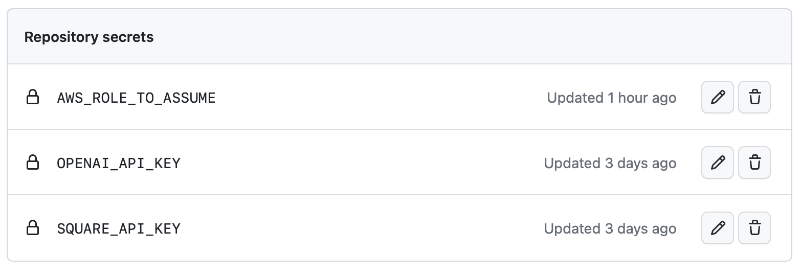
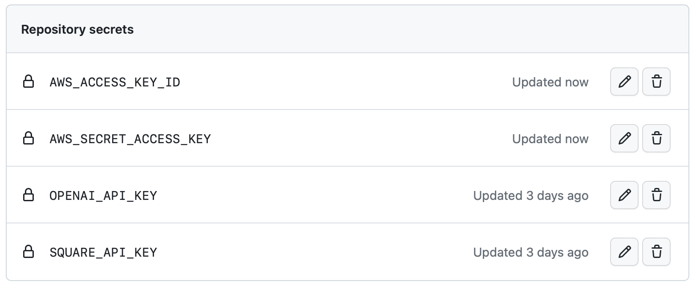
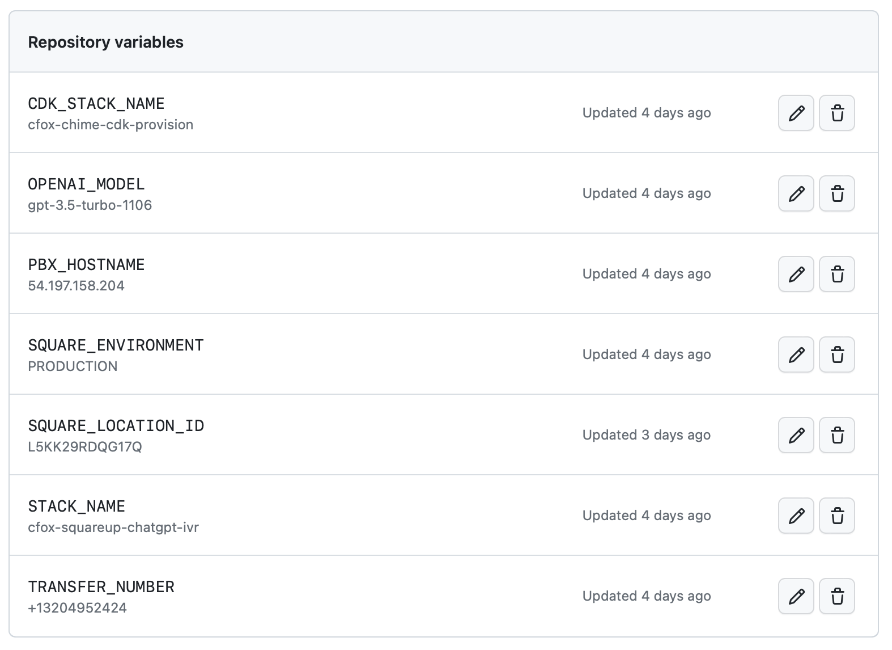
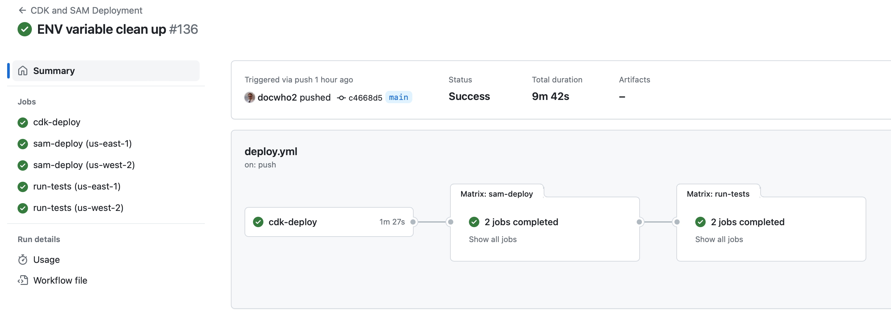

# Amazon Chime SMA ChatGPT IVR for Square Retail

## Background

This project is a [SIP Media Application](https://docs.aws.amazon.com/chime-sdk/latest/ag/use-sip-apps.html) and makes use of the 
[Java Chime SMA Flow Library](https://github.com/docwho2/java-chime-voicesdk-sma) to deliver a [ChatGPT](https://openai.com/chatgpt) voice bot IVR application. The IVR application is integrated with the [Square API](https://developer.squareup.com/us/en) to allow callers to ask questions about products 
and business hours, transfer to employee cell phones, etc.

## Use Case

[Copper Fox Gifts](https://www.copperfoxgifts.com) is a retail store located in a small town in MN. The goal is to handle the majority of calls without human intervention. Here's a breakdown of the types of calls they receive:

- **About 50% of the calls**: "Are you open now?" This is a typical question in resort-type towns where store hours change seasonally and frequently. Many visitors prefer to call ahead to ensure the store is open before they head out.
  - A common follow-up to this is: "What are your hours today?"
  
- **45% of the calls**: "Do you have XYZ product?" Queries range from mittens, hats, and gummy bears to shorts, candles, and more.

- **The remaining calls**: These are primarily from vendors who are coordinating with a specific individual at the store and wish to speak with them directly.


## Solution Summary

The goal is to introduce a "Store Virtual Assistant" powered by [OpenAI ChatGPT](https://openai.com/chatgpt) that can not only answer store-specific queries but also address any general questions the caller might have.
- Utilize [ChatGPT Function Calls](https://platform.openai.com/docs/guides/gpt/function-calling) to facilitate Square API calls, enabling access to inventory, employee details, and store hours.
  - Further leverage function calls so that the model can determine when a call should be transferred or concluded.
- Employ strategic prompting to prime the model with pertinent store information and to guide interactions with callers.
- Ensure a robust and dependable solution that is deployed across multiple regions within AWS and is entirely cloud-based.
- CI/CD [GitHub Workflow](https://docs.github.com/en/actions/using-workflows/about-workflows) that deploys/updates two regions in parallel.

**Features:**
- Callers are consistently greeted and informed about the store's operational status (open or closed).
- Store hours are ascertained in real-time via a Square API call.
- Product category and individual item searches are also driven by Square API calls.
  - Callers can inquire about product categories or specific items in stock.
- Engaging with store employees or the primary store line.
  - Callers can request to connect with specific employees, with the information sourced from a Square API call (Team Member list).
  - If the caller simply wishes to speak to a representative, the model is preloaded with a default number to redirect the call.
    - During transfers to the main line, this process is optimized to use SIP directly connecting to the store's [Asterisk PBX](https://www.asterisk.org).
- Directions to the store can be requested and Google directions URL can be sent to the callers mobile device if requested.
- Messages can be sent to via Email to any of the employees.
  - ChatGPT can compose some interesting emails, quite entertaining.
  - The calling number is included in the subject of the email to lend context.
- You can call +1 (320) 425-0645 to try it, please don't ask to speak with someone as this is a real store with real people working in it.  This is deployed in production via the [workflow](.github/workflows/deploy.yml) and answers all calls for the store.

## High Level Components


## Call Flow Details

### SMA Controller

The [ChimeSMA](ChimeSMA/src/main/java/cloud/cleo/chimesma/squareup/ChimeSMA.java) controller controls the call at a high level.  Callers are greeted and told whether the store is open or closed.

```Java
protected Action getInitialAction() {

        // Play open or closed prompt based on Square Hours  
        final var openClosed = PlayAudioAction.builder()
                .withKeyF(f -> squareHours.isOpen() ? "open.wav" : "closed.wav") // This is always in english
                .withNextAction(MAIN_MENU)
                .withErrorAction(MAIN_MENU)
                .build();

        // Start with a welcome message
        final var welcome = PlayAudioAction.builder()
                .withKey("welcome.wav") // This is always in english
                .withNextAction(openClosed)
                .withErrorAction(openClosed)
                .build();

        return welcome;
    }
```

Control is then handed off to a Lex Bot which is backed by ChatGPT to handle the interaction until a terminating event happens.

```Java
final var lexBotEN = StartBotConversationAction.builder()
                .withDescription("ChatGPT English")
                .withLocale(english)
                .withContent("You can ask about our products, hours, location, or speak to one of our team members. Tell us how we can help today?")
                .build();
```

If ChatGPT determines the call needs to be transferred or ended, that action is returned and the SMA Controller transfers or ends the call.

```Java
Function<StartBotConversationAction, Action> botNextAction = (a) -> {
    final var attrs = a.getActionData().getIntentResult().getSessionState().getSessionAttributes();
    final var botResponse = attrs.get("botResponse");  // When transferring or hanging up, play back GPT's last response
    final var action = attrs.get("action");  // We don't need or want real intents, so the action when exiting the Bot will be set
    return switch (action) {
        case "transfer" -> {
            final var phone = attrs.get("transferNumber");
            final var transfer = CallAndBridgeAction.builder()
                .withDescription("Send Call to Team Member")
                .withRingbackToneKey("ringing.wav")
                .withCallTimeoutSeconds(60) // Store has 40 seconds before VM, and default is 30, so push to 60 to be safe
                .withUri(phone)
               .build();
            if (phone.equals(MAIN_NUMBER) && !VC_ARN.equalsIgnoreCase("PSTN")) {
                // We are transferring to main number, so use SIP by sending call to Voice Connector
                transfer.setArn(VC_ARN);
                transfer.setDescription("Send Call to Main Number via SIP");
            }
            yield SpeakAction.builder()
                .withDescription("Indicate transfer in progress with Bot response")
                .withTextF(tf -> botResponse)
                .withNextAction(transfer)
                .build();
            }
        case "quit" ->
            SpeakAction.builder()
                .withDescription("Saying Good Bye")
                .withTextF(tf -> botResponse)
                .withNextAction(hangup)
                .build();
        default ->
            SpeakAction.builder()
                .withText("A system error has occured, please call back and try again")
                .withNextAction(hangup)
                .build();
    }; 
};
```

### ChatGPT Fullfillment Lambda

The [ChatGPTLambda](ChatGPT/src/main/java/cloud/cleo/squareup/ChatGPTLambda.java) and [Functions](ChatGPT/src/main/java/cloud/cleo/squareup/functions) allow the caller to interface with ChatGPT and provide answers based on realtime data from Square API's.  The model is initialized when a new [Session](ChatGPT/src/main/java/cloud/cleo/squareup/ChatGPTSessionState.java) is started.

```Java
         // General Prompting
        sb.append("Please be a helpfull assistant for a retail store named \"Copper Fox Gifts\", which has clothing items, home decor, gifts of all kinds, speciality foods, and much more.  ");
        sb.append("The store is located at 160 Main Street, Wahkon Minnesota, near Lake Mille Lacs.  ");
        sb.append("Do not respond with the whole employee list.  You may confirm the existance of an employee and give the full name.  ");

        // Mode specific prompting
        switch (inputMode) {
            case TEXT -> {
                sb.append("I am interacting via SMS.  Please keep answers very short and concise, preferably under 180 characters.  ");
                sb.append("To interact with an employee suggest the person call this number instead of texting and ask to speak to that person.  ");
            }
            case SPEECH, DTMF -> {
                sb.append("I am interacting with speech via a telephone interface.  please keep answers short and concise.  ");
                
                // Hangup
                sb.append("When the caller indicates they are done with the conversation, execute the ").append(HANGUP_FUNCTION_NAME).append(" function.  ");
                
                // Transferring
                sb.append("To transfer or speak with a employee that has a phone number, execute the ").append(TRANSFER_FUNCTION_NAME).append(" function.  ");
                sb.append("If the caller wants to just speak to a person or leave a voicemail, execute ").append(TRANSFER_FUNCTION_NAME).append(" with ").append(System.getenv("MAIN_NUMBER")).append(" which rings the main phone in the store.  ");
                sb.append("Do not provide employee phone numbers, you can use the phone numbers to execute the ").append(TRANSFER_FUNCTION_NAME).append(" function.  ");
                
                // Only recommend resturants for call ins, not SMS
                sb.append("Muggs of Mille Lacs is a great resturant next door that serves some on the best burgers in the lake area and has a large selection draft beers and great pub fare.  ");
            }
        }
```

### Example ChatGPT Function

The [Store Hours](ChatGPT/src/main/java/cloud/cleo/squareup/functions/SquareHours.java) function is an example of extending the model to provide realtime information.  The executor for the function is rather simple.

```Java
@Override
public String getDescription() {
        return "Return the open store hours by day of week, any day of week not returned means the store is closed that day.";
    }

public Function<Request, Object> getExecutor() {
        return (var r) -> {
            try {
                return client.getLocationsApi()
                        .retrieveLocation(System.getenv("SQUARE_LOCATION_ID"))
                        .getLocation().getBusinessHours();
            } catch (Exception ex) {
                return mapper.createObjectNode().put("error_message", ex.getLocalizedMessage());
            } 
        };
    }
```

This API call to Square returns a JSON structure that is returned directly to ChatGPT for it to interpret.

```Json
    {
      "periods": [
        {
          "day_of_week": "SUN",
          "start_local_time": "11:00:00",
          "end_local_time": "15:00:00"
        },
        {
          "day_of_week": "FRI",
          "start_local_time": "10:00:00",
          "end_local_time": "17:00:00"
        },
        {
          "day_of_week": "SAT",
          "start_local_time": "10:00:00",
          "end_local_time": "17:00:00"
        }
      ]
    }
```

Depending on how the caller asks about hours, the model uses the data to answer questions:

- Are you open next Thursday?
    - No, we are closed on Thursdays (sometimes it will then speak all the open hours)
- What are your hours?
    - Speaks out the hours for each day in order (SUN, FRI, SAT)
    - Sometimes it sumarizes and says Saturday and Sunday from 10 to 5 and Sunday from 11 to 3

## Chime SDK Phone Number

Once you have deployed the project either via CLI or Workflow, everything is all SIP.  At this stage you could integrate a PBX (like Asterisk) and call into the application via the Voice Connector that was providioned, however the easiest way to test is to provision a phone number in the AWS Console, then create a SIP Rule to point the phone number to the SMA's created in each region.

After provisioning a [phone number in Chime](https://docs.aws.amazon.com/chime-sdk/latest/ag/provision-phone.html), you will need to create a [SIP Rule](https://docs.aws.amazon.com/chime-sdk/latest/ag/understand-sip-data-models.html) for the phone number. When you call the phone number, you will always be routed to the SMA in the us-east-1 region. Only if that region or the Lambda associated with the SMA goes down will you fail over to the us-west-2 region.


## Twilio Provisioning and Setup

[Twilio](https://www.twilio.com/) is like the swiss army knife of communications and allows you greater flexibility than provisioning a PSTN number in AWS Chime Voice SDK.

Pros:
- Larger Phone Number Pool
  - International numbers (UK, Germany, etc.)
  - Chime only provides numbers in the US.
- Flexibility in terms of what you can do with incoming voice calls.
  - Forward the number anywhere at any time.
  - Use local cloud scripts in Twilio to do just about anything.
  - Send to your SIP PBX.
- SMS Support.
  - Forward or respond to SMS in any way you want.
  - You can [connect SMS to the Lex Bot](https://docs.aws.amazon.com/lex/latest/dg/twilio-bot-association.html) deployed in this solution to not only have GPT talk to customers, but also provide the same over SMS.
  - Chime PSTN numbers assigned to SMA's do not support SMS in any way.
- Load Balancing across AWS Regions.
  - Chime numbers point to one region and only failover to the other region if the call can't be sent to the higher priority region.
  - You can equally load balance calls to AWS regions.
    - Futher if both regions didn't respond for some reason you can send the call to another SIP Destination (PBX, or some other destination)
    - You can also use a [SIP Trunk Disaster Recovery URL](https://www.twilio.com/docs/sip-trunking#disaster-recovery) as a failsafe if all of Chime Voice becomes unreachable.
    - In fact you could deploy to as many supported regions as you want, configure balancing equally over us-east-1 and us-west-2, and then a lower priority to ca-central-1 for example.
- Twilio uses AWS itself and and it's [US Edge locations](https://www.twilio.com/docs/global-infrastructure/edge-locations) are positioned inside AWS regions.
  - Low latency and the signaling never really goes over the Internet.

Cons:
- Introduces more complexity dealing with the integration, Chime Numbers just require a SIP Rule pointing to SMA's and done (no Voice Connector necessary).
- Each Twilio number requires a distinct SIP trunk paired to Voice Connectors in Chime Voice SDK.
  - You are limited to 3 Voice Connectors per region in your AWS account by default.

### Twilio Integration Details

The main issue with integration is the fact that say you have Twilio number +1-800-555-5555 and point it at the Chime Voice Connectors.
- Chime recieves the SIP invite and sees that number +1-800-555-5555 is not known and rejects the call because that number does not exist in Chime.
- You can however use [SIP Header Manipulation](https://www.twilio.com/docs/sip-trunking/sip-header-manipulation) to change the _To_ header to +1-703-555-0122.
  - +1-703-555-0122 is special Chime number that the Voice Connector will answer and in conjuction with a _Request URI hostname_ SIP Rule pointing to a SMA will route the call properly into the application.
  - Unfortunately Twilio does not yet provide an API to create these or assign them to a SIP trunk, thus some manual intervention is required for deployment.
    - You only need to create the Header Manipulation Once which can then be used on any SIP trunk moving forward.
    - When you initially deploy and if you destroy and then re-deploy, then you need to go to the Twilio console and apply the header manipulation to the SIP Trunk.

Creating a SIP Header Manipulation in the Twilio Console:
- In the Twilio Console _Develop_ section choose _Elastic SIP Trunking_ --> _SIP Header Manipulations_ [Link](https://console.twilio.com/us1/develop/sip-trunking/settings/header-manipulation?frameUrl=%2Fconsole%2Fsip-trunking%2Fsettings%2Fheader-manipulation%3Fx-target-region%3Dus1).
- Click on _Create a Policy_ in the upper right.
- Enter a name for the policy (like "Chime7035550122").
- Click _Create_.
- Click _Add request rule_.
- Enter a name for the rule (like "To7035550122").
- In the _Actions_ Block enter:
  - SIP header field -> Select _To number_
  - Action -> _Replace with_
  - Value -> _+17035550122_
- Click _Add rule_.
- Click _Save Policy_ at the bottom of Screen.
- You can now apply this to SIP Trunks (that you create or provisioned via CLI or Work Flow).

(more to come here on provisioning)


## Deploy the Project

This project uses both AWS SAM and AWS CDK to deploy resources.  Because Chime Voice SDK resources are not included in CloudFormation, they must be provisioned using AWS API calls.  Custom resources must be created to solve this problem.  This project includes and makes use of [Chime Voice SDK Provisioning Project](https://github.com/docwho2/java-chime-voice-sdk-cdk).

* CDK code deploys Chime resources like the SIP media application (SMA), Voice Connector, and SIP rules to enable SIP connectivity.
* SAM deploys the actual Lambda's (ChatGPT and SMA), Lex Bot, S3 Prompt Bucket, Prompts, etc.

Some of the prerequisites to fully utilize the project are API keys for both OpenAI and Square.  If you don't care about testing the Square retail features and only want to interfact with ChatGPT, then you can skip any of the Square values and the project will still work.

* [Obtain OpenAI API key](https://platform.openai.com/docs/quickstart?context=curl)
* [Obtain Square API Key](https://developer.squareup.com/docs/build-basics/access-tokens)
* [Obtain Square location ID](https://developer.squareup.com/blog/see-your-location-id-without-the-api-call/)

### Forking repository and utlizing the GitHub Workflow

The [GitHub Workflow](.github/workflows/deploy.yml) included in the repository can be used to a create a full CI/CD pipeline as changes are comitted to the main branch.

To allow the workflow to operate on your AWS environment, you can use several methods, but in this case we are using the recommended [OIDC method](https://github.com/aws-actions/configure-aws-credentials#OIDC) that requires some setup inside your account.  The workflow uses this to setup Credentials:

```yaml
- name: Setup AWS Credentials
      id: aws-creds
      uses: aws-actions/configure-aws-credentials@v4
      with:
        aws-region: ${{ matrix.region }}
        # The full role ARN if you are using OIDC
        # https://github.com/aws-actions/configure-aws-credentials#oidc
        role-to-assume: ${{ secrets.AWS_ROLE_TO_ASSUME }}
        # Set up the below secrets if you are not using OIDC and want to use regular keys (best practive is to use just role above with OIDC provider)
        aws-access-key-id: ${{ secrets.AWS_ACCESS_KEY_ID }}
        aws-secret-access-key: ${{ secrets.AWS_SECRET_ACCESS_KEY }}
        mask-aws-account-id: true
```

You will need to [create secrets](https://docs.github.com/en/actions/security-guides/using-secrets-in-github-actions#creating-secrets-for-a-repository) to use OIDC or Keys.  Set the role or Keys, but not both:

If you are using the [OIDC method](https://github.com/aws-actions/configure-aws-credentials#OIDC)
- Create a Secret named **AWS_ROLE_TO_ASSUME** and set it to the full ARN of the role
  - It should look something like "arn:aws:iam::123456789:role/github-oidc-provider-Role-nqvduv7P15BZ"

If you are going to use [Access Key and Secret](https://repost.aws/knowledge-center/create-access-key)
- Create a Secret named **AWS_ACCESS_KEY_ID** and set to the Access Key ID
- Create a Secret named **AWS_SECRET_ACCESS_KEY** and set to the Secret Access Key

The workflow has sensible defaults (see below snippet from the workflow), but you will need to set up variables and secrets:

```yaml
env:
  # Create secrets in the repository and they will be pushed to Parameter store, these are required
  # If you don't set an API key for square, you can still use ChatGPT by itself
  SQUARE_API_KEY: ${{ secrets.SQUARE_API_KEY || 'DISABLED' }}
  OPENAI_API_KEY: ${{ secrets.OPENAI_API_KEY || 'NEED_TO_SET_THIS' }}  
    
  
  # Create repository variables to override any/all of the below from the defaults
  #
  CDK_STACK_NAME: ${{ vars.CDK_STACK_NAME || 'chatgpt-square-ivr-cdk' }}
  STACK_NAME: ${{ vars.STACK_NAME || 'chatgpt-square-ivr' }}
  
  # The E164 Number to be used when transferring to main number
  TRANSFER_NUMBER: ${{ vars.TRANSFER_NUMBER || '+18004444444' }}
  
  # Set to PRODUCTION if you have a real Sqaure Buisness or Leave it as SANDBOX if you just have a dev account
  SQUARE_ENVIRONMENT: ${{ vars.SQUARE_ENVIRONMENT || 'SANDBOX' }}
  # You can have many locations in Square, need to set to the location you want to query inventory or employees against (required for functions to work)
  SQUARE_LOCATION_ID: ${{ vars.SQUARE_LOCATION_ID || 'DISABLED' }}
  
  # https://platform.openai.com/docs/models/overview (requres model with function calling)
  OPENAI_MODEL: ${{ vars.OPENAI_MODEL || 'gpt-3.5-turbo-1106' }}
  
  # Define in repo variable if you want want to route main number calls via SIP via the Voice Connector
  PBX_HOSTNAME:  ${{ vars.PBX_HOSTNAME || '' }}
  
  # Polly voices to use for English and Spanish https://docs.aws.amazon.com/polly/latest/dg/ntts-voices-main.html
  VOICE_ID_EN: ${{ vars.VOICE_ID_EN  || 'Joanna' }}
  VOICE_ID_ES: ${{ vars.VOICE_ID_ES  || 'Lupe' }}
```

Example [Secrets](https://docs.github.com/en/actions/security-guides/using-secrets-in-github-actions#creating-secrets-for-a-repository) :

OIDC Method:



Access Keys:




Example [Variables](https://docs.github.com/en/actions/learn-github-actions/variables#creating-configuration-variables-for-a-repository) :



The general steps are:
* [Fork the repository](https://docs.github.com/en/get-started/quickstart/fork-a-repo)
* [Setup required Secrets](https://docs.github.com/en/actions/security-guides/using-secrets-in-github-actions#creating-secrets-for-a-repository).
  - Setup either OIDC or Access Keys as described above.
  - Create a Secret named **OPENAI_API_KEY** and set to your API key otherwise ChatGPT will not function.
  - Create a Secret named **SQUARE_API_KEY** if are going to be using Square functionaliy, if don't set this, then square functionality will be disabled.
* Optionaly [set any variables](https://docs.github.com/en/actions/learn-github-actions/variables#creating-configuration-variables-for-a-repository) from the defaults like **OPENAI_MODEL** for example.
  - If you are using square then you must also create a variable named **SQUARE_LOCATION_ID** and set to the Location ID you want the API to query.
  - If you are using a production Square API Key, then also create a variable named **SQUARE_ENVIRONMENT** and set it to **PRODUCTION** as the default is **SANDBOX**.
  - Create variables for anything else you want to tweak like stack names, ChatGPT model, etc.

Then start committing changes and watch the magic happen.  CDK deploys regions in parallel and then a matrix job deploys each region in parallel for faster deployments:



### Using the deploy.sh bash script

To deploy this project via CLI, you need the following tools.

* AWS CLI - [Install AWS CLI](https://docs.aws.amazon.com/cli/latest/userguide/getting-started-install.html)
* AWS SAM CLI - [Install the SAM CLI](https://docs.aws.amazon.com/serverless-application-model/latest/developerguide/serverless-sam-cli-install.html)
* AWS CDK - [Instal CDK](https://docs.aws.amazon.com/cdk/v2/guide/getting_started.html)
* Java 17 - [Install Java 17](https://docs.aws.amazon.com/corretto/latest/corretto-17-ug/downloads-list.html)
* Maven - [Install Maven](https://maven.apache.org/install.html)

If you have [brew](https://brew.sh) installed (highly recommended) then:
```bash
brew install awscli
brew install aws-sam-cli
brew install aws-cdk
brew install corretto17
brew install maven

```

To build and deploy, run the following in your shell (or CloudShell) assuming AWS CLI is setup and verified to work.

```bash
git clone https://github.com/docwho2/java-squareup-chatgpt-ivr.git
cd java-squareup-chatgpt-ivr
./deploy.sh

```

You may find it easier to deploy in a [Cloud Shell](https://aws.amazon.com/cloudshell/).  Simply launch a Cloud Shell, then proceed like above.  The deploy script will install maven/Java if it detects you are in a CloudShell.  Note: Due limited storage when using a CloudShell if you have other artifacts and have otherwise used much of the storage, the deploy will fail with space issues (run "df" and check if you experience a failed deployment).

You will see the progress as the stacks deploy.  If you want to change any of the values the script asked for you can simply run it again or as many times as you need.


## Testing

After deploying you can use the [test script](testGPT.sh) to send commands to ChatGPT just to make sure everything is working as planned.  The script collects your input and uses the aws cli to send requests to both regions.

Asking a question like the below example validates several things:
- The Lex Bot is functioning and calling the [ChatGPT Lambda](ChatGPT/src/main/java/cloud/cleo/squareup/ChatGPTLambda.java)
- ChatGPT is functioning properly
  - Your API key is valid and OpenAI service is alive
  - GPT is performing function calling correctly for defined functions
- Square is functioning properly
  - Your Square API Key and location ID are correct
  - Square API's are responding and service is alive
  - Valid data was returned from Square and properly interpreted by GPT

```bash
./testGPT.sh

Enter text to send to ChatGPT Bot [How are you doing today?]: Tell me about your store hours

[Tell me about your store hours] - us-east-1
Response is: 
[We are currently closed. Our regular hours are:
- Friday: 10:00 AM - 5:00 PM
- Saturday: 10:00 AM - 5:00 PM
- Sunday: 11:00 AM - 3:00 PM]


[Tell me about your store hours] - us-west-2
Response is: 
[We are currently closed. Our regular hours are:
- Friday: 10:00 AM - 5:00 PM
- Saturday: 10:00 AM - 5:00 PM
- Sunday: 11:00 AM - 3:00 PM]

```

Testing is also done at deploy time and a couple times a day via Work Flows.
- The [Test Workflow](.github/workflows/tests.yml) can be run at any time manually and also runs daily via cron settings.
- The [Test Action](.github/actions/test/action.yml) is meant to be shared and used in various jobs.  After deploy, tests are run for example, but they can also be run manually with the above mentioned WorkFlow.


## Cleanup

To delete the application and all resources created, use the destroy script.  If you provisioned a phone number, you will need to manually delete that as well or **you will continue to incur charges** for that.

You can run the following:

```bash
./destroy.sh

```

## Sample Asterisk Config

Connecting your PBX to the Chime Voice Connectors to send and receive calls.  You would take the Chime Voice Connector hostnames from the output of stacks after deployment.  Obviously if you tear down the stacks and redeploy, the Voice Connector names will change, so you need to go back to Asterisk and update the names.

_pjsip_wizzard.conf_ examples: 

```properties
[aws-chime-virginia]
type=wizard
transport=transport-udp
remote_hosts=fdtthyhzkjkmvgvgvgykxx.voiceconnector.chime.aws
endpoint/context=incoming-twilio
endpoint/disallow=all
endpoint/allow=ulaw
endpoint/direct_media=no
endpoint/dtmf_mode=auto
endpoint/rtp_symmetric=yes

[aws-chime-oregon]
type=wizard
transport=transport-udp
remote_hosts=cyl0xlnxwrojzkca0pz0d2.voiceconnector.chime.aws
endpoint/context=incoming-twilio
endpoint/disallow=all
endpoint/allow=ulaw
endpoint/direct_media=no
endpoint/dtmf_mode=auto
endpoint/rtp_symmetric=yes
```

_extensions.conf_ excerpt:

```properties
[incoming-twilio]

exten => _+1320495242X,1,NoOp(Call for Copper Fox DID ${EXTEN})
        same => n,Goto(copperfox,${EXTEN:1},1)


[copperfox]
include => outbound-tc-local
include => outbound-longdistance

; Calls will come from Chime Voice Connector (or Twilio)
exten => 13204952424,1,NoOp(Call to Copper Fox Main Line)
	same => n,GoSub(known-callers,start,1)
        same => n,Dial(SCCP/13204952424,40)
        same => n,VoiceMail(${EXTEN})
        same => n,Hangup()

; Call SMA in East and failover to West if down
exten => 290,1,NoOP(Call to AWS Chime)
        same => n,Dial(PJSIP/+17035550122@aws-chime-virginia)
        same => n,Playback(sorry-youre-having-problems)
        same => n,Dial(PJSIP/+17035550122@aws-chime-oregon)

; Call SMA in the East region only
exten => 291,1,NoOP(Call to AWS Chime)
        same => n,Dial(PJSIP/+17035550122@aws-chime-virginia)

; Call SMA in the West region only
exten => 292,1,NoOP(Call to AWS Chime Oregon)
        same => n,Dial(PJSIP/+17035550122@aws-chime-oregon)

```

I've alo observed that Chime endpoints can change over time, usually there are 12, but once Asterisk locks them in it doesn't seem to update them over time.  Asterisk will refuse the call if a new endpoint is added/swapped at some point, so the brute force solution is to just relaod Asterisk every morning.

```
[root@Asterisk asterisk]# crontab -l
0 6 * * * /sbin/asterisk -x "core restart when convenient"

[root@Asterisk asterisk]# dig fdtthyhzkjkmvgvgvgykxx.voiceconnector.chime.aws

; <<>> DiG 9.11.4-P2-RedHat-9.11.4-26.P2.amzn2.13.5 <<>> fdtthyhzkjkmvgvgvgykxx.voiceconnector.chime.aws
;; QUESTION SECTION:
;fdtthyhzkjkmvgvgvgykxx.voiceconnector.chime.aws. IN A

;; ANSWER SECTION:
fdtthyhzkjkmvgvgvgykxx.voiceconnector.chime.aws. 60 IN A 3.80.16.114
fdtthyhzkjkmvgvgvgykxx.voiceconnector.chime.aws. 60 IN A 3.80.16.0
fdtthyhzkjkmvgvgvgykxx.voiceconnector.chime.aws. 60 IN A 3.80.16.101
fdtthyhzkjkmvgvgvgykxx.voiceconnector.chime.aws. 60 IN A 3.80.16.108
fdtthyhzkjkmvgvgvgykxx.voiceconnector.chime.aws. 60 IN A 3.80.16.103
fdtthyhzkjkmvgvgvgykxx.voiceconnector.chime.aws. 60 IN A 3.80.16.115
fdtthyhzkjkmvgvgvgykxx.voiceconnector.chime.aws. 60 IN A 3.80.16.102
fdtthyhzkjkmvgvgvgykxx.voiceconnector.chime.aws. 60 IN A 3.80.16.100
fdtthyhzkjkmvgvgvgykxx.voiceconnector.chime.aws. 60 IN A 3.80.16.107
fdtthyhzkjkmvgvgvgykxx.voiceconnector.chime.aws. 60 IN A 3.80.16.1
fdtthyhzkjkmvgvgvgykxx.voiceconnector.chime.aws. 60 IN A 3.80.16.116
fdtthyhzkjkmvgvgvgykxx.voiceconnector.chime.aws. 60 IN A 3.80.16.106
```


## Sample Deploy Output

```
java-squareup-chatgpt-ivr % ./deploy.sh

ChatGPT won't work if you don't provide a valid API Key, however you can still deploy
Enter your OpenAI API Key [XXXXXXXXXX]: 
Enter OpenAI Model [gpt-3.5-turbo-1106]: 

If you don't have a Square API Key, just hit enter for the next 3 prompts (will disable square functions)

Enter your Square API Key [DISABLED]: 
Enter Square Environment (SANDBOX|PRODUCTION) [SANDBOX]: 
Enter Square Location ID  [DISABLED]: 

Enter transfer # when caller wants to speak to a person [+18004444444]: 


CloudShell not detected, assuming you have Java/Maven/SAM/CDK all installed, if not script will error

Will now ensure CDK is bootstrapped in us-east-1 us-west-2
 ⏳  Bootstrapping environment aws://***/us-east-1...
Trusted accounts for deployment: (none)
Trusted accounts for lookup: (none)
Using default execution policy of 'arn:aws:iam::aws:policy/AdministratorAccess'. Pass '--cloudformation-execution-policies' to customize.

 ✨ hotswap deployment skipped - no changes were detected (use --force to override)

 ✅  Environment aws://***/us-east-1 bootstrapped (no changes).

 ⏳  Bootstrapping environment aws://***/us-west-2...
Trusted accounts for deployment: (none)
Trusted accounts for lookup: (none)
Using default execution policy of 'arn:aws:iam::aws:policy/AdministratorAccess'. Pass '--cloudformation-execution-policies' to customize.

 ✨ hotswap deployment skipped - no changes were detected (use --force to override)

 ✅  Environment aws://***/us-west-2 bootstrapped (no changes).


Deploying CDK stack to us-east-1 us-west-2


✨  Synthesis time: 2.86s

chatgpt-square-ivr-cdk:  start: Building 878abf4f8a52ee049c6a885f81aff403cae67b16991c29d582799c0ac1a22669:***-us-east-1
chatgpt-square-ivr-cdk:  success: Built 878abf4f8a52ee049c6a885f81aff403cae67b16991c29d582799c0ac1a22669:***-us-east-1
chatgpt-square-ivr-cdk:  start: Publishing 878abf4f8a52ee049c6a885f81aff403cae67b16991c29d582799c0ac1a22669:***-us-east-1
chatgpt-square-ivr-cdk:  start: Building c0460130f5069dbb2c5e5c6f98a0100dd798e1c7961ec42393e643ceca3490be:***-us-west-2
chatgpt-square-ivr-cdk:  success: Built c0460130f5069dbb2c5e5c6f98a0100dd798e1c7961ec42393e643ceca3490be:***-us-west-2
chatgpt-square-ivr-cdk:  start: Publishing c0460130f5069dbb2c5e5c6f98a0100dd798e1c7961ec42393e643ceca3490be:***-us-west-2
chatgpt-square-ivr-cdk:  success: Published 878abf4f8a52ee049c6a885f81aff403cae67b16991c29d582799c0ac1a22669:***-us-east-1
east (chatgpt-square-ivr-cdk)
east (chatgpt-square-ivr-cdk): deploying... [1/2]
chatgpt-square-ivr-cdk: creating CloudFormation changeset...
chatgpt-square-ivr-cdk:  success: Published c0460130f5069dbb2c5e5c6f98a0100dd798e1c7961ec42393e643ceca3490be:***-us-west-2
west (chatgpt-square-ivr-cdk)
west (chatgpt-square-ivr-cdk): deploying... [2/2]
chatgpt-square-ivr-cdk: creating CloudFormation changeset...
chatgpt-square-ivr-cdk |  0/19 | 1:40:01 PM | CREATE_IN_PROGRESS   | AWS::IAM::Role              | smalambdaRole 
chatgpt-square-ivr-cdk |  0/19 | 1:40:01 PM | CREATE_IN_PROGRESS   | AWS::CDK::Metadata          | west/CDKMetadata/Default (CDKMetadata) 
chatgpt-square-ivr-cdk |  0/19 | 1:40:01 PM | CREATE_IN_PROGRESS   | AWS::SSM::Parameter         | west/VC_ARN_PARAM (VCARNPARAMA1F8171A) 
chatgpt-square-ivr-cdk |  0/19 | 1:40:02 PM | CREATE_IN_PROGRESS   | AWS::IAM::Role              | west/AWS679f53fac002430cb0da5b7982bd2287/ServiceRole (AWS679f53fac002430cb0da5b7982bd2287ServiceRoleC1EA0FF2) 
chatgpt-square-ivr-cdk |  0/19 | 1:39:49 PM | REVIEW_IN_PROGRESS   | AWS::CloudFormation::Stack  | chatgpt-square-ivr-cdk User Initiated
chatgpt-square-ivr-cdk |  0/19 | 1:39:56 PM | CREATE_IN_PROGRESS   | AWS::CloudFormation::Stack  | chatgpt-square-ivr-cdk User Initiated
chatgpt-square-ivr-cdk |  0/19 | 1:40:04 PM | CREATE_IN_PROGRESS   | AWS::IAM::Role              | east/AWS679f53fac002430cb0da5b7982bd2287/ServiceRole (AWS679f53fac002430cb0da5b7982bd2287ServiceRoleC1EA0FF2) Resource creation Initiated
chatgpt-square-ivr-cdk |  0/19 | 1:40:05 PM | CREATE_IN_PROGRESS   | AWS::SSM::Parameter         | east/VC_ARN_PARAM (VCARNPARAMA1F8171A) Resource creation Initiated
chatgpt-square-ivr-cdk |  0/19 | 1:40:05 PM | CREATE_IN_PROGRESS   | AWS::IAM::Role              | smalambdaRole Resource creation Initiated
chatgpt-square-ivr-cdk |  0/19 | 1:40:05 PM | CREATE_IN_PROGRESS   | AWS::CDK::Metadata          | east/CDKMetadata/Default (CDKMetadata) Resource creation Initiated
chatgpt-square-ivr-cdk |  1/19 | 1:40:05 PM | CREATE_COMPLETE      | AWS::SSM::Parameter         | east/VC_ARN_PARAM (VCARNPARAMA1F8171A) 
chatgpt-square-ivr-cdk |  2/19 | 1:40:05 PM | CREATE_COMPLETE      | AWS::CDK::Metadata          | east/CDKMetadata/Default (CDKMetadata) 
chatgpt-square-ivr-cdk |  2/19 | 1:39:48 PM | REVIEW_IN_PROGRESS   | AWS::CloudFormation::Stack  | chatgpt-square-ivr-cdk User Initiated
chatgpt-square-ivr-cdk |  2/19 | 1:39:59 PM | CREATE_IN_PROGRESS   | AWS::CloudFormation::Stack  | chatgpt-square-ivr-cdk User Initiated
chatgpt-square-ivr-cdk |  2/19 | 1:40:03 PM | CREATE_IN_PROGRESS   | AWS::IAM::Role              | east/AWS679f53fac002430cb0da5b7982bd2287/ServiceRole (AWS679f53fac002430cb0da5b7982bd2287ServiceRoleC1EA0FF2) 
chatgpt-square-ivr-cdk |  2/19 | 1:40:03 PM | CREATE_IN_PROGRESS   | AWS::SSM::Parameter         | east/VC_ARN_PARAM (VCARNPARAMA1F8171A) 
chatgpt-square-ivr-cdk |  2/19 | 1:40:03 PM | CREATE_IN_PROGRESS   | AWS::CDK::Metadata          | east/CDKMetadata/Default (CDKMetadata) 
chatgpt-square-ivr-cdk |  2/19 | 1:40:03 PM | CREATE_IN_PROGRESS   | AWS::IAM::Role              | smalambdaRole 
chatgpt-square-ivr-cdk |  0/19 | 1:40:03 PM | CREATE_IN_PROGRESS   | AWS::SSM::Parameter         | west/VC_ARN_PARAM (VCARNPARAMA1F8171A) Resource creation Initiated
chatgpt-square-ivr-cdk |  0/19 | 1:40:03 PM | CREATE_IN_PROGRESS   | AWS::CDK::Metadata          | west/CDKMetadata/Default (CDKMetadata) Resource creation Initiated
chatgpt-square-ivr-cdk |  1/19 | 1:40:03 PM | CREATE_COMPLETE      | AWS::CDK::Metadata          | west/CDKMetadata/Default (CDKMetadata) 
chatgpt-square-ivr-cdk |  1/19 | 1:40:03 PM | CREATE_IN_PROGRESS   | AWS::IAM::Role              | west/AWS679f53fac002430cb0da5b7982bd2287/ServiceRole (AWS679f53fac002430cb0da5b7982bd2287ServiceRoleC1EA0FF2) Resource creation Initiated
chatgpt-square-ivr-cdk |  2/19 | 1:40:03 PM | CREATE_COMPLETE      | AWS::SSM::Parameter         | west/VC_ARN_PARAM (VCARNPARAMA1F8171A) 
chatgpt-square-ivr-cdk |  2/19 | 1:40:03 PM | CREATE_IN_PROGRESS   | AWS::IAM::Role              | smalambdaRole Resource creation Initiated
chatgpt-square-ivr-cdk |  3/19 | 1:40:21 PM | CREATE_COMPLETE      | AWS::IAM::Role              | east/AWS679f53fac002430cb0da5b7982bd2287/ServiceRole (AWS679f53fac002430cb0da5b7982bd2287ServiceRoleC1EA0FF2) 
chatgpt-square-ivr-cdk |  4/19 | 1:40:21 PM | CREATE_COMPLETE      | AWS::IAM::Role              | smalambdaRole 
chatgpt-square-ivr-cdk |  3/19 | 1:40:19 PM | CREATE_COMPLETE      | AWS::IAM::Role              | west/AWS679f53fac002430cb0da5b7982bd2287/ServiceRole (AWS679f53fac002430cb0da5b7982bd2287ServiceRoleC1EA0FF2) 
chatgpt-square-ivr-cdk |  4/19 | 1:40:19 PM | CREATE_COMPLETE      | AWS::IAM::Role              | smalambdaRole 
chatgpt-square-ivr-cdk |  4/19 | 1:40:19 PM | CREATE_IN_PROGRESS   | AWS::IAM::Policy            | west/SMA-CR/CustomResourcePolicy (SMACRCustomResourcePolicy277D2013) 
chatgpt-square-ivr-cdk |  4/19 | 1:40:20 PM | CREATE_IN_PROGRESS   | AWS::IAM::Policy            | west/VC-CR-TERM/CustomResourcePolicy (VCCRTERMCustomResourcePolicy3D87E733) 
chatgpt-square-ivr-cdk |  4/19 | 1:40:20 PM | CREATE_IN_PROGRESS   | AWS::IAM::Policy            | west/SR-CR2/CustomResourcePolicy (SRCR2CustomResourcePolicy6283867E) 
chatgpt-square-ivr-cdk |  4/19 | 1:40:20 PM | CREATE_IN_PROGRESS   | AWS::IAM::Policy            | west/VC-CR/CustomResourcePolicy (VCCRCustomResourcePolicy9739604D) 
chatgpt-square-ivr-cdk |  4/19 | 1:40:20 PM | CREATE_IN_PROGRESS   | AWS::Lambda::Function       | west/AWS679f53fac002430cb0da5b7982bd2287 (AWS679f53fac002430cb0da5b7982bd22872D164C4C) 
chatgpt-square-ivr-cdk |  4/19 | 1:40:20 PM | CREATE_IN_PROGRESS   | AWS::Lambda::Function       | west/sma-lambda (smalambda) 
chatgpt-square-ivr-cdk |  4/19 | 1:40:21 PM | CREATE_IN_PROGRESS   | AWS::IAM::Policy            | west/SMA-CR/CustomResourcePolicy (SMACRCustomResourcePolicy277D2013) Resource creation Initiated
chatgpt-square-ivr-cdk |  4/19 | 1:40:21 PM | CREATE_IN_PROGRESS   | AWS::IAM::Policy            | west/VC-CR-TERM/CustomResourcePolicy (VCCRTERMCustomResourcePolicy3D87E733) Resource creation Initiated
chatgpt-square-ivr-cdk |  4/19 | 1:40:21 PM | CREATE_IN_PROGRESS   | AWS::IAM::Policy            | west/SR-CR2/CustomResourcePolicy (SRCR2CustomResourcePolicy6283867E) Resource creation Initiated
chatgpt-square-ivr-cdk |  4/19 | 1:40:21 PM | CREATE_IN_PROGRESS   | AWS::IAM::Policy            | west/VC-CR/CustomResourcePolicy (VCCRCustomResourcePolicy9739604D) Resource creation Initiated
chatgpt-square-ivr-cdk |  4/19 | 1:40:21 PM | CREATE_IN_PROGRESS   | AWS::Lambda::Function       | west/sma-lambda (smalambda) Resource creation Initiated
chatgpt-square-ivr-cdk |  4/19 | 1:40:22 PM | CREATE_IN_PROGRESS   | AWS::Lambda::Function       | west/AWS679f53fac002430cb0da5b7982bd2287 (AWS679f53fac002430cb0da5b7982bd22872D164C4C) Resource creation Initiated
chatgpt-square-ivr-cdk |  4/19 | 1:40:21 PM | CREATE_IN_PROGRESS   | AWS::IAM::Policy            | east/SMA-CR/CustomResourcePolicy (SMACRCustomResourcePolicy277D2013) 
chatgpt-square-ivr-cdk |  4/19 | 1:40:21 PM | CREATE_IN_PROGRESS   | AWS::IAM::Policy            | east/SR-CR1/CustomResourcePolicy (SRCR1CustomResourcePolicy9714D179) 
chatgpt-square-ivr-cdk |  4/19 | 1:40:21 PM | CREATE_IN_PROGRESS   | AWS::IAM::Policy            | east/VC-CR/CustomResourcePolicy (VCCRCustomResourcePolicy9739604D) 
chatgpt-square-ivr-cdk |  4/19 | 1:40:21 PM | CREATE_IN_PROGRESS   | AWS::IAM::Policy            | east/VC-CR-TERM/CustomResourcePolicy (VCCRTERMCustomResourcePolicy3D87E733) 
chatgpt-square-ivr-cdk |  4/19 | 1:40:22 PM | CREATE_IN_PROGRESS   | AWS::Lambda::Function       | east/AWS679f53fac002430cb0da5b7982bd2287 (AWS679f53fac002430cb0da5b7982bd22872D164C4C) 
chatgpt-square-ivr-cdk |  4/19 | 1:40:22 PM | CREATE_IN_PROGRESS   | AWS::Lambda::Function       | east/sma-lambda (smalambda) 
chatgpt-square-ivr-cdk |  4/19 | 1:40:22 PM | CREATE_IN_PROGRESS   | AWS::IAM::Policy            | east/SMA-CR/CustomResourcePolicy (SMACRCustomResourcePolicy277D2013) Resource creation Initiated
chatgpt-square-ivr-cdk |  4/19 | 1:40:22 PM | CREATE_IN_PROGRESS   | AWS::IAM::Policy            | east/VC-CR-TERM/CustomResourcePolicy (VCCRTERMCustomResourcePolicy3D87E733) Resource creation Initiated
chatgpt-square-ivr-cdk |  4/19 | 1:40:22 PM | CREATE_IN_PROGRESS   | AWS::IAM::Policy            | east/VC-CR/CustomResourcePolicy (VCCRCustomResourcePolicy9739604D) Resource creation Initiated
chatgpt-square-ivr-cdk |  4/19 | 1:40:22 PM | CREATE_IN_PROGRESS   | AWS::IAM::Policy            | east/SR-CR1/CustomResourcePolicy (SRCR1CustomResourcePolicy9714D179) Resource creation Initiated
chatgpt-square-ivr-cdk |  4/19 | 1:40:23 PM | CREATE_IN_PROGRESS   | AWS::Lambda::Function       | east/sma-lambda (smalambda) Resource creation Initiated
chatgpt-square-ivr-cdk |  4/19 | 1:40:23 PM | CREATE_IN_PROGRESS   | AWS::Lambda::Function       | east/AWS679f53fac002430cb0da5b7982bd2287 (AWS679f53fac002430cb0da5b7982bd22872D164C4C) Resource creation Initiated
chatgpt-square-ivr-cdk |  5/19 | 1:40:27 PM | CREATE_COMPLETE      | AWS::Lambda::Function       | west/sma-lambda (smalambda) 
chatgpt-square-ivr-cdk |  6/19 | 1:40:28 PM | CREATE_COMPLETE      | AWS::Lambda::Function       | west/AWS679f53fac002430cb0da5b7982bd2287 (AWS679f53fac002430cb0da5b7982bd22872D164C4C) 
chatgpt-square-ivr-cdk |  6/19 | 1:40:28 PM | CREATE_IN_PROGRESS   | AWS::SSM::Parameter         | west/LAMBDAARN (LAMBDAARN5D66CCB0) 
chatgpt-square-ivr-cdk |  6/19 | 1:40:29 PM | CREATE_IN_PROGRESS   | AWS::SSM::Parameter         | west/LAMBDAARN (LAMBDAARN5D66CCB0) Resource creation Initiated
chatgpt-square-ivr-cdk |  5/19 | 1:40:29 PM | CREATE_COMPLETE      | AWS::Lambda::Function       | east/sma-lambda (smalambda) 
chatgpt-square-ivr-cdk |  6/19 | 1:40:29 PM | CREATE_COMPLETE      | AWS::Lambda::Function       | east/AWS679f53fac002430cb0da5b7982bd2287 (AWS679f53fac002430cb0da5b7982bd22872D164C4C) 
chatgpt-square-ivr-cdk |  6/19 | 1:40:29 PM | CREATE_IN_PROGRESS   | AWS::SSM::Parameter         | east/LAMBDAARN (LAMBDAARN5D66CCB0) 
chatgpt-square-ivr-cdk |  6/19 | 1:40:30 PM | CREATE_IN_PROGRESS   | AWS::SSM::Parameter         | east/LAMBDAARN (LAMBDAARN5D66CCB0) Resource creation Initiated
chatgpt-square-ivr-cdk |  7/19 | 1:40:31 PM | CREATE_COMPLETE      | AWS::SSM::Parameter         | east/LAMBDAARN (LAMBDAARN5D66CCB0) 
chatgpt-square-ivr-cdk |  7/19 | 1:40:29 PM | CREATE_COMPLETE      | AWS::SSM::Parameter         | west/LAMBDAARN (LAMBDAARN5D66CCB0) 
chatgpt-square-ivr-cdk |  8/19 | 1:40:36 PM | CREATE_COMPLETE      | AWS::IAM::Policy            | west/SMA-CR/CustomResourcePolicy (SMACRCustomResourcePolicy277D2013) 
chatgpt-square-ivr-cdk |  9/19 | 1:40:36 PM | CREATE_COMPLETE      | AWS::IAM::Policy            | west/VC-CR-TERM/CustomResourcePolicy (VCCRTERMCustomResourcePolicy3D87E733) 
chatgpt-square-ivr-cdk | 10/19 | 1:40:37 PM | CREATE_COMPLETE      | AWS::IAM::Policy            | west/SR-CR2/CustomResourcePolicy (SRCR2CustomResourcePolicy6283867E) 
chatgpt-square-ivr-cdk | 11/19 | 1:40:37 PM | CREATE_COMPLETE      | AWS::IAM::Policy            | west/VC-CR/CustomResourcePolicy (VCCRCustomResourcePolicy9739604D) 
chatgpt-square-ivr-cdk | 11/19 | 1:40:37 PM | CREATE_IN_PROGRESS   | Custom::SipMediaApplication | west/SMA-CR/Resource/Default (SMACR6E385B4A) 
chatgpt-square-ivr-cdk | 11/19 | 1:40:37 PM | CREATE_IN_PROGRESS   | Custom::VoiceConnector      | west/VC-CR/Resource/Default (VCCRE7EE978A) 
chatgpt-square-ivr-cdk |  8/19 | 1:40:38 PM | CREATE_COMPLETE      | AWS::IAM::Policy            | east/VC-CR-TERM/CustomResourcePolicy (VCCRTERMCustomResourcePolicy3D87E733) 
chatgpt-square-ivr-cdk |  9/19 | 1:40:38 PM | CREATE_COMPLETE      | AWS::IAM::Policy            | east/SMA-CR/CustomResourcePolicy (SMACRCustomResourcePolicy277D2013) 
chatgpt-square-ivr-cdk | 10/19 | 1:40:38 PM | CREATE_COMPLETE      | AWS::IAM::Policy            | east/SR-CR1/CustomResourcePolicy (SRCR1CustomResourcePolicy9714D179) 
chatgpt-square-ivr-cdk | 11/19 | 1:40:38 PM | CREATE_COMPLETE      | AWS::IAM::Policy            | east/VC-CR/CustomResourcePolicy (VCCRCustomResourcePolicy9739604D) 
chatgpt-square-ivr-cdk | 11/19 | 1:40:39 PM | CREATE_IN_PROGRESS   | Custom::SipMediaApplication | east/SMA-CR/Resource/Default (SMACR6E385B4A) 
chatgpt-square-ivr-cdk | 11/19 | 1:40:39 PM | CREATE_IN_PROGRESS   | Custom::VoiceConnector      | east/VC-CR/Resource/Default (VCCRE7EE978A) 
chatgpt-square-ivr-cdk | 11/19 | 1:40:49 PM | CREATE_IN_PROGRESS   | Custom::VoiceConnector      | west/VC-CR/Resource/Default (VCCRE7EE978A) Resource creation Initiated
chatgpt-square-ivr-cdk | 12/19 | 1:40:49 PM | CREATE_COMPLETE      | Custom::VoiceConnector      | west/VC-CR/Resource/Default (VCCRE7EE978A) 
chatgpt-square-ivr-cdk | 12/19 | 1:40:49 PM | CREATE_IN_PROGRESS   | AWS::SSM::Parameter         | west/VC_HOSTNAME_PARAM (VCHOSTNAMEPARAM2165CF79) 
chatgpt-square-ivr-cdk | 12/19 | 1:40:49 PM | CREATE_IN_PROGRESS   | Custom::VoiceConnectorTerm  | west/VC-CR-TERM/Resource/Default (VCCRTERM11C63EB8) 
chatgpt-square-ivr-cdk | 12/19 | 1:40:50 PM | CREATE_IN_PROGRESS   | AWS::SSM::Parameter         | west/VC_HOSTNAME_PARAM (VCHOSTNAMEPARAM2165CF79) Resource creation Initiated
chatgpt-square-ivr-cdk | 12/19 | 1:40:50 PM | CREATE_IN_PROGRESS   | Custom::SipMediaApplication | west/SMA-CR/Resource/Default (SMACR6E385B4A) Resource creation Initiated
chatgpt-square-ivr-cdk | 13/19 | 1:40:51 PM | CREATE_COMPLETE      | AWS::SSM::Parameter         | west/VC_HOSTNAME_PARAM (VCHOSTNAMEPARAM2165CF79) 
chatgpt-square-ivr-cdk | 14/19 | 1:40:51 PM | CREATE_COMPLETE      | Custom::SipMediaApplication | west/SMA-CR/Resource/Default (SMACR6E385B4A) 
chatgpt-square-ivr-cdk | 11/19 | 1:40:51 PM | CREATE_IN_PROGRESS   | Custom::SipMediaApplication | east/SMA-CR/Resource/Default (SMACR6E385B4A) Resource creation Initiated
chatgpt-square-ivr-cdk | 11/19 | 1:40:51 PM | CREATE_IN_PROGRESS   | Custom::VoiceConnector      | east/VC-CR/Resource/Default (VCCRE7EE978A) Resource creation Initiated
chatgpt-square-ivr-cdk | 12/19 | 1:40:51 PM | CREATE_COMPLETE      | Custom::SipMediaApplication | east/SMA-CR/Resource/Default (SMACR6E385B4A) 
chatgpt-square-ivr-cdk | 13/19 | 1:40:51 PM | CREATE_COMPLETE      | Custom::VoiceConnector      | east/VC-CR/Resource/Default (VCCRE7EE978A) 
chatgpt-square-ivr-cdk | 13/19 | 1:40:52 PM | CREATE_IN_PROGRESS   | AWS::SSM::Parameter         | east/SMA_ID_PARAM (SMAIDPARAM0A524744) 
chatgpt-square-ivr-cdk | 13/19 | 1:40:52 PM | CREATE_IN_PROGRESS   | AWS::Lambda::Permission     | east/SMA-CR-PERM (SMACRPERM) 
chatgpt-square-ivr-cdk | 13/19 | 1:40:52 PM | CREATE_IN_PROGRESS   | Custom::VoiceConnectorTerm  | east/VC-CR-TERM/Resource/Default (VCCRTERM11C63EB8) 
chatgpt-square-ivr-cdk | 13/19 | 1:40:52 PM | CREATE_IN_PROGRESS   | AWS::SSM::Parameter         | east/VC_HOSTNAME_PARAM (VCHOSTNAMEPARAM2165CF79) 
chatgpt-square-ivr-cdk | 13/19 | 1:40:52 PM | CREATE_IN_PROGRESS   | Custom::SipRule             | east/SR-CR1/Resource/Default (SRCR17A38CCA2) 
chatgpt-square-ivr-cdk | 13/19 | 1:40:53 PM | CREATE_IN_PROGRESS   | AWS::SSM::Parameter         | east/SMA_ID_PARAM (SMAIDPARAM0A524744) Resource creation Initiated
chatgpt-square-ivr-cdk | 13/19 | 1:40:53 PM | CREATE_IN_PROGRESS   | AWS::Lambda::Permission     | east/SMA-CR-PERM (SMACRPERM) Resource creation Initiated
chatgpt-square-ivr-cdk | 14/19 | 1:40:53 PM | CREATE_COMPLETE      | AWS::SSM::Parameter         | east/SMA_ID_PARAM (SMAIDPARAM0A524744) 
chatgpt-square-ivr-cdk | 14/19 | 1:40:53 PM | CREATE_IN_PROGRESS   | AWS::SSM::Parameter         | east/VC_HOSTNAME_PARAM (VCHOSTNAMEPARAM2165CF79) Resource creation Initiated
chatgpt-square-ivr-cdk | 15/19 | 1:40:53 PM | CREATE_COMPLETE      | AWS::Lambda::Permission     | east/SMA-CR-PERM (SMACRPERM) 
chatgpt-square-ivr-cdk | 16/19 | 1:40:53 PM | CREATE_COMPLETE      | AWS::SSM::Parameter         | east/VC_HOSTNAME_PARAM (VCHOSTNAMEPARAM2165CF79) 
chatgpt-square-ivr-cdk | 14/19 | 1:40:51 PM | CREATE_IN_PROGRESS   | AWS::SSM::Parameter         | west/SMA_ID_PARAM (SMAIDPARAM0A524744) 
chatgpt-square-ivr-cdk | 14/19 | 1:40:51 PM | CREATE_IN_PROGRESS   | AWS::Lambda::Permission     | west/SMA-CR-PERM (SMACRPERM) 
chatgpt-square-ivr-cdk | 14/19 | 1:40:51 PM | CREATE_IN_PROGRESS   | Custom::SipRule             | west/SR-CR2/Resource/Default (SRCR2E1269187) 
chatgpt-square-ivr-cdk | 14/19 | 1:40:52 PM | CREATE_IN_PROGRESS   | Custom::VoiceConnectorTerm  | west/VC-CR-TERM/Resource/Default (VCCRTERM11C63EB8) Resource creation Initiated
chatgpt-square-ivr-cdk | 15/19 | 1:40:52 PM | CREATE_COMPLETE      | Custom::VoiceConnectorTerm  | west/VC-CR-TERM/Resource/Default (VCCRTERM11C63EB8) 
chatgpt-square-ivr-cdk | 15/19 | 1:40:52 PM | CREATE_IN_PROGRESS   | AWS::SSM::Parameter         | west/SMA_ID_PARAM (SMAIDPARAM0A524744) Resource creation Initiated
chatgpt-square-ivr-cdk | 15/19 | 1:40:52 PM | CREATE_IN_PROGRESS   | AWS::Lambda::Permission     | west/SMA-CR-PERM (SMACRPERM) Resource creation Initiated
chatgpt-square-ivr-cdk | 16/19 | 1:40:52 PM | CREATE_COMPLETE      | AWS::SSM::Parameter         | west/SMA_ID_PARAM (SMAIDPARAM0A524744) 
chatgpt-square-ivr-cdk | 17/19 | 1:40:53 PM | CREATE_COMPLETE      | AWS::Lambda::Permission     | west/SMA-CR-PERM (SMACRPERM) 
chatgpt-square-ivr-cdk | 17/19 | 1:40:53 PM | CREATE_IN_PROGRESS   | Custom::SipRule             | west/SR-CR2/Resource/Default (SRCR2E1269187) Resource creation Initiated
chatgpt-square-ivr-cdk | 18/19 | 1:40:54 PM | CREATE_COMPLETE      | Custom::SipRule             | west/SR-CR2/Resource/Default (SRCR2E1269187) 
chatgpt-square-ivr-cdk | 19/19 | 1:40:55 PM | CREATE_COMPLETE      | AWS::CloudFormation::Stack  | chatgpt-square-ivr-cdk 

 ✅  west (chatgpt-square-ivr-cdk)

✨  Deployment time: 67.89s

Outputs:
west.SMAID = 361b1f39-cf7b-4f35-b04f-0a39e2876b38
west.VCHOSTNAME = b7myixompli7rcb5hdwwrm.voiceconnector.chime.aws
Stack ARN:
arn:aws:cloudformation:us-west-2:***:stack/chatgpt-square-ivr-cdk/1380a090-80ca-11ee-a788-0ac549880e8d

✨  Total time: 70.75s

chatgpt-square-ivr-cdk | 16/19 | 1:40:54 PM | CREATE_IN_PROGRESS   | Custom::VoiceConnectorTerm  | east/VC-CR-TERM/Resource/Default (VCCRTERM11C63EB8) Resource creation Initiated
chatgpt-square-ivr-cdk | 17/19 | 1:40:54 PM | CREATE_COMPLETE      | Custom::VoiceConnectorTerm  | east/VC-CR-TERM/Resource/Default (VCCRTERM11C63EB8) 
chatgpt-square-ivr-cdk | 17/19 | 1:40:54 PM | CREATE_IN_PROGRESS   | Custom::SipRule             | east/SR-CR1/Resource/Default (SRCR17A38CCA2) Resource creation Initiated
chatgpt-square-ivr-cdk | 18/19 | 1:40:54 PM | CREATE_COMPLETE      | Custom::SipRule             | east/SR-CR1/Resource/Default (SRCR17A38CCA2) 
chatgpt-square-ivr-cdk | 19/19 | 1:40:56 PM | CREATE_COMPLETE      | AWS::CloudFormation::Stack  | chatgpt-square-ivr-cdk 

 ✅  east (chatgpt-square-ivr-cdk)

✨  Deployment time: 71.36s

Outputs:
east.SMAID = bc08cbfe-e007-46f6-bd08-0e71707d9da8
east.VCHOSTNAME = elb3optyef4vu5djzcti20.voiceconnector.chime.aws
Stack ARN:
arn:aws:cloudformation:us-east-1:***:stack/chatgpt-square-ivr-cdk/12c2f5e0-80ca-11ee-b7c2-0a9923416cf1

✨  Total time: 74.21s


Building Libraries
[INFO] Scanning for projects...
[INFO] ------------------------------------------------------------------------
[INFO] ------------------------------------------------------------------------
[INFO] Reactor Summary:
[INFO] 
[INFO] AWS Lambda Java Runtime Serialization 2.0.0 ........ SUCCESS [  0.400 s]
[INFO] AWS Lambda Java Events Library 4.0.0 ............... SUCCESS [  0.147 s]
[INFO] Chime SMA Parent POM 1.0 ........................... SUCCESS [  0.001 s]
[INFO] Chime SDK SMA Event Library 1.0 .................... SUCCESS [  0.018 s]
[INFO] Chime SDK SMA Flow Library 1.0 ..................... SUCCESS [  0.028 s]
[INFO] Chime Polly Prompt Generator 1.0 ................... SUCCESS [  1.524 s]
[INFO] Chime Lex ChatGPT Lambda 1.0 ....................... SUCCESS [  1.834 s]
[INFO] Chime SDK SMA Examples 1.0 ......................... SUCCESS [  1.071 s]
[INFO] Chime Voice CDK Provision 1.0 ...................... SUCCESS [  0.345 s]
[INFO] Square Chime SMA Parent POM 1.0 .................... SUCCESS [  0.002 s]
[INFO] Square Chime Lex ChatGPT Lambda 1.0 ................ SUCCESS [  2.429 s]
[INFO] Square Chime SMA Lambda 1.0 ........................ SUCCESS [  0.807 s]
[INFO] ------------------------------------------------------------------------
[INFO] BUILD SUCCESS
[INFO] ------------------------------------------------------------------------
[INFO] Total time:  8.681 s
[INFO] Finished at: 2023-11-11T13:41:08-06:00
[INFO] ------------------------------------------------------------------------
                                                                                                                     
Building codeuri: /Users/sjensen/dude/java-squareup-chatgpt-ivr/ChatGPT runtime: java17 metadata: {} architecture: x86_64 functions: ChatGPT                                                                     
 Running JavaMavenWorkflow:CopySource                                                                                                                                                                            
 Running JavaMavenWorkflow:MavenBuild                                                                                                                                                                            
 Running JavaMavenWorkflow:MavenCopyDependency                                                                                                                                                                   
 Running JavaMavenWorkflow:MavenCopyArtifacts                                                                                                                                                                    
 Running JavaMavenWorkflow:CleanUp                                                                                                                                                                               
 Running JavaMavenWorkflow:JavaCopyDependencies                                                                                                                                                                  

Build Succeeded

Built Artifacts  : .aws-sam/build
Built Template   : .aws-sam/build/template.yaml

Commands you can use next
=========================
[*] Validate SAM template: sam validate
[*] Invoke Function: sam local invoke
[*] Test Function in the Cloud: sam sync --stack-name {{stack-name}} --watch
[*] Deploy: sam deploy --guided

		Managed S3 bucket: aws-sam-cli-managed-default-samclisourcebucket-13mtysy565mpu
		A different default S3 bucket can be set in samconfig.toml
		Or by specifying --s3-bucket explicitly.
	Uploading to edbb4caca275e3789a7e7b323715310e  18709716 / 18709716  (100.00%)
File with same data already exists at edbb4caca275e3789a7e7b323715310e, skipping upload                                                                                                                          
	Uploading to 8e59dd1bc032ccd9e5d603662d4af6aa  12156120 / 12156120  (100.00%)
	Uploading to 03a1e0f143a451b90f9f90e595685355  33735650 / 33735650  (100.00%)

	Deploying with following values
	===============================
	Stack name                   : chatgpt-square-ivr
	Region                       : us-east-1
	Confirm changeset            : False
	Disable rollback             : False
	Deployment s3 bucket         : aws-sam-cli-managed-default-samclisourcebucket-13mtysy565mpu
	Capabilities                 : ["CAPABILITY_IAM"]
	Parameter overrides          : {"OPENAIAPIKEY": "/chatgpt-square-ivr/OPENAI_API_KEY", "SMAID": "/chatgpt-square-ivr-cdk/SMA_ID", "VOICECONNECTORARN": "/chatgpt-square-ivr-cdk/VC_ARN", "SQUAREENVIRONMENT": "SANDBOX", "SQUARELOCATIONID": "DISABLED", "TRANSFERNUMBER": "+18004444444", "OPENAIMODEL": "gpt-3.5-turbo-1106", "VOICEIDEN": "Joanna", "VOICEIDES": "Lupe"}
	Signing Profiles             : {}

Initiating deployment
=====================

	Uploading to 57f7012144864dea8bceb3c43ccd2e92.template  16416 / 16416  (100.00%)


Waiting for changeset to be created..

CloudFormation stack changeset
-------------------------------------------------------------------------------------------------------------------------------------------------------------------------------------------------------------
Operation                                           LogicalResourceId                                   ResourceType                                        Replacement                                       
-------------------------------------------------------------------------------------------------------------------------------------------------------------------------------------------------------------
+ Add                                               BotAliasGPT                                         AWS::Lex::BotAlias                                  N/A                                               
+ Add                                               BotRuntimeRole                                      AWS::IAM::Role                                      N/A                                               
+ Add                                               BotVersionGPT                                       AWS::Lex::BotVersion                                N/A                                               
+ Add                                               ChatGPTAliasSNAPSTART                               AWS::Lambda::Alias                                  N/A                                               
+ Add                                               ChatGPTRole                                         AWS::IAM::Role                                      N/A                                               
+ Add                                               ChatGPTVersiona09db0da17                            AWS::Lambda::Version                                N/A                                               
+ Add                                               ChatGPT                                             AWS::Lambda::Function                               N/A                                               
+ Add                                               ChimeCallLexGPT                                     AWS::Lex::ResourcePolicy                            N/A                                               
+ Add                                               ChimeSMAAliasSNAPSTART                              AWS::Lambda::Alias                                  N/A                                               
+ Add                                               ChimeSMAPerm                                        AWS::Lambda::Permission                             N/A                                               
+ Add                                               ChimeSMARole                                        AWS::IAM::Role                                      N/A                                               
+ Add                                               ChimeSMASnapPerm                                    AWS::Lambda::Permission                             N/A                                               
+ Add                                               ChimeSMAVersiondb12bc9449                           AWS::Lambda::Version                                N/A                                               
+ Add                                               ChimeSMA                                            AWS::Lambda::Function                               N/A                                               
+ Add                                               ClosedEN                                            Custom::PromptCreator                               N/A                                               
+ Add                                               GoodbyePromptEN                                     Custom::PromptCreator                               N/A                                               
+ Add                                               GoodbyePromptES                                     Custom::PromptCreator                               N/A                                               
+ Add                                               LexBotGPT                                           AWS::Lex::Bot                                       N/A                                               
+ Add                                               LexToChatGPTPerm                                    AWS::Lambda::Permission                             N/A                                               
+ Add                                               LexToChatGPTSnapPerm                                AWS::Lambda::Permission                             N/A                                               
+ Add                                               MainPromptEast                                      Custom::PromptCreator                               N/A                                               
+ Add                                               OpenEN                                              Custom::PromptCreator                               N/A                                               
+ Add                                               PromptBucketPolicy                                  AWS::S3::BucketPolicy                               N/A                                               
+ Add                                               PromptBucket                                        AWS::S3::Bucket                                     N/A                                               
+ Add                                               PromptCopierRole                                    AWS::IAM::Role                                      N/A                                               
+ Add                                               PromptCopier                                        AWS::Lambda::Function                               N/A                                               
+ Add                                               PromptCreatorRole                                   AWS::IAM::Role                                      N/A                                               
+ Add                                               PromptCreator                                       AWS::Lambda::Function                               N/A                                               
+ Add                                               SessionTable                                        AWS::DynamoDB::Table                                N/A                                               
+ Add                                               StaticPrompts                                       Custom::PromptCopier                                N/A                                               
+ Add                                               TransferEN                                          Custom::PromptCreator                               N/A                                               
-------------------------------------------------------------------------------------------------------------------------------------------------------------------------------------------------------------


Changeset created successfully. arn:aws:cloudformation:us-east-1:***:changeSet/samcli-deploy1699731736/0c063172-8389-4763-b45a-f8ee80e49c72


2023-11-11 13:42:33 - Waiting for stack create/update to complete

CloudFormation events from stack operations (refresh every 5.0 seconds)
-------------------------------------------------------------------------------------------------------------------------------------------------------------------------------------------------------------
ResourceStatus                                      ResourceType                                        LogicalResourceId                                   ResourceStatusReason                              
-------------------------------------------------------------------------------------------------------------------------------------------------------------------------------------------------------------
CREATE_IN_PROGRESS                                  AWS::CloudFormation::Stack                          chatgpt-square-ivr                                  User Initiated                                    
CREATE_IN_PROGRESS                                  AWS::IAM::Role                                      ChimeSMARole                                        -                                                 
CREATE_IN_PROGRESS                                  AWS::S3::Bucket                                     PromptBucket                                        -                                                 
CREATE_IN_PROGRESS                                  AWS::DynamoDB::Table                                SessionTable                                        -                                                 
CREATE_IN_PROGRESS                                  AWS::IAM::Role                                      BotRuntimeRole                                      -                                                 
CREATE_IN_PROGRESS                                  AWS::S3::Bucket                                     PromptBucket                                        Resource creation Initiated                       
CREATE_IN_PROGRESS                                  AWS::IAM::Role                                      BotRuntimeRole                                      Resource creation Initiated                       
CREATE_IN_PROGRESS                                  AWS::DynamoDB::Table                                SessionTable                                        Resource creation Initiated                       
CREATE_IN_PROGRESS                                  AWS::IAM::Role                                      ChimeSMARole                                        Resource creation Initiated                       
CREATE_COMPLETE                                     AWS::DynamoDB::Table                                SessionTable                                        -                                                 
CREATE_IN_PROGRESS                                  AWS::IAM::Role                                      ChatGPTRole                                         -                                                 
CREATE_IN_PROGRESS                                  AWS::IAM::Role                                      ChatGPTRole                                         Resource creation Initiated                       
CREATE_COMPLETE                                     AWS::IAM::Role                                      ChimeSMARole                                        -                                                 
CREATE_COMPLETE                                     AWS::IAM::Role                                      BotRuntimeRole                                      -                                                 
CREATE_IN_PROGRESS                                  AWS::Lex::Bot                                       LexBotGPT                                           -                                                 
CREATE_COMPLETE                                     AWS::S3::Bucket                                     PromptBucket                                        -                                                 
CREATE_IN_PROGRESS                                  AWS::IAM::Role                                      PromptCreatorRole                                   -                                                 
CREATE_IN_PROGRESS                                  AWS::S3::BucketPolicy                               PromptBucketPolicy                                  -                                                 
CREATE_IN_PROGRESS                                  AWS::IAM::Role                                      PromptCopierRole                                    -                                                 
CREATE_IN_PROGRESS                                  AWS::Lex::Bot                                       LexBotGPT                                           Resource creation Initiated                       
CREATE_IN_PROGRESS                                  AWS::IAM::Role                                      PromptCreatorRole                                   Resource creation Initiated                       
CREATE_IN_PROGRESS                                  AWS::IAM::Role                                      PromptCopierRole                                    Resource creation Initiated                       
CREATE_IN_PROGRESS                                  AWS::S3::BucketPolicy                               PromptBucketPolicy                                  Resource creation Initiated                       
CREATE_COMPLETE                                     AWS::S3::BucketPolicy                               PromptBucketPolicy                                  -                                                 
CREATE_COMPLETE                                     AWS::IAM::Role                                      ChatGPTRole                                         -                                                 
CREATE_IN_PROGRESS                                  AWS::Lambda::Function                               ChatGPT                                             -                                                 
CREATE_IN_PROGRESS                                  AWS::Lambda::Function                               ChatGPT                                             Resource creation Initiated                       
CREATE_COMPLETE                                     AWS::IAM::Role                                      PromptCreatorRole                                   -                                                 
CREATE_COMPLETE                                     AWS::IAM::Role                                      PromptCopierRole                                    -                                                 
CREATE_IN_PROGRESS                                  AWS::Lambda::Function                               PromptCreator                                       -                                                 
CREATE_IN_PROGRESS                                  AWS::Lambda::Function                               PromptCopier                                        -                                                 
CREATE_COMPLETE                                     AWS::Lambda::Function                               ChatGPT                                             -                                                 
CREATE_IN_PROGRESS                                  AWS::Lambda::Permission                             LexToChatGPTPerm                                    -                                                 
CREATE_IN_PROGRESS                                  AWS::Lambda::Version                                ChatGPTVersiona09db0da17                            -                                                 
CREATE_IN_PROGRESS                                  AWS::Lambda::Function                               PromptCreator                                       Resource creation Initiated                       
CREATE_IN_PROGRESS                                  AWS::Lambda::Function                               PromptCopier                                        Resource creation Initiated                       
CREATE_IN_PROGRESS                                  AWS::Lambda::Permission                             LexToChatGPTPerm                                    Resource creation Initiated                       
CREATE_COMPLETE                                     AWS::Lambda::Permission                             LexToChatGPTPerm                                    -                                                 
CREATE_IN_PROGRESS                                  AWS::Lambda::Version                                ChatGPTVersiona09db0da17                            Resource creation Initiated                       
CREATE_COMPLETE                                     AWS::Lambda::Function                               PromptCopier                                        -                                                 
CREATE_COMPLETE                                     AWS::Lambda::Function                               PromptCreator                                       -                                                 
CREATE_COMPLETE                                     AWS::Lex::Bot                                       LexBotGPT                                           -                                                 
CREATE_IN_PROGRESS                                  Custom::PromptCopier                                StaticPrompts                                       -                                                 
CREATE_IN_PROGRESS                                  Custom::PromptCreator                               GoodbyePromptES                                     -                                                 
CREATE_IN_PROGRESS                                  Custom::PromptCreator                               TransferEN                                          -                                                 
CREATE_IN_PROGRESS                                  Custom::PromptCreator                               OpenEN                                              -                                                 
CREATE_IN_PROGRESS                                  Custom::PromptCreator                               MainPromptEast                                      -                                                 
CREATE_IN_PROGRESS                                  Custom::PromptCreator                               ClosedEN                                            -                                                 
CREATE_IN_PROGRESS                                  Custom::PromptCreator                               GoodbyePromptEN                                     -                                                 
CREATE_IN_PROGRESS                                  AWS::Lex::BotVersion                                BotVersionGPT                                       -                                                 
CREATE_IN_PROGRESS                                  AWS::Lex::BotVersion                                BotVersionGPT                                       Resource creation Initiated                       
CREATE_IN_PROGRESS                                  Custom::PromptCreator                               GoodbyePromptES                                     Resource creation Initiated                       
CREATE_IN_PROGRESS                                  Custom::PromptCopier                                StaticPrompts                                       Resource creation Initiated                       
CREATE_IN_PROGRESS                                  Custom::PromptCreator                               GoodbyePromptEN                                     Resource creation Initiated                       
CREATE_IN_PROGRESS                                  Custom::PromptCreator                               MainPromptEast                                      Resource creation Initiated                       
CREATE_IN_PROGRESS                                  Custom::PromptCreator                               OpenEN                                              Resource creation Initiated                       
CREATE_COMPLETE                                     Custom::PromptCreator                               GoodbyePromptES                                     -                                                 
CREATE_COMPLETE                                     Custom::PromptCopier                                StaticPrompts                                       -                                                 
CREATE_IN_PROGRESS                                  Custom::PromptCreator                               TransferEN                                          Resource creation Initiated                       
CREATE_COMPLETE                                     Custom::PromptCreator                               GoodbyePromptEN                                     -                                                 
CREATE_COMPLETE                                     Custom::PromptCreator                               MainPromptEast                                      -                                                 
CREATE_COMPLETE                                     Custom::PromptCreator                               OpenEN                                              -                                                 
CREATE_COMPLETE                                     Custom::PromptCreator                               TransferEN                                          -                                                 
CREATE_IN_PROGRESS                                  Custom::PromptCreator                               ClosedEN                                            Resource creation Initiated                       
CREATE_COMPLETE                                     Custom::PromptCreator                               ClosedEN                                            -                                                 
CREATE_COMPLETE                                     AWS::Lex::BotVersion                                BotVersionGPT                                       -                                                 
CREATE_COMPLETE                                     AWS::Lambda::Version                                ChatGPTVersiona09db0da17                            -                                                 
CREATE_IN_PROGRESS                                  AWS::Lambda::Alias                                  ChatGPTAliasSNAPSTART                               -                                                 
CREATE_IN_PROGRESS                                  AWS::Lambda::Alias                                  ChatGPTAliasSNAPSTART                               Resource creation Initiated                       
CREATE_COMPLETE                                     AWS::Lambda::Alias                                  ChatGPTAliasSNAPSTART                               -                                                 
CREATE_IN_PROGRESS                                  AWS::Lambda::Permission                             LexToChatGPTSnapPerm                                -                                                 
CREATE_IN_PROGRESS                                  AWS::Lex::BotAlias                                  BotAliasGPT                                         -                                                 
CREATE_IN_PROGRESS                                  AWS::Lambda::Permission                             LexToChatGPTSnapPerm                                Resource creation Initiated                       
CREATE_COMPLETE                                     AWS::Lambda::Permission                             LexToChatGPTSnapPerm                                -                                                 
CREATE_IN_PROGRESS                                  AWS::Lex::BotAlias                                  BotAliasGPT                                         Resource creation Initiated                       
CREATE_COMPLETE                                     AWS::Lex::BotAlias                                  BotAliasGPT                                         -                                                 
CREATE_IN_PROGRESS                                  AWS::Lex::ResourcePolicy                            ChimeCallLexGPT                                     -                                                 
CREATE_IN_PROGRESS                                  AWS::Lambda::Function                               ChimeSMA                                            -                                                 
CREATE_IN_PROGRESS                                  AWS::Lambda::Function                               ChimeSMA                                            Resource creation Initiated                       
CREATE_IN_PROGRESS                                  AWS::Lex::ResourcePolicy                            ChimeCallLexGPT                                     Resource creation Initiated                       
CREATE_COMPLETE                                     AWS::Lex::ResourcePolicy                            ChimeCallLexGPT                                     -                                                 
CREATE_COMPLETE                                     AWS::Lambda::Function                               ChimeSMA                                            -                                                 
CREATE_IN_PROGRESS                                  AWS::Lambda::Version                                ChimeSMAVersiondb12bc9449                           -                                                 
CREATE_IN_PROGRESS                                  AWS::Lambda::Permission                             ChimeSMAPerm                                        -                                                 
CREATE_IN_PROGRESS                                  AWS::Lambda::Permission                             ChimeSMAPerm                                        Resource creation Initiated                       
CREATE_COMPLETE                                     AWS::Lambda::Permission                             ChimeSMAPerm                                        -                                                 
CREATE_IN_PROGRESS                                  AWS::Lambda::Version                                ChimeSMAVersiondb12bc9449                           Resource creation Initiated                       
CREATE_COMPLETE                                     AWS::Lambda::Version                                ChimeSMAVersiondb12bc9449                           -                                                 
CREATE_IN_PROGRESS                                  AWS::Lambda::Alias                                  ChimeSMAAliasSNAPSTART                              -                                                 
CREATE_IN_PROGRESS                                  AWS::Lambda::Alias                                  ChimeSMAAliasSNAPSTART                              Resource creation Initiated                       
CREATE_COMPLETE                                     AWS::Lambda::Alias                                  ChimeSMAAliasSNAPSTART                              -                                                 
CREATE_IN_PROGRESS                                  AWS::Lambda::Permission                             ChimeSMASnapPerm                                    -                                                 
CREATE_IN_PROGRESS                                  AWS::Lambda::Permission                             ChimeSMASnapPerm                                    Resource creation Initiated                       
CREATE_COMPLETE                                     AWS::Lambda::Permission                             ChimeSMASnapPerm                                    -                                                 
CREATE_COMPLETE                                     AWS::CloudFormation::Stack                          chatgpt-square-ivr                                  -                                                 
-------------------------------------------------------------------------------------------------------------------------------------------------------------------------------------------------------------


Successfully created/updated stack - chatgpt-square-ivr in us-east-1


		Managed S3 bucket: aws-sam-cli-managed-default-samclisourcebucket-m21j5av2movi
		A different default S3 bucket can be set in samconfig.toml
		Or by specifying --s3-bucket explicitly.
	Uploading to edbb4caca275e3789a7e7b323715310e  18709716 / 18709716  (100.00%)
File with same data already exists at edbb4caca275e3789a7e7b323715310e, skipping upload                                                                                                                          
	Uploading to 8e59dd1bc032ccd9e5d603662d4af6aa  12156120 / 12156120  (100.00%)
	Uploading to 03a1e0f143a451b90f9f90e595685355  33735650 / 33735650  (100.00%)

	Deploying with following values
	===============================
	Stack name                   : chatgpt-square-ivr
	Region                       : us-west-2
	Confirm changeset            : False
	Disable rollback             : False
	Deployment s3 bucket         : aws-sam-cli-managed-default-samclisourcebucket-m21j5av2movi
	Capabilities                 : ["CAPABILITY_IAM"]
	Parameter overrides          : {"OPENAIAPIKEY": "/chatgpt-square-ivr/OPENAI_API_KEY", "SMAID": "/chatgpt-square-ivr-cdk/SMA_ID", "VOICECONNECTORARN": "/chatgpt-square-ivr-cdk/VC_ARN", "SQUAREENVIRONMENT": "SANDBOX", "SQUARELOCATIONID": "DISABLED", "TRANSFERNUMBER": "+18004444444", "OPENAIMODEL": "gpt-3.5-turbo-1106", "VOICEIDEN": "Joanna", "VOICEIDES": "Lupe"}
	Signing Profiles             : {}

Initiating deployment
=====================

	Uploading to c00f16ae3c0dda98779c01bf739809bb.template  16412 / 16412  (100.00%)


Waiting for changeset to be created..

CloudFormation stack changeset
-------------------------------------------------------------------------------------------------------------------------------------------------------------------------------------------------------------
Operation                                           LogicalResourceId                                   ResourceType                                        Replacement                                       
-------------------------------------------------------------------------------------------------------------------------------------------------------------------------------------------------------------
+ Add                                               BotAliasGPT                                         AWS::Lex::BotAlias                                  N/A                                               
+ Add                                               BotRuntimeRole                                      AWS::IAM::Role                                      N/A                                               
+ Add                                               BotVersionGPT                                       AWS::Lex::BotVersion                                N/A                                               
+ Add                                               ChatGPTAliasSNAPSTART                               AWS::Lambda::Alias                                  N/A                                               
+ Add                                               ChatGPTRole                                         AWS::IAM::Role                                      N/A                                               
+ Add                                               ChatGPTVersion0f137f08d8                            AWS::Lambda::Version                                N/A                                               
+ Add                                               ChatGPT                                             AWS::Lambda::Function                               N/A                                               
+ Add                                               ChimeCallLexGPT                                     AWS::Lex::ResourcePolicy                            N/A                                               
+ Add                                               ChimeSMAAliasSNAPSTART                              AWS::Lambda::Alias                                  N/A                                               
+ Add                                               ChimeSMAPerm                                        AWS::Lambda::Permission                             N/A                                               
+ Add                                               ChimeSMARole                                        AWS::IAM::Role                                      N/A                                               
+ Add                                               ChimeSMASnapPerm                                    AWS::Lambda::Permission                             N/A                                               
+ Add                                               ChimeSMAVersion3bae246093                           AWS::Lambda::Version                                N/A                                               
+ Add                                               ChimeSMA                                            AWS::Lambda::Function                               N/A                                               
+ Add                                               ClosedEN                                            Custom::PromptCreator                               N/A                                               
+ Add                                               GoodbyePromptEN                                     Custom::PromptCreator                               N/A                                               
+ Add                                               GoodbyePromptES                                     Custom::PromptCreator                               N/A                                               
+ Add                                               LexBotGPT                                           AWS::Lex::Bot                                       N/A                                               
+ Add                                               LexToChatGPTPerm                                    AWS::Lambda::Permission                             N/A                                               
+ Add                                               LexToChatGPTSnapPerm                                AWS::Lambda::Permission                             N/A                                               
+ Add                                               MainPromptEast                                      Custom::PromptCreator                               N/A                                               
+ Add                                               OpenEN                                              Custom::PromptCreator                               N/A                                               
+ Add                                               PromptBucketPolicy                                  AWS::S3::BucketPolicy                               N/A                                               
+ Add                                               PromptBucket                                        AWS::S3::Bucket                                     N/A                                               
+ Add                                               PromptCopierRole                                    AWS::IAM::Role                                      N/A                                               
+ Add                                               PromptCopier                                        AWS::Lambda::Function                               N/A                                               
+ Add                                               PromptCreatorRole                                   AWS::IAM::Role                                      N/A                                               
+ Add                                               PromptCreator                                       AWS::Lambda::Function                               N/A                                               
+ Add                                               SessionTable                                        AWS::DynamoDB::Table                                N/A                                               
+ Add                                               StaticPrompts                                       Custom::PromptCopier                                N/A                                               
+ Add                                               TransferEN                                          Custom::PromptCreator                               N/A                                               
-------------------------------------------------------------------------------------------------------------------------------------------------------------------------------------------------------------


Changeset created successfully. arn:aws:cloudformation:us-west-2:***:changeSet/samcli-deploy1699732145/bec8de1f-78d5-4e54-8853-aba4164c6b4a


2023-11-11 13:49:18 - Waiting for stack create/update to complete

CloudFormation events from stack operations (refresh every 5.0 seconds)
-------------------------------------------------------------------------------------------------------------------------------------------------------------------------------------------------------------
ResourceStatus                                      ResourceType                                        LogicalResourceId                                   ResourceStatusReason                              
-------------------------------------------------------------------------------------------------------------------------------------------------------------------------------------------------------------
CREATE_IN_PROGRESS                                  AWS::CloudFormation::Stack                          chatgpt-square-ivr                                  User Initiated                                    
CREATE_IN_PROGRESS                                  AWS::IAM::Role                                      ChimeSMARole                                        -                                                 
CREATE_IN_PROGRESS                                  AWS::DynamoDB::Table                                SessionTable                                        -                                                 
CREATE_IN_PROGRESS                                  AWS::IAM::Role                                      BotRuntimeRole                                      -                                                 
CREATE_IN_PROGRESS                                  AWS::S3::Bucket                                     PromptBucket                                        -                                                 
CREATE_IN_PROGRESS                                  AWS::S3::Bucket                                     PromptBucket                                        Resource creation Initiated                       
CREATE_IN_PROGRESS                                  AWS::DynamoDB::Table                                SessionTable                                        Resource creation Initiated                       
CREATE_IN_PROGRESS                                  AWS::IAM::Role                                      BotRuntimeRole                                      Resource creation Initiated                       
CREATE_IN_PROGRESS                                  AWS::IAM::Role                                      ChimeSMARole                                        Resource creation Initiated                       
CREATE_COMPLETE                                     AWS::DynamoDB::Table                                SessionTable                                        -                                                 
CREATE_IN_PROGRESS                                  AWS::IAM::Role                                      ChatGPTRole                                         -                                                 
CREATE_IN_PROGRESS                                  AWS::IAM::Role                                      ChatGPTRole                                         Resource creation Initiated                       
CREATE_COMPLETE                                     AWS::IAM::Role                                      ChimeSMARole                                        -                                                 
CREATE_COMPLETE                                     AWS::IAM::Role                                      BotRuntimeRole                                      -                                                 
CREATE_IN_PROGRESS                                  AWS::Lex::Bot                                       LexBotGPT                                           -                                                 
CREATE_COMPLETE                                     AWS::S3::Bucket                                     PromptBucket                                        -                                                 
CREATE_IN_PROGRESS                                  AWS::IAM::Role                                      PromptCopierRole                                    -                                                 
CREATE_IN_PROGRESS                                  AWS::IAM::Role                                      PromptCreatorRole                                   -                                                 
CREATE_IN_PROGRESS                                  AWS::S3::BucketPolicy                               PromptBucketPolicy                                  -                                                 
CREATE_IN_PROGRESS                                  AWS::Lex::Bot                                       LexBotGPT                                           Resource creation Initiated                       
CREATE_IN_PROGRESS                                  AWS::IAM::Role                                      PromptCopierRole                                    Resource creation Initiated                       
CREATE_IN_PROGRESS                                  AWS::S3::BucketPolicy                               PromptBucketPolicy                                  Resource creation Initiated                       
CREATE_IN_PROGRESS                                  AWS::IAM::Role                                      PromptCreatorRole                                   Resource creation Initiated                       
CREATE_COMPLETE                                     AWS::S3::BucketPolicy                               PromptBucketPolicy                                  -                                                 
CREATE_COMPLETE                                     AWS::IAM::Role                                      ChatGPTRole                                         -                                                 
CREATE_IN_PROGRESS                                  AWS::Lambda::Function                               ChatGPT                                             -                                                 
CREATE_IN_PROGRESS                                  AWS::Lambda::Function                               ChatGPT                                             Resource creation Initiated                       
CREATE_COMPLETE                                     AWS::IAM::Role                                      PromptCopierRole                                    -                                                 
CREATE_COMPLETE                                     AWS::IAM::Role                                      PromptCreatorRole                                   -                                                 
CREATE_COMPLETE                                     AWS::Lambda::Function                               ChatGPT                                             -                                                 
CREATE_IN_PROGRESS                                  AWS::Lambda::Function                               PromptCopier                                        -                                                 
CREATE_IN_PROGRESS                                  AWS::Lambda::Function                               PromptCreator                                       -                                                 
CREATE_IN_PROGRESS                                  AWS::Lambda::Version                                ChatGPTVersion0f137f08d8                            -                                                 
CREATE_IN_PROGRESS                                  AWS::Lambda::Permission                             LexToChatGPTPerm                                    -                                                 
CREATE_IN_PROGRESS                                  AWS::Lambda::Function                               PromptCopier                                        Resource creation Initiated                       
CREATE_IN_PROGRESS                                  AWS::Lambda::Function                               PromptCreator                                       Resource creation Initiated                       
CREATE_IN_PROGRESS                                  AWS::Lambda::Permission                             LexToChatGPTPerm                                    Resource creation Initiated                       
CREATE_COMPLETE                                     AWS::Lambda::Permission                             LexToChatGPTPerm                                    -                                                 
CREATE_IN_PROGRESS                                  AWS::Lambda::Version                                ChatGPTVersion0f137f08d8                            Resource creation Initiated                       
CREATE_COMPLETE                                     AWS::Lex::Bot                                       LexBotGPT                                           -                                                 
CREATE_COMPLETE                                     AWS::Lambda::Function                               PromptCopier                                        -                                                 
CREATE_COMPLETE                                     AWS::Lambda::Function                               PromptCreator                                       -                                                 
CREATE_IN_PROGRESS                                  Custom::PromptCopier                                StaticPrompts                                       -                                                 
CREATE_IN_PROGRESS                                  Custom::PromptCreator                               GoodbyePromptES                                     -                                                 
CREATE_IN_PROGRESS                                  Custom::PromptCreator                               MainPromptEast                                      -                                                 
CREATE_IN_PROGRESS                                  Custom::PromptCreator                               GoodbyePromptEN                                     -                                                 
CREATE_IN_PROGRESS                                  Custom::PromptCreator                               ClosedEN                                            -                                                 
CREATE_IN_PROGRESS                                  Custom::PromptCreator                               OpenEN                                              -                                                 
CREATE_IN_PROGRESS                                  Custom::PromptCreator                               TransferEN                                          -                                                 
CREATE_IN_PROGRESS                                  AWS::Lex::BotVersion                                BotVersionGPT                                       -                                                 
CREATE_IN_PROGRESS                                  AWS::Lex::BotVersion                                BotVersionGPT                                       Resource creation Initiated                       
CREATE_IN_PROGRESS                                  Custom::PromptCopier                                StaticPrompts                                       Resource creation Initiated                       
CREATE_COMPLETE                                     Custom::PromptCopier                                StaticPrompts                                       -                                                 
CREATE_IN_PROGRESS                                  Custom::PromptCreator                               GoodbyePromptES                                     Resource creation Initiated                       
CREATE_IN_PROGRESS                                  Custom::PromptCreator                               TransferEN                                          Resource creation Initiated                       
CREATE_IN_PROGRESS                                  Custom::PromptCreator                               GoodbyePromptEN                                     Resource creation Initiated                       
CREATE_IN_PROGRESS                                  Custom::PromptCreator                               OpenEN                                              Resource creation Initiated                       
CREATE_IN_PROGRESS                                  Custom::PromptCreator                               ClosedEN                                            Resource creation Initiated                       
CREATE_COMPLETE                                     Custom::PromptCreator                               GoodbyePromptES                                     -                                                 
CREATE_COMPLETE                                     Custom::PromptCreator                               TransferEN                                          -                                                 
CREATE_COMPLETE                                     Custom::PromptCreator                               GoodbyePromptEN                                     -                                                 
CREATE_IN_PROGRESS                                  Custom::PromptCreator                               MainPromptEast                                      Resource creation Initiated                       
CREATE_COMPLETE                                     Custom::PromptCreator                               OpenEN                                              -                                                 
CREATE_COMPLETE                                     Custom::PromptCreator                               ClosedEN                                            -                                                 
CREATE_COMPLETE                                     Custom::PromptCreator                               MainPromptEast                                      -                                                 
CREATE_COMPLETE                                     AWS::Lex::BotVersion                                BotVersionGPT                                       -                                                 
CREATE_COMPLETE                                     AWS::Lambda::Version                                ChatGPTVersion0f137f08d8                            -                                                 
CREATE_IN_PROGRESS                                  AWS::Lambda::Alias                                  ChatGPTAliasSNAPSTART                               -                                                 
CREATE_IN_PROGRESS                                  AWS::Lambda::Alias                                  ChatGPTAliasSNAPSTART                               Resource creation Initiated                       
CREATE_COMPLETE                                     AWS::Lambda::Alias                                  ChatGPTAliasSNAPSTART                               -                                                 
CREATE_IN_PROGRESS                                  AWS::Lambda::Permission                             LexToChatGPTSnapPerm                                -                                                 
CREATE_IN_PROGRESS                                  AWS::Lex::BotAlias                                  BotAliasGPT                                         -                                                 
CREATE_IN_PROGRESS                                  AWS::Lambda::Permission                             LexToChatGPTSnapPerm                                Resource creation Initiated                       
CREATE_IN_PROGRESS                                  AWS::Lex::BotAlias                                  BotAliasGPT                                         Resource creation Initiated                       
CREATE_COMPLETE                                     AWS::Lambda::Permission                             LexToChatGPTSnapPerm                                -                                                 
CREATE_COMPLETE                                     AWS::Lex::BotAlias                                  BotAliasGPT                                         -                                                 
CREATE_IN_PROGRESS                                  AWS::Lex::ResourcePolicy                            ChimeCallLexGPT                                     -                                                 
CREATE_IN_PROGRESS                                  AWS::Lambda::Function                               ChimeSMA                                            -                                                 
CREATE_IN_PROGRESS                                  AWS::Lambda::Function                               ChimeSMA                                            Resource creation Initiated                       
CREATE_IN_PROGRESS                                  AWS::Lex::ResourcePolicy                            ChimeCallLexGPT                                     Resource creation Initiated                       
CREATE_COMPLETE                                     AWS::Lex::ResourcePolicy                            ChimeCallLexGPT                                     -                                                 
CREATE_COMPLETE                                     AWS::Lambda::Function                               ChimeSMA                                            -                                                 
CREATE_IN_PROGRESS                                  AWS::Lambda::Permission                             ChimeSMAPerm                                        -                                                 
CREATE_IN_PROGRESS                                  AWS::Lambda::Version                                ChimeSMAVersion3bae246093                           -                                                 
CREATE_IN_PROGRESS                                  AWS::Lambda::Permission                             ChimeSMAPerm                                        Resource creation Initiated                       
CREATE_COMPLETE                                     AWS::Lambda::Permission                             ChimeSMAPerm                                        -                                                 
CREATE_IN_PROGRESS                                  AWS::Lambda::Version                                ChimeSMAVersion3bae246093                           Resource creation Initiated                       
CREATE_COMPLETE                                     AWS::Lambda::Version                                ChimeSMAVersion3bae246093                           -                                                 
CREATE_IN_PROGRESS                                  AWS::Lambda::Alias                                  ChimeSMAAliasSNAPSTART                              -                                                 
CREATE_IN_PROGRESS                                  AWS::Lambda::Alias                                  ChimeSMAAliasSNAPSTART                              Resource creation Initiated                       
CREATE_COMPLETE                                     AWS::Lambda::Alias                                  ChimeSMAAliasSNAPSTART                              -                                                 
CREATE_IN_PROGRESS                                  AWS::Lambda::Permission                             ChimeSMASnapPerm                                    -                                                 
CREATE_IN_PROGRESS                                  AWS::Lambda::Permission                             ChimeSMASnapPerm                                    Resource creation Initiated                       
CREATE_COMPLETE                                     AWS::Lambda::Permission                             ChimeSMASnapPerm                                    -                                                 
CREATE_COMPLETE                                     AWS::CloudFormation::Stack                          chatgpt-square-ivr                                  -                                                 
-------------------------------------------------------------------------------------------------------------------------------------------------------------------------------------------------------------


Successfully created/updated stack - chatgpt-square-ivr in us-west-2


Congrats!  You have deployed the ChatGPT IVR for Square Retail


You can now go to the AWS Admin Console and provision a phone number and create a SIP Rule pointing to the SIP Media App's
  https://docs.aws.amazon.com/chime-sdk/latest/ag/provision-phone.html
  https://docs.aws.amazon.com/chime-sdk/latest/ag/understand-sip-data-models.html

Point Your Phone Number SIP Rule to:
  SMA ID bc08cbfe-e007-46f6-bd08-0e71707d9da8 in region us-east-1
  SMA ID 361b1f39-cf7b-4f35-b04f-0a39e2876b38 in region us-west-2
```
