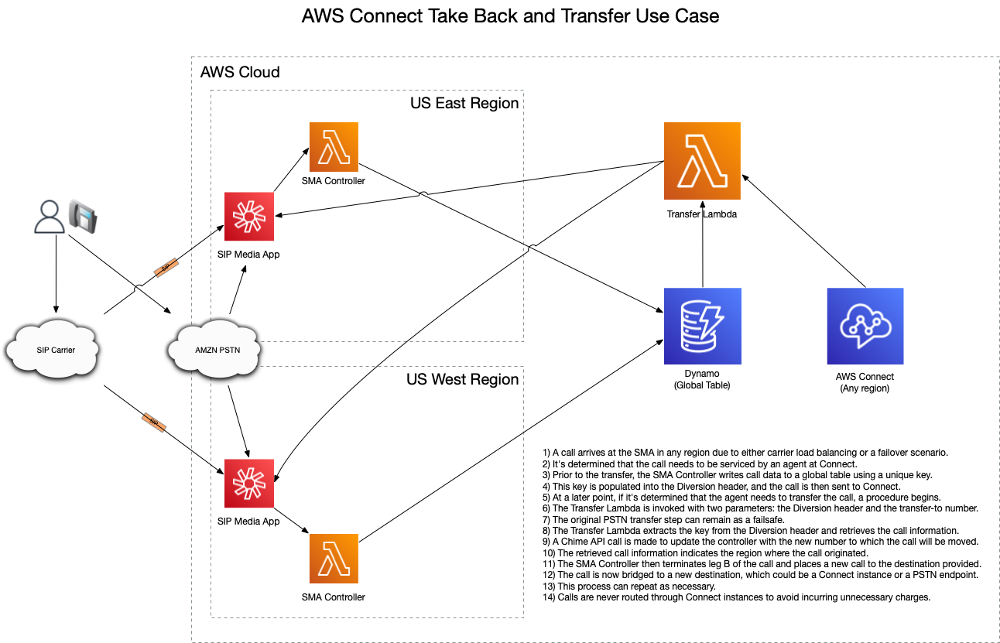
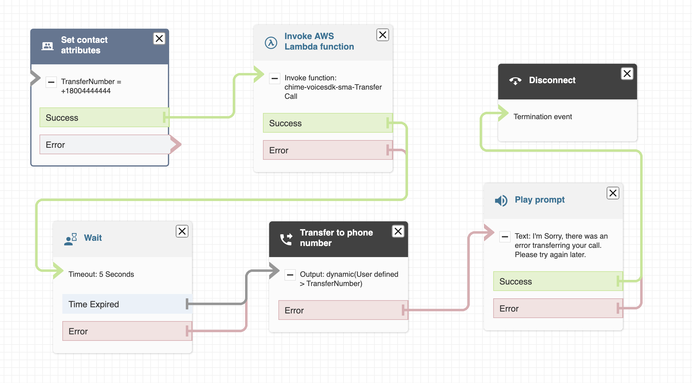
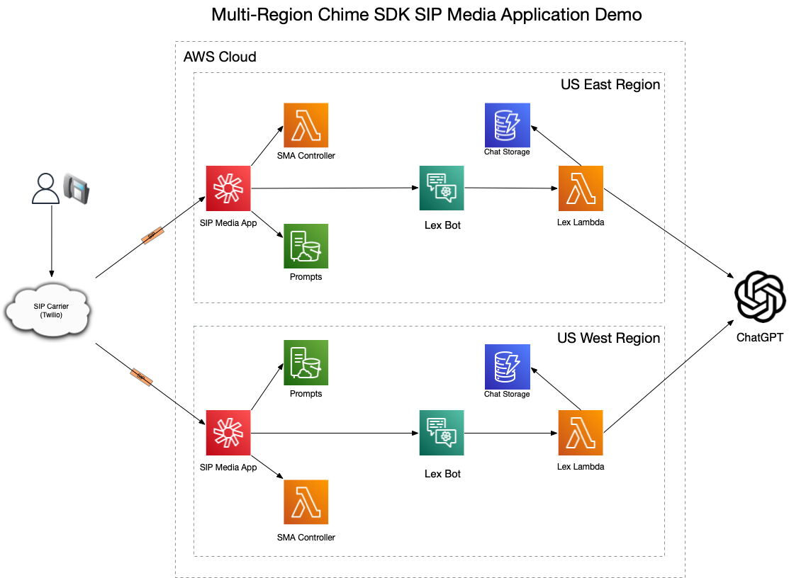
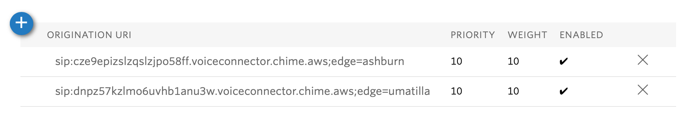
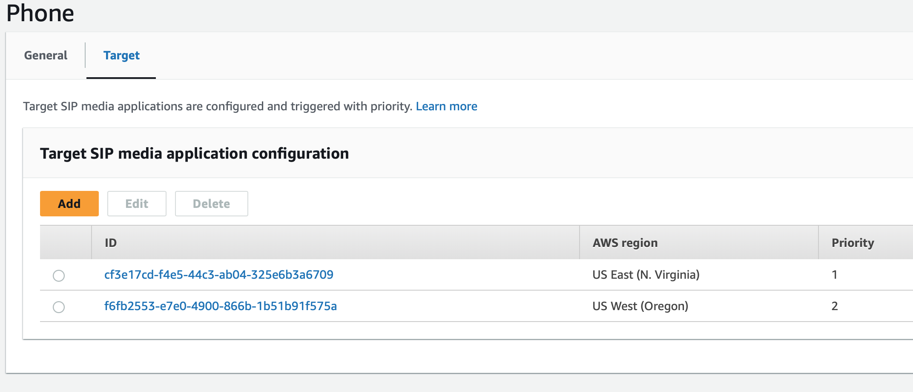

# Amazon Chime SDK SIP Media Application Java Library

## Background

This project provides a library to accelerate the development of [SIP Media Applications](https://docs.aws.amazon.com/chime-sdk/latest/ag/use-sip-apps.html) (SMA) in Java. These apps allow for the deployment of multi-region and fault-tolerant self-service applications. Some benefits of using Chime SDK versus [Amazon Connect](https://aws.amazon.com/pm/connect/) for self-service applications are:

- SIP Ingress
  - Bring your own carrier.
  - Load balance across regions if desired.
- SIP Egress
  - Transfer calls to PBXs or other destinations via SIP for handling (PSTN bypass).
  - Use your preferred carrier to route calls or Amazon.
- Built from the ground up to be carrier-class and multi-region.
- Amazon Chime PSTN numbers can span regions in the US (us-east-1 and us-west-2).
- Deployed as code versus Connect Flows.
  - Source control to manage and track changes.
  - Integrates into DevOps processes already in place.
- Central call control
  - Route calls to multiple Connect instances (many organizations have several instances and other groups on legacy systems).
  - Don't wrap/trombone calls through Connect instances when calls need to be transferred.
- Servicing calls in Chime SDK can potentially reduce costs.
  - SMA calls incur $0.002/min vs Connect's $0.018/min for self-service.
  - PSTN Ingress and Egress charges are the same between Chime and Connect.

## Library Overview

The library provides two approaches: a JSON event mapping model and, on top of that, a flow-based library that allows programmers to develop call flows without having to deal with event handling and flow optimization. The latter enables developers to quickly build applications with minimal coding.

### JSON Java Events

AWS Lambda is excellent at handling events in JSON. AWS provides the [Lambda Java Events](https://github.com/aws/aws-lambda-java-libs/tree/main/aws-lambda-java-events) library, which handles most of the services that directly integrate with Lambda and provides a full Java Object model for the requests and responses. However, the Chime SMA events are not included in this package. This library follows a similar approach and is used as follows:

- You define your Lambda to implement [RequestHandler](https://github.com/aws/aws-lambda-java-libs/blob/main/aws-lambda-java-core/src/main/java/com/amazonaws/services/lambda/runtime/RequestHandler.java)<[SMARequest](ChimeSMAEvent/src/main/java/cloud/cleo/chimesma/model/SMARequest.java), [SMAResponse](ChimeSMAEvent/src/main/java/cloud/cleo/chimesma/model/SMAResponse.java)>.
- Process the incoming request and respond as necessary. Refer to [Helloworld.java](Examples/src/main/java/cloud/cleo/chimesma/examples/response/HelloWorld.java) for an example.
- Note that you are responsible for handling the SMA state machine, and this quickly becomes unmanageable as the complexity of your application increases.
- Use this low-level approach when you need to control every aspect of the state machine.
- For more in-depth information about using the library and writing applications, please refer to the Library [README](ChimeSMAEvent/README.md).

### Java Action Flow Model

Building upon the above, the "Action Flow Model" maps each of the [supported actions for the PSTN Audio service](https://docs.aws.amazon.com/chime-sdk/latest/dg/specify-actions.html) to Java Objects that you can dynamically connect to each other to create flows. These objects are easily extensible, allowing for the creation of complex interactions and routing. This part of the library provides:

- A flow-based approach that makes developing applications easier to understand compared to an event-driven model.
  - The flow is built statically in memory during initialization (SNAP Start Init), enabling very low latency responses.
- Strong Java typing and a builder approach for creating action objects.
- Sensible defaults for most of the action parameters, which can be set or passed into the Lambda (e.g., BOT_ALIAS_ARN to start bot conversations).
- Derived values whenever possible to reduce lines of code.
  - Speak actions require you to set SSML or Text for operations. The flow action takes only a text parameter and determines and sets the correct value when sending back the JSON.
- Response optimization by sending multiple actions at once (SMA supports up to 10).
  - Each action is evaluated to determine whether it can be chained with another before sending the action list.
  - Example: Pause -> Speak -> Pause -> StartRecording -> SpeakAndGetDigits, when sent one by one, would require 4 Lambda calls without optimization.
  - Actions like SpeakAndGetDigits require a result before proceeding and cannot be chained with another action.
- Java Locale support across all relevant actions to easily build multilingual interactions (Prompts, Speak, and Bots).
- Easy extension of existing actions. See [CallAndBridgeActionTBTDiversion.java](Examples/src/main/java/cloud/cleo/chimesma/actions/CallAndBridgeActionTBTDiversion.java), which extends the standard [CallAndBridge](ChimeSMAFlow/src/main/java/cloud/cleo/chimesma/actions/CallAndBridgeAction.java) action to write call information to a DynamoDB table that can be used in a Connect flow to implement take-back and transfer. See the use case later in this document.

To use the Flow Model:

- Simply create a Java Object that inherits from [AbstractFlow](ChimeSMAFlow/src/main/java/cloud/cleo/chimesma/actions/AbstractFlow.java).
- Implement the `getInitialAction()` method, which returns the start of the flow.
- Refer to the flow-based [HelloWorld.java](Examples/src/main/java/cloud/cleo/chimesma/examples/actions/HelloWorld.java) example.
- For more in-depth information about using the library and writing applications, please refer to the Library [README](ChimeSMAFlow/README.md).


## Amazon Connect Take Back and Transfer Use Case

This use case demonstrates sending calls to [Amazon Connect](https://aws.amazon.com/pm/connect/) and then later moving the call to another destination, such as a PSTN number (which could be another Connect instance), SIP destination, or continuing a flow at the SMA Application. Calls are released from the Connect instance (call leg disconnected by the SMA Application) and moved to another destination.

The general steps are as follows:

1. The [CallAndBridgeActionTBTDiversion](Examples/src/main/java/cloud/cleo/chimesma/actions/CallAndBridgeActionTBTDiversion.java) action writes call data to a DynamoDB table prior to actually moving the call.
2. The Connect Script executes a Lambda function to transfer calls.


### High Level Components



### Connect Call Flow

In your Connect flow, let's assume you have the destination number set on the contact attribute "TransferNumber". Normally, you would pass that directly to the "Transfer to phone number" step to place the outbound call. For this use case, we simply insert an "Invoke AWS Lambda function" and "Wait" step into the flow. The original transfer step can be left in place as a failsafe. The wait condition gives the Lambda function time to contact the Chime SDK API to signal the SMA app to disconnect the call. Typically, this entire process executes within a sub-second timeframe.



### Transfer Lambda

When invoking the Lambda from Connect, we pass both the Diversion header (referred to as "Call-Forwarding-Indicator" in Connect) and the TransferNumber.

```plaintext
Diversion: <key>, TransferNumber: <destination>
```


The Lambda function then performs the following steps:

1. Extracts the key from the Diversion header (which is a random E164 number).
2. Executes a DynamoDB call to retrieve the call information, which consists of:
   - AWS Region
   - sipMediaApplicationId
   - transactionId
3. Finally, the Lambda function executes a Chime SDK API call to UpdateSipMediaApplicationCall:
   - The AWS Region is used to initialize the Chime SDK client properly to support calls ingressing from either region.
   - The TransferNumber is passed as a parameter to inform the SMA Handler where to transfer the call.

Sample Lambda code in NodeJS.
  ```javascript
        const {ChimeClient, UpdateSipMediaApplicationCallCommand} = require("@aws-sdk/client-chime");
        const {DynamoDBClient, GetItemCommand} = require("@aws-sdk/client-dynamodb")
        const ddb = new DynamoDBClient();
        const regex = /(\+[0-9]+)/;
        const table_name = process.env.CALLS_TABLE_NAME;
        exports.handler = async function (event) {
            console.log(JSON.stringify(event));
            let match = event.Details.Parameters.Diversion.match(regex);
            console.log('Extracted phone is ' + match[1] );
            
            const dparams = {
                Key : {
                  phoneNumber : {
                    S: match[1]
                  }
                },
                TableName: table_name
            };
            
            const dresponse = await ddb.send(new GetItemCommand(dparams));
            console.log(JSON.stringify(dresponse))
            
            const cparams = {
                SipMediaApplicationId: dresponse.Item.sipMediaApplicationId.S,
                TransactionId: dresponse.Item.transactionId.S,
                Arguments: {
                    phoneNumber: event.Details.Parameters.TransferNumberD
                }   
            };
            // We need to know region before initializing client
            const chime = new ChimeClient({ region: dresponse.Item.region.S,  });
            const cresponse = await chime.send(new UpdateSipMediaApplicationCallCommand(cparams));
            console.log(JSON.stringify(cresponse));
            return {status: 'OK'};
        };
  ```

## Example Flow Application

The [Example Flow](Examples/src/main/java/cloud/cleo/chimesma/examples/actions/ExampleFlow.java) exercises several Actions provided by the Chime SDK. The Connect use case mentioned above is also incorporated into the Demo app.

### High Level Components



### Calling into the Demo Application

#### Twilio

[Twilio SIP Trunking](https://www.twilio.com/docs/sip-trunking) can be used to send calls into your SMA or the SIP carrier of your choice. For this demo, the Twilio number +1-320-495-2425 will be load balanced across regions. The first prompt in the demo announces the region, so you can observe that calling the above number will land you in either us-east-1 or us-west-2. When configuring the Twilio [Origination Settings](https://www.twilio.com/docs/sip-trunking#origination), you can make use of the "edge" setting to optimize the SIP traffic.

In this case, the first SIP URI references a [Voice Connector](https://docs.aws.amazon.com/chime-sdk/latest/ag/voice-connectors.html) in the us-east-1 region. By adding the "edge=ashburn" parameter in Twilio's configuration, the call will be egressed into AWS within us-east-1. The same applies for the "edge=umatilla" parameter, which is Twilio's edge in Oregon (us-west-2). It's recommended to minimize the traversal of traffic over the internet if possible.



#### Chime SDK Phone Number

After provisioning a [phone number in Chime](https://docs.aws.amazon.com/chime-sdk/latest/ag/provision-phone.html), you need to create a [SIP Rule](https://docs.aws.amazon.com/chime-sdk/latest/ag/understand-sip-data-models.html) for the phone number. Chime does not support load balancing, so you must set up an ordered priority. When you call +1-320-200-2007, you will always be routed to the SMA in the us-east-1 region. Only if that region or the Lambda associated with the SMA goes down will you fail over to the us-west-2 region.

Please note that Chime currently provides PSTN numbers only in the United States and not in all countries. If you are deploying in Europe or other regions, you will need to use a SIP carrier like Twilio, as mentioned above. I have tested these configurations in the Frankfurt and London regions without any issues. For a complete list of available regions for Chime SDK PSTN numbers, refer to the PSTN section in the [Available Regions](https://docs.aws.amazon.com/chime-sdk/latest/dg/sdk-available-regions.html) documentation.



#### Asterisk PBX

For testing apps there certainly is no reason to incur PSTN charges, so I use an IP Phone connected to [Asterisk](https://www.asterisk.org) to place 
calls into SMA's.  Like Twilio above, in the [pjsip_wizzard.conf](https://wiki.asterisk.org/wiki/display/AST/PJSIP+Configuration+Wizard) you can create trunks 
for each region endpoint:

```
[aws-chime-east]
type=wizard
transport=transport-udp
remote_hosts=cze9epizslzqslzjpo58ff.voiceconnector.chime.aws
endpoint/disallow=all
endpoint/allow=ulaw
endpoint/direct_media=no
endpoint/dtmf_mode=auto
endpoint/rtp_symmetric=yes

[aws-chime-oregon]
type=wizard
transport=transport-udp
remote_hosts=dnpz57kzlmo6uvhb1anu3w.voiceconnector.chime.aws
endpoint/disallow=all
endpoint/allow=ulaw
endpoint/direct_media=no
endpoint/dtmf_mode=auto
endpoint/rtp_symmetric=yes
```

You can observe no less than 12 endpoints are ready to take your call in each region !!!

```
Asterisk*CLI> pjsip show endpoint aws-chime-oregon 

Endpoint:  aws-chime-oregon                                     Not in use    0 of inf
        Aor:  aws-chime-oregon                                   0
      Contact:  aws-chime-oregon/sip:dnpz57kzlmo6uvhb1anu3 228c75f425 Created       0.000
  Transport:  transport-udp             udp      0      0  0.0.0.0:5060
   Identify:  aws-chime-oregon-identify/aws-chime-oregon
        Match: 99.77.253.106/32
        Match: 99.77.253.110/32
        Match: 99.77.253.109/32
        Match: 99.77.253.104/32
        Match: 99.77.253.102/32
        Match: 99.77.253.107/32
        Match: 99.77.253.103/32
        Match: 99.77.253.105/32
        Match: 99.77.253.11/32
        Match: 99.77.253.0/32
        Match: 99.77.253.108/32
        Match: 99.77.253.100/32
```

In the [extensions.conf](https://wiki.asterisk.org/wiki/display/AST/Contexts%2C+Extensions%2C+and+Priorities) you configure a number you can dial 
to route to the trunks in question.  The number  +1-703-555-0122 is a Chime Call in number than can be used to route to SMA's.  This allows you to 
call into connectors and your SMA with a sip rule without provisioning a phone number at all !

- 290 will try us-east-1 first and if it fails, you hear a prompt (so you know the first region was down) and then it tries the next region
- 291 will call only us-east-1
- 292 will call only us-west-2

```
exten => 290,1,NoOP(Call to AWS Chime with ordered failover)
        same => n,Dial(PJSIP/+17035550122@aws-chime-east)
        same => n,Playback(sorry-youre-having-problems)
        same => n,Dial(PJSIP/+17035550122@aws-chime-oregon)

exten => 291,1,NoOP(Call to AWS Chime East)
        same => n,Dial(PJSIP/+17035550122@aws-chime-east)

exten => 292,1,NoOP(Call to AWS Chime Oregon)
        same => n,Dial(PJSIP/+17035550122@aws-chime-oregon)
```


### Starting the Flow

The demo flow is divided into two main parts to demonstrate moving up and down menu levels:

1. The main menu to handle top-level functions.
2. The recording sub-menu to handle recording and playback of audio.

The initial action is to play a static prompt and proceed to the main menu.

```java
public class ExampleFlow extends AbstractFlow {

    private final static Action MAIN_MENU = getMainMenu();
    private final static Action CALL_RECORDING_MENU = getCallRecordingMenu();
    @Override
    protected Action getInitialAction() {

        // Start with a welcome message and then main menu with region static prompt
        return PlayAudioAction.builder()
                .withKey(System.getenv("AWS_REGION") + "-welcome.wav") // This is always in english
                .withNextAction(MAIN_MENU)
                .withErrorAction(MAIN_MENU)
                .build();

    }

     public static Action getMainMenu() {
        // Main menu will be locale specific prompting
        final var menu = PlayAudioAndGetDigitsAction.builder()
                .withAudioSource(AudioSourceLocale.builder().withKeyLocale("main-menu").build())
                .withFailureAudioSource(AudioSourceLocale.builder().withKeyLocale("try-again").build())
                .withRepeatDurationInMilliseconds(3000)
                .withRepeat(2)
                .withMinNumberOfDigits(1)
                .withMaxNumberOfDigits(1)
                .withInputDigitsRegex("^\\d{1}$")
                .withErrorAction(goodbye)
                .withNextActionF(a -> {
                    switch (a.getReceivedDigits()) {
                        case "1":
                            return lexBotEN;
                        case "2":
                            return lexBotES;
                        case "3":
                            return connect;
                        case "4":
                            return CALL_RECORDING_MENU;
                        default:
                            return goodbye;
                    }
                })
                .build();
...
```

The initial response will make use of the [PlayAudio](https://docs.aws.amazon.com/chime-sdk/latest/dg/play-audio.html) and [PlayAudioAndGetDigits](https://docs.aws.amazon.com/chime-sdk/latest/dg/play-audio-get-digits.html) actions. Both actions utilize static prompts stored in S3. The main menu prompt is locale-specific and can be played in both English and Spanish, as we will see later. These two actions are chainable, so the library will send them both in the initial response.

```json
{
    "SchemaVersion": "1.0",
    "Actions": [
        {
            "Type": "PlayAudio",
            "Parameters": {
                "CallId": "be23f6a9-66f0-4d55-b6d9-b9e614a729ac",
                "ParticipantTag": "LEG-A",
                "AudioSource": {
                    "Type": "S3",
                    "BucketName": "chime-voicesdk-sma-promptbucket-1sr9bfy6k3k30",
                    "Key": "us-west-2-welcome.wav"
                }
            }
        },
        {
            "Type": "PlayAudioAndGetDigits",
            "Parameters": {
                "CallId": "be23f6a9-66f0-4d55-b6d9-b9e614a729ac",
                "ParticipantTag": "LEG-A",
                "InputDigitsRegex": "^\\d{1}$",
                "AudioSource": {
                    "Type": "S3",
                    "BucketName": "chime-voicesdk-sma-promptbucket-1sr9bfy6k3k30",
                    "Key": "main-menu-en-US.wav"
                },
                "FailureAudioSource": {
                    "Type": "S3",
                    "BucketName": "chime-voicesdk-sma-promptbucket-1sr9bfy6k3k30",
                    "Key": "try-again-en-US.wav"
                },
                "MinNumberOfDigits": 1,
                "MaxNumberOfDigits": 1,
                "Repeat": 2,
                "RepeatDurationInMilliseconds": 3000
            }
        }
    ],
    "TransactionAttributes": {
        "CurrentActionId": "6",
        "locale": "en-US",
        "CurrentActionIdList": "18,6"
    }
}
```

### Main Menu

The main menu presents the caller with 4 choices:

- Press 1 for Chat GPT Bot in English.
- Press 2 for Chat GPT Bot in Spanish.
- Press 3 for Connect Take Back and Transfer.
- Press 4 for Audio Recording Menu.
- Any other key ends the call.

After the caller enters a digit (or no input and the timeout occurs), the following code is executed to move the call to the next action.

```java
.withNextActionF(a -> {
    switch (a.getReceivedDigits()) {
        case "1":
            return lexBotEN;
        case "2":
            return lexBotES;
        case "3":
            return connect;
        case "4":
            return CALL_RECORDING_MENU;
        default:
            return goodbye;
    }
})
```

### Lex Bots

Handing control over to a Lex Bot in Chime is similar to how it's done in Amazon Connect. We could have used a Bot to handle the main menu function instead of collecting digits and further delegating intents to other bots or flows. In this example, our Bot defined in the CloudFormation [template](template.yaml) has 3 intents:

- "Quit": The caller is done talking to ChatGPT and wants to move on.
- "Transfer": The caller wants to speak with a real person.
- "FallbackIntent": Anything else the caller asks is passed to ChatGPT for a response, with context maintained in a DynamoDB table.

When the user presses:
- One: Control is passed to our Bot with the locale set to English (en-US), and the welcome prompt is played in English.
- Two: Control is passed to our Bot with the locale set to Spanish (es-US), and the welcome prompt is played in Spanish.

Anytime ".withLocale()" is used on an action, that state is maintained by the library. You can observe this by:
- Pressing Two to go to the Spanish Bot.
- Saying "adiós" to indicate that you're done.
- The next action will then be to go to the main menu, but you will hear the main menu in Spanish because the locale was set in a prior action.
- If you then pressed One, it would set the locale back to English, and when you return to the main menu, it would be in English once again.

Your Lex session is tied to the call ID, so you can do the following:
- Press One for ChatGPT.
- Ask, "What is the biggest lake in Minnesota?"
- ChatGPT: "Lake Superior, anything else?"
- Say, "That's all."
- Back at the main menu now.
- Press One for ChatGPT again.
- Ask, "How deep is that lake?"
- ChatGPT: "Lake Superior is XXX feet deep, etc."

The Bot still retains the context of your conversation with ChatGPT during the call, so it knows that when you come back, you are still referring to Lake Superior. If you tell the Bot that you want to speak with a person, it will return the "Transfer" intent, and the next action will be the Connect use case of take back and transfer, which is the same as pressing 3 at the main menu.

```java
        final var lexBotEN = StartBotConversationAction.builder()
                .withDescription("ChatGPT English")
                .withLocale(english)
                .withContent("What can Chat GPT help you with?")
                .build();

        final var lexBotES = StartBotConversationAction.builder()
                .withDescription("ChatGPT Spanish")
                .withLocale(spanish)
                .withContent("¿En qué puede ayudarte Chat GPT?")
                .build();

        // Two invocations of the bot, so create one function and use for both
        Function<StartBotConversationAction, Action> botNextAction = (a) -> {
            switch (a.getIntentName()) {
                // The Lex bot also has intent to speak with someone
                case "Transfer":
                    return connect;
                case "Quit":
                default:
                    return MAIN_MENU;
            }
        };

        // Both bots are the same, so the handler is the same
        lexBotEN.setNextActionF(botNextAction);
        lexBotES.setNextActionF(botNextAction);
```

### Connect Take Back and Transfer

When pressing 3 or asking the Bot to speak with a person, the call will be transferred to an Amazon Connect instance in us-east-1. This functionality is achieved by extending the base [CallAndBridge](https://docs.aws.amazon.com/chime-sdk/latest/dg/call-and-bridge.html) action. The details of this use case are described in a prior section.

Using this action in the library is no different from using the base [CallAndBridgeAction](ChimeSMAFlow/src/main/java/cloud/cleo/chimesma/actions/CallAndBridgeAction.java). In this case, we are sending the call to a static number ("+15052162949") that points to a sample call flow. The flow executes the transfer Lambda and then transfers the call to "+18004444444," which is a carrier test number (Old MCI number). This is a terminal step, so once you have been transferred, you can simply hang up to release the call resources in Chime.

```java
// Send call to Connect to demo Take Back and Transfer
final var connect = CallAndBridgeActionTBTDiversion.builder()
   .withDescription("Send Call to AWS Connect")
   .withUri("+15052162949")
   .withRingbackToneKeyLocale("transfer")  // If the Spanish locale is set, the caller will hear transferring in Spanish
   .build();
```

This action could be further extended to save the Locale in the DynamoDB table. When the call lands at Connect, a Lambda function could be used to retrieve this information and set the language in the Connect flow or any other data collected in the Chime SMA app, such as caller account number, etc.

### Record Audio Menu

When pressing 4 at the main menu, we go to a sub-menu that uses Speak instead of static prompts like the main menu. The menu options are as follows:

- Pressing one allows you to record audio, which is saved to the default RECORD_BUCKET.
- Pressing two plays back your recorded audio or a message indicating that you have not recorded audio yet.
- Any other key returns you back to the main menu.

Here is an example code snippet that represents the actions and their configuration:

```java
// This menu is just in English, we will use Speak instead of static prompts like the main menu
final var menu = SpeakAndGetDigitsAction.builder()
        .withSpeechParameters(SpeakAndGetDigitsAction.SpeechParameters.builder()
                .withText("Call Recording Menu. Press One to record an Audio File. Press Two to listen to your recorded Audio File. Press any other key to return to the Main Menu.").build())
        .withFailureSpeechParameters(SpeakAndGetDigitsAction.SpeechParameters.builder()
                .withText("Please try again.").build())
        .withRepeatDurationInMilliseconds(3000)
        .withRepeat(2)
        .withMinNumberOfDigits(1)
        .withMaxNumberOfDigits(1)
        .withInputDigitsRegex("^\\d{1}$")
        .withErrorAction(MAIN_MENU)
        .build();

menu.setNextActionF(a -> {
    switch (a.getReceivedDigits()) {
        case "1":
            return recordPrompt;
        case "2":
            final var key = a.getTransactionAttribute(RecordAudioAction.RECORD_AUDIO_KEY);
            if (key != null) {
                // Some Audio has been recorded
                return playAudio;
            } else {
                // No Audio has been recorded
                return noRecording;
            }
        default:
            return MAIN_MENU;
    }
});
```

The [RecordAudio](https://docs.aws.amazon.com/chime-sdk/latest/dg/record-audio.html) action does not provide an indication to start recording, so a beep WAV file is played to indicate that recording is active. Once again, the library optimizes the interaction by sending all the actions at once to create a fluid flow for the caller.

When pressing one to record audio, the SMA response would look like this:

```json
{
    "SchemaVersion": "1.0",
    "Actions": [
        {
            "Type": "Speak",
            "Parameters": {
                "Text": "At the beep, record up to 30 seconds of Audio. Press any key to stop the recording.",
                "CallId": "f085191e-c647-4503-9d3a-3cba41aead2e",
                "LanguageCode": "en-US",
                "TextType": "text",
                "VoiceId": "Joanna"
            }
        },
        {
            "Type": "PlayAudio",
            "Parameters": {
                "CallId": "f085191e-c647-4503-9d3a-3cba41aead2e",
                "AudioSource": {
                    "Type": "S3",
                    "BucketName": "chime-voicesdk-sma-promptbucket-1sr9bfy6k3k30",
                    "Key": "beep.wav"
                }
            }
        },
        {
            "Type": "RecordAudio",
            "Parameters": {
                "CallId": "f085191e-c647-4503-9d3a-3cba41aead2e",
                "DurationInSeconds": 30,
                "SilenceDurationInSeconds": 5,
                "RecordingTerminators": [
                    "0","1","2","3","4","5","6","7","8","9","#","*"
                ],
                "RecordingDestination": {
                    "Type": "S3",
                    "BucketName": "chime-voicesdk-sma-recordbucket-rfr6d796zj6i"
                }
            }
        }
    ],
    "TransactionAttributes": {
        "CurrentActionId": "13",
        "locale": "en-US",
        "CurrentActionIdList": "15,14,13"
    }
}
```

This response includes the Speak action to prompt the user, the PlayAudio action to play the beep sound, and the RecordAudio action to record the audio. The transaction attributes maintain the current action and locale information for future references.

### Wrapping Up

This library, in combination with the CloudFormation template, demonstrates the following capabilities:

- Deployment of resilient multi-region voice applications.
- Creation of static prompts with Polly at deploy time to save costs on Polly usage.
- Deployment of static prompt files with the application.
- Easy integration with source control and pipeline deployment using "sam deploy".
- Programming flows in Java that are easy to understand compared to the SMA Event handling model.
- Extensibility of actions to keep flows concise and easy to understand.
- Utilization of Lambda SNAP Start to improve latency and performance.
- Locale support for multi-lingual applications.
- Leveraging the full power of Java for routing decisions and input/output to the actions.

In the future, some additions that could be made to the demo include:

- Transfer action that uses a global DynamoDB table to map logical names to transfer destinations, such as SIP or PSTN, with additional information like "Queue" or "Skill" names for Connect to pick up.
- Time of Day action that retrieves hours from an API or DynamoDB table, allowing for outputs such as Open/Closed status and support for holiday/special hours.
- Utilizing [Function Calling](https://platform.openai.com/docs/guides/gpt/function-calling) to enhance the capabilities of the ChatGPT bot.

These enhancements would further expand the functionality and flexibility of the library.

## Deploy the Project

The Serverless Application Model Command Line Interface (SAM CLI) is an extension of the AWS CLI that adds functionality for building and testing Lambda applications.  
Before proceeding, it is assumed you have valid AWS credentials setup with the AWS CLI and permissions to perform CloudFormation stack operations.

To use the SAM CLI, you need the following tools.

* SAM CLI - [Install the SAM CLI](https://docs.aws.amazon.com/serverless-application-model/latest/developerguide/serverless-sam-cli-install.html)
* Java17 - [Install the Java 11](https://docs.aws.amazon.com/corretto/latest/corretto-17-ug/downloads-list.html)
* Maven - [Install Maven](https://maven.apache.org/install.html)

If you have brew installed then
```bash
brew install aws-sam-cli
brew install corretto17
brew install maven
```

To build and deploy, run the following in your shell.  Note: you must edit the [samconfig.toml](samconfig.toml) and change the parameteres to 
taste before running the build like the Connect Instance ID and SMA ID to ones that exist within that region.

```bash
git clone https://github.com/docwho2/java-chime-voicesdk-sma.git
cd java-chime-voicesdk-sma
./init.bash
sam build
sam deploy --config-env east
sam deploy --config-env west
```

The commands perform the follwoing operations:
- Clones the repository into your local directory
- Change directory into the cloned repository
- Set up some required components like the V4 Java Events library that is not published yet (this is a sub-module) and install the parent POM used by Lambda functions.
- Build the components that will be deployed by SAM
- Package and deploy the project to us-east-1
- Package and deploy the project to us-west-2

You will see the progress as the stack deploys.  As metntioned earlier, you will need to put your OpenAI API Key into parameter store or the deploy will error, but it will give you an error message 
that tells you there is no value for "OPENAI_API_KEY" in the [Parameter Store](https://docs.aws.amazon.com/systems-manager/latest/userguide/systems-manager-parameter-store.html).


## Fetch, tail, and filter Lambda function logs

To simplify troubleshooting, SAM CLI has a command called `sam logs`. `sam logs` lets you fetch logs generated by the deployed Lambda functions from the command line. In addition to printing the logs on the terminal, this command has several nifty features to help you quickly see what's going on with the demo.


```bash
sam logs --tail
```

Example:
```
2023/07/05/[56]374cd7798d2a4e36a494a23d658b9741 2023-07-05T10:16:34.013000 RESTORE_START Runtime Version: java:11.v21	Runtime Version ARN: arn:aws:lambda:us-east-1::runtime:156ab0dc268a6b4a8dedcbcf0974795cafba2ee8760fe386062fffdbb887b971
2023/07/05/[56]374cd7798d2a4e36a494a23d658b9741 2023-07-05T10:16:34.376000 RESTORE_REPORT Restore Duration: 511.25 ms
2023/07/05/[56]374cd7798d2a4e36a494a23d658b9741 2023-07-05T10:16:34.379000 START RequestId: b771fecc-1b53-4faf-922d-1d74357b1676 Version: 56
2023/07/05/[56]374cd7798d2a4e36a494a23d658b9741 2023-07-05T10:16:34.565000 b771fecc-1b53-4faf-922d-1d74357b1676 DEBUG AbstractFlow:214 - SMARequest(schemaVersion=1.0, sequence=1, invocationEventType=NEW_INBOUND_CALL, callDetails=SMARequest.CallDetails(transactionId=6600de06-fc5a-4a57-8c11-420ccae6f93b, transactionAttributes=null, awsAccountId=364253738352, awsRegion=us-east-1, sipMediaApplicationId=cf3e17cd-f4e5-44c3-ab04-325e6b3a6709, participants=[SMARequest.Participant(callId=6cbd7153-b1cd-48b1-8598-9687f6903db1, participantTag=LEG-A, to=+17035550122, from=+16128140714, direction=Inbound, startTime=2023-07-05T10:16:33.239Z, status=null)]), errorType=null, errorMessage=null, actionData=null)
2023/07/05/[56]374cd7798d2a4e36a494a23d658b9741 2023-07-05T10:16:34.566000 b771fecc-1b53-4faf-922d-1d74357b1676 DEBUG AbstractFlow:219 - New Inbound Call, starting flow
2023/07/05/[56]374cd7798d2a4e36a494a23d658b9741 2023-07-05T10:16:34.567000 b771fecc-1b53-4faf-922d-1d74357b1676 INFO  AbstractFlow:149 - Adding action PlayAudio key=[us-east-1-welcome.wav] bucket=[chime-voicesdk-sma-promptbucket-1p1tvnc4izve]
2023/07/05/[56]374cd7798d2a4e36a494a23d658b9741 2023-07-05T10:16:34.567000 b771fecc-1b53-4faf-922d-1d74357b1676 INFO  AbstractFlow:157 - Chaining action PlayAudioAndGetDigits [^\d{1}$]
2023/07/05/[56]374cd7798d2a4e36a494a23d658b9741 2023-07-05T10:16:34.595000 b771fecc-1b53-4faf-922d-1d74357b1676 INFO  AbstractFlow:238 - New Call Handler Code Here
2023/07/05/[56]374cd7798d2a4e36a494a23d658b9741 2023-07-05T10:16:34.682000 b771fecc-1b53-4faf-922d-1d74357b1676 DEBUG AbstractFlow:314 - {"SchemaVersion":"1.0","Actions":[{"Type":"PlayAudio","Parameters":{"CallId":"6cbd7153-b1cd-48b1-8598-9687f6903db1","ParticipantTag":"LEG-A","AudioSource":{"Type":"S3","BucketName":"chime-voicesdk-sma-promptbucket-1p1tvnc4izve","Key":"us-east-1-welcome.wav"}}},{"Type":"PlayAudioAndGetDigits","Parameters":{"CallId":"6cbd7153-b1cd-48b1-8598-9687f6903db1","ParticipantTag":"LEG-A","InputDigitsRegex":"^\\d{1}$","AudioSource":{"Type":"S3","BucketName":"chime-voicesdk-sma-promptbucket-1p1tvnc4izve","Key":"main-menu-en-US.wav"},"FailureAudioSource":{"Type":"S3","BucketName":"chime-voicesdk-sma-promptbucket-1p1tvnc4izve","Key":"try-again-en-US.wav"},"MinNumberOfDigits":1,"MaxNumberOfDigits":1,"Repeat":2,"RepeatDurationInMilliseconds":3000}}],"TransactionAttributes":{"CurrentActionId":"6","locale":"en-US","CurrentActionIdList":"18,6"}}
2023/07/05/[56]374cd7798d2a4e36a494a23d658b9741 2023-07-05T10:16:34.686000 END RequestId: b771fecc-1b53-4faf-922d-1d74357b1676
2023/07/05/[56]374cd7798d2a4e36a494a23d658b9741 2023-07-05T10:16:34.686000 REPORT RequestId: b771fecc-1b53-4faf-922d-1d74357b1676	Duration: 306.34 ms	Billed Duration: 610 ms	Memory Size: 3009 MB	Max Memory Used: 155 MB	Restore Duration: 511.25 ms	Billed Restore Duration: 303 ms	
2023/07/05/[56]374cd7798d2a4e36a494a23d658b9741 2023-07-05T10:16:43.928000 START RequestId: 7667964c-05ac-4891-b28c-56f1282ebc1b Version: 56
2023/07/05/[56]374cd7798d2a4e36a494a23d658b9741 2023-07-05T10:16:44.025000 7667964c-05ac-4891-b28c-56f1282ebc1b DEBUG AbstractFlow:214 - SMARequest(schemaVersion=1.0, sequence=2, invocationEventType=ACTION_SUCCESSFUL, callDetails=SMARequest.CallDetails(transactionId=6600de06-fc5a-4a57-8c11-420ccae6f93b, transactionAttributes={CurrentActionId=6, locale=en-US, CurrentActionIdList=18,6}, awsAccountId=364253738352, awsRegion=us-east-1, sipMediaApplicationId=cf3e17cd-f4e5-44c3-ab04-325e6b3a6709, participants=[SMARequest.Participant(callId=6cbd7153-b1cd-48b1-8598-9687f6903db1, participantTag=LEG-A, to=+17035550122, from=+16128140714, direction=Inbound, startTime=2023-07-05T10:16:33.239Z, status=Connected)]), errorType=null, errorMessage=null, actionData=ResponsePlayAudioAndGetDigits(type=PlayAudioAndGetDigits, parameters=ResponsePlayAudioAndGetDigits.Parameters(callId=6cbd7153-b1cd-48b1-8598-9687f6903db1, participantTag=LEG-A, inputDigitsRegex=^\d{1}$, audioSource=ResponsePlayAudio.AudioSource(type=S3, bucketName=chime-voicesdk-sma-promptbucket-1p1tvnc4izve, key=main-menu-en-US.wav), failureAudioSource=ResponsePlayAudio.AudioSource(type=S3, bucketName=chime-voicesdk-sma-promptbucket-1p1tvnc4izve, key=try-again-en-US.wav), minNumberOfDigits=1, maxNumberOfDigits=1, terminatorDigits=null, inBetweenDigitsDurationInMilliseconds=3000, repeat=2, repeatDurationInMilliseconds=3000), receivedDigits=1, errorType=null, errorMessage=null))
2023/07/05/[56]374cd7798d2a4e36a494a23d658b9741 2023-07-05T10:16:44.029000 7667964c-05ac-4891-b28c-56f1282ebc1b DEBUG AbstractFlow:207 - Current Action is PlayAudioAndGetDigits [^\d{1}$] with ID 6
2023/07/05/[56]374cd7798d2a4e36a494a23d658b9741 2023-07-05T10:16:44.030000 7667964c-05ac-4891-b28c-56f1282ebc1b DEBUG Action:180 - This Action has a locale set to en_US
2023/07/05/[56]374cd7798d2a4e36a494a23d658b9741 2023-07-05T10:16:44.031000 7667964c-05ac-4891-b28c-56f1282ebc1b INFO  AbstractFlow:149 - Adding action StartBotConversation desc=[ChatGPT English] da=[ElicitIntent] content=[What can Chat GPT help you with?]
2023/07/05/[56]374cd7798d2a4e36a494a23d658b9741 2023-07-05T10:16:44.045000 7667964c-05ac-4891-b28c-56f1282ebc1b INFO  AbstractFlow:340 - Moving to next action: StartBotConversation desc=[ChatGPT English] da=[ElicitIntent] content=[What can Chat GPT help you with?]
2023/07/05/[56]374cd7798d2a4e36a494a23d658b9741 2023-07-05T10:16:44.065000 7667964c-05ac-4891-b28c-56f1282ebc1b DEBUG AbstractFlow:314 - {"SchemaVersion":"1.0","Actions":[{"Type":"StartBotConversation","Parameters":{"CallId":"6cbd7153-b1cd-48b1-8598-9687f6903db1","BotAliasArn":"arn:aws:lex:us-east-1:364253738352:bot-alias/GDGCNIR2DC/NMJJX2WV6A","LocaleId":"en_US","Configuration":{"SessionState":{"DialogAction":{"Type":"ElicitIntent"}},"WelcomeMessages":[{"Content":"What can Chat GPT help you with?","ContentType":"PlainText"}]}}}],"TransactionAttributes":{"CurrentActionId":"4","locale":"en-US","CurrentActionIdList":"4"}}
2023/07/05/[56]374cd7798d2a4e36a494a23d658b9741 2023-07-05T10:16:44.067000 END RequestId: 7667964c-05ac-4891-b28c-56f1282ebc1b
2023/07/05/[56]374cd7798d2a4e36a494a23d658b9741 2023-07-05T10:16:44.067000 REPORT RequestId: 7667964c-05ac-4891-b28c-56f1282ebc1b	Duration: 138.27 ms	Billed Duration: 139 ms	Memory Size: 3009 MB	Max Memory Used: 159 MB	
2023/07/05/[56]374cd7798d2a4e36a494a23d658b9741 2023-07-05T10:16:55.980000 START RequestId: c5617d6b-3eff-409b-bff8-7f6ed83c319a Version: 56
2023/07/05/[56]374cd7798d2a4e36a494a23d658b9741 2023-07-05T10:16:56.025000 c5617d6b-3eff-409b-bff8-7f6ed83c319a DEBUG AbstractFlow:214 - SMARequest(schemaVersion=1.0, sequence=3, invocationEventType=ACTION_SUCCESSFUL, callDetails=SMARequest.CallDetails(transactionId=6600de06-fc5a-4a57-8c11-420ccae6f93b, transactionAttributes={CurrentActionId=4, locale=en-US, CurrentActionIdList=4}, awsAccountId=364253738352, awsRegion=us-east-1, sipMediaApplicationId=cf3e17cd-f4e5-44c3-ab04-325e6b3a6709, participants=[SMARequest.Participant(callId=6cbd7153-b1cd-48b1-8598-9687f6903db1, participantTag=LEG-A, to=+17035550122, from=+16128140714, direction=Inbound, startTime=2023-07-05T10:16:33.239Z, status=Connected)]), errorType=null, errorMessage=null, actionData=ActionDataStartBotConversation(callId=null, type=StartBotConversation, parameters=ResponseStartBotConversation.Parameters(callId=6cbd7153-b1cd-48b1-8598-9687f6903db1, participantTag=LEG-A, botAliasArn=arn:aws:lex:us-east-1:364253738352:bot-alias/GDGCNIR2DC/NMJJX2WV6A, localeId=en_US, configuration=ResponseStartBotConversation.Configuration(sessionState=ResponseStartBotConversation.SessionState(sessionAttributes=null, dialogAction=ResponseStartBotConversation.DialogAction(type=ElicitIntent), intent=null), welcomeMessages=[ResponseStartBotConversation.WelcomeMessage(content=What can Chat GPT help you with?, contentType=PlainText)])), intentResult=ActionDataStartBotConversation.IntentResult(sessionId=6cbd7153-b1cd-48b1-8598-9687f6903db1, sessionState=ResponseStartBotConversation.SessionState(sessionAttributes={}, dialogAction=null, intent=ResponseStartBotConversation.Intent(name=Quit, Slots={}, state=ReadyForFulfillment, confirmationState=None)), interpretations=[ActionDataStartBotConversation.Interpretation(intent=ResponseStartBotConversation.Intent(name=Quit, Slots={}, state=ReadyForFulfillment, confirmationState=None), nluConfidence=ActionDataStartBotConversation.NluConfidence(score=1.0)), ActionDataStartBotConversation.Interpretation(intent=ResponseStartBotConversation.Intent(name=FallbackIntent, Slots={}, state=null, confirmationState=null), nluConfidence=null), ActionDataStartBotConversation.Interpretation(intent=ResponseStartBotConversation.Intent(name=Transfer, Slots={}, state=null, confirmationState=null), nluConfidence=ActionDataStartBotConversation.NluConfidence(score=0.42))]), errorType=null, errorMessage=null))
2023/07/05/[56]374cd7798d2a4e36a494a23d658b9741 2023-07-05T10:16:56.026000 c5617d6b-3eff-409b-bff8-7f6ed83c319a DEBUG Action:180 - This Action has a locale set to en_US
2023/07/05/[56]374cd7798d2a4e36a494a23d658b9741 2023-07-05T10:16:56.026000 c5617d6b-3eff-409b-bff8-7f6ed83c319a DEBUG AbstractFlow:207 - Current Action is StartBotConversation desc=[ChatGPT English] da=[ElicitIntent] content=[What can Chat GPT help you with?] with ID 4
2023/07/05/[56]374cd7798d2a4e36a494a23d658b9741 2023-07-05T10:16:56.026000 c5617d6b-3eff-409b-bff8-7f6ed83c319a DEBUG Action:99 - Lex Bot has finished and Intent is Quit
2023/07/05/[56]374cd7798d2a4e36a494a23d658b9741 2023-07-05T10:16:56.027000 c5617d6b-3eff-409b-bff8-7f6ed83c319a INFO  AbstractFlow:149 - Adding action PlayAudioAndGetDigits [^\d{1}$]
2023/07/05/[56]374cd7798d2a4e36a494a23d658b9741 2023-07-05T10:16:56.027000 c5617d6b-3eff-409b-bff8-7f6ed83c319a INFO  AbstractFlow:340 - Moving to next action: PlayAudioAndGetDigits [^\d{1}$]
2023/07/05/[56]374cd7798d2a4e36a494a23d658b9741 2023-07-05T10:16:56.028000 c5617d6b-3eff-409b-bff8-7f6ed83c319a DEBUG AbstractFlow:314 - {"SchemaVersion":"1.0","Actions":[{"Type":"PlayAudioAndGetDigits","Parameters":{"CallId":"6cbd7153-b1cd-48b1-8598-9687f6903db1","ParticipantTag":"LEG-A","InputDigitsRegex":"^\\d{1}$","AudioSource":{"Type":"S3","BucketName":"chime-voicesdk-sma-promptbucket-1p1tvnc4izve","Key":"main-menu-en-US.wav"},"FailureAudioSource":{"Type":"S3","BucketName":"chime-voicesdk-sma-promptbucket-1p1tvnc4izve","Key":"try-again-en-US.wav"},"MinNumberOfDigits":1,"MaxNumberOfDigits":1,"Repeat":2,"RepeatDurationInMilliseconds":3000}}],"TransactionAttributes":{"CurrentActionId":"6","locale":"en-US","CurrentActionIdList":"6","LexLastMatchedIntent":"Quit"}}
2023/07/05/[56]374cd7798d2a4e36a494a23d658b9741 2023-07-05T10:16:56.031000 END RequestId: c5617d6b-3eff-409b-bff8-7f6ed83c319a
2023/07/05/[56]374cd7798d2a4e36a494a23d658b9741 2023-07-05T10:16:56.031000 REPORT RequestId: c5617d6b-3eff-409b-bff8-7f6ed83c319a	Duration: 50.76 ms	Billed Duration: 51 ms	Memory Size: 3009 MB	Max Memory Used: 159 MB	
2023/07/05/[56]374cd7798d2a4e36a494a23d658b9741 2023-07-05T10:16:58.051000 START RequestId: 09cea32b-12e6-4283-9092-15e3fd5eabf8 Version: 56
2023/07/05/[56]374cd7798d2a4e36a494a23d658b9741 2023-07-05T10:16:58.054000 09cea32b-12e6-4283-9092-15e3fd5eabf8 DEBUG AbstractFlow:214 - SMARequest(schemaVersion=1.0, sequence=4, invocationEventType=ACTION_SUCCESSFUL, callDetails=SMARequest.CallDetails(transactionId=6600de06-fc5a-4a57-8c11-420ccae6f93b, transactionAttributes={CurrentActionId=6, LexLastMatchedIntent=Quit, locale=en-US, CurrentActionIdList=6}, awsAccountId=364253738352, awsRegion=us-east-1, sipMediaApplicationId=cf3e17cd-f4e5-44c3-ab04-325e6b3a6709, participants=[SMARequest.Participant(callId=6cbd7153-b1cd-48b1-8598-9687f6903db1, participantTag=LEG-A, to=+17035550122, from=+16128140714, direction=Inbound, startTime=2023-07-05T10:16:33.239Z, status=Connected)]), errorType=null, errorMessage=null, actionData=ResponsePlayAudioAndGetDigits(type=PlayAudioAndGetDigits, parameters=ResponsePlayAudioAndGetDigits.Parameters(callId=6cbd7153-b1cd-48b1-8598-9687f6903db1, participantTag=LEG-A, inputDigitsRegex=^\d{1}$, audioSource=ResponsePlayAudio.AudioSource(type=S3, bucketName=chime-voicesdk-sma-promptbucket-1p1tvnc4izve, key=main-menu-en-US.wav), failureAudioSource=ResponsePlayAudio.AudioSource(type=S3, bucketName=chime-voicesdk-sma-promptbucket-1p1tvnc4izve, key=try-again-en-US.wav), minNumberOfDigits=1, maxNumberOfDigits=1, terminatorDigits=null, inBetweenDigitsDurationInMilliseconds=3000, repeat=2, repeatDurationInMilliseconds=3000), receivedDigits=8, errorType=null, errorMessage=null))
2023/07/05/[56]374cd7798d2a4e36a494a23d658b9741 2023-07-05T10:16:58.054000 09cea32b-12e6-4283-9092-15e3fd5eabf8 DEBUG AbstractFlow:207 - Current Action is PlayAudioAndGetDigits [^\d{1}$] with ID 6
2023/07/05/[56]374cd7798d2a4e36a494a23d658b9741 2023-07-05T10:16:58.054000 09cea32b-12e6-4283-9092-15e3fd5eabf8 INFO  AbstractFlow:149 - Adding action PlayAudio desc=[Say Goodbye] keyL=[goodbye] bucket=[chime-voicesdk-sma-promptbucket-1p1tvnc4izve]
2023/07/05/[56]374cd7798d2a4e36a494a23d658b9741 2023-07-05T10:16:58.055000 09cea32b-12e6-4283-9092-15e3fd5eabf8 INFO  AbstractFlow:157 - Chaining action Hangup desc=[This is my last step]
2023/07/05/[56]374cd7798d2a4e36a494a23d658b9741 2023-07-05T10:16:58.057000 09cea32b-12e6-4283-9092-15e3fd5eabf8 INFO  AbstractFlow:340 - Moving to next action: PlayAudio desc=[Say Goodbye] keyL=[goodbye] bucket=[chime-voicesdk-sma-promptbucket-1p1tvnc4izve]
2023/07/05/[56]374cd7798d2a4e36a494a23d658b9741 2023-07-05T10:16:58.060000 09cea32b-12e6-4283-9092-15e3fd5eabf8 DEBUG AbstractFlow:314 - {"SchemaVersion":"1.0","Actions":[{"Type":"PlayAudio","Parameters":{"CallId":"6cbd7153-b1cd-48b1-8598-9687f6903db1","ParticipantTag":"LEG-A","AudioSource":{"Type":"S3","BucketName":"chime-voicesdk-sma-promptbucket-1p1tvnc4izve","Key":"goodbye-en-US.wav"}}},{"Type":"Hangup","Parameters":{"CallId":"6cbd7153-b1cd-48b1-8598-9687f6903db1"}}],"TransactionAttributes":{"CurrentActionId":"1","LexLastMatchedIntent":"Quit","locale":"en-US","CurrentActionIdList":"2,1"}}
2023/07/05/[56]374cd7798d2a4e36a494a23d658b9741 2023-07-05T10:16:58.061000 END RequestId: 09cea32b-12e6-4283-9092-15e3fd5eabf8
2023/07/05/[56]374cd7798d2a4e36a494a23d658b9741 2023-07-05T10:16:58.061000 REPORT RequestId: 09cea32b-12e6-4283-9092-15e3fd5eabf8	Duration: 10.09 ms	Billed Duration: 11 ms	Memory Size: 3009 MB	Max Memory Used: 160 MB	
2023/07/05/[56]374cd7798d2a4e36a494a23d658b9741 2023-07-05T10:17:00.009000 START RequestId: 010f6002-d185-4e96-9971-5360a2c6aa72 Version: 56
2023/07/05/[56]374cd7798d2a4e36a494a23d658b9741 2023-07-05T10:17:00.014000 010f6002-d185-4e96-9971-5360a2c6aa72 DEBUG AbstractFlow:214 - SMARequest(schemaVersion=1.0, sequence=5, invocationEventType=HANGUP, callDetails=SMARequest.CallDetails(transactionId=6600de06-fc5a-4a57-8c11-420ccae6f93b, transactionAttributes={CurrentActionId=1, LexLastMatchedIntent=Quit, locale=en-US, CurrentActionIdList=2,1}, awsAccountId=364253738352, awsRegion=us-east-1, sipMediaApplicationId=cf3e17cd-f4e5-44c3-ab04-325e6b3a6709, participants=[SMARequest.Participant(callId=6cbd7153-b1cd-48b1-8598-9687f6903db1, participantTag=LEG-A, to=+17035550122, from=+16128140714, direction=Inbound, startTime=2023-07-05T10:16:33.239Z, status=Disconnected)]), errorType=null, errorMessage=null, actionData=ResponseHangup(type=Hangup, parameters=ResponseHangup.Parameters(callId=6cbd7153-b1cd-48b1-8598-9687f6903db1, participantTag=LEG-A, sipResponseCode=null)))
2023/07/05/[56]374cd7798d2a4e36a494a23d658b9741 2023-07-05T10:17:00.015000 010f6002-d185-4e96-9971-5360a2c6aa72 DEBUG AbstractFlow:270 - Call Was disconnected by [Application], sending empty response
2023/07/05/[56]374cd7798d2a4e36a494a23d658b9741 2023-07-05T10:17:00.015000 010f6002-d185-4e96-9971-5360a2c6aa72 DEBUG AbstractFlow:207 - Current Action is Hangup desc=[This is my last step] with ID 1
2023/07/05/[56]374cd7798d2a4e36a494a23d658b9741 2023-07-05T10:17:00.015000 010f6002-d185-4e96-9971-5360a2c6aa72 INFO  AbstractFlow:243 - Hangup Handler Code Here
2023/07/05/[56]374cd7798d2a4e36a494a23d658b9741 2023-07-05T10:17:00.016000 010f6002-d185-4e96-9971-5360a2c6aa72 DEBUG AbstractFlow:314 - {"SchemaVersion":"1.0","Actions":[]}
2023/07/05/[56]374cd7798d2a4e36a494a23d658b9741 2023-07-05T10:17:00.017000 END RequestId: 010f6002-d185-4e96-9971-5360a2c6aa72
2023/07/05/[56]374cd7798d2a4e36a494a23d658b9741 2023-07-05T10:17:00.017000 REPORT RequestId: 010f6002-d185-4e96-9971-5360a2c6aa72	Duration: 8.31 ms	Billed Duration: 9 ms	Memory Size: 3009 MB	Max Memory Used: 160 MB	

^C CTRL+C received, cancelling...                                              
```

You can find more information and examples about filtering Lambda function logs in the [SAM CLI Documentation](https://docs.aws.amazon.com/serverless-application-model/latest/developerguide/serverless-sam-cli-logging.html).


## Cleanup

To delete the demo, use the SAM CLI.

You can run the following:

```bash
sam delete --config-env east
sam delete --config-env west
```

## Sample Deploy Output
```
java-chime-voicesdk-sma$ sam deploy --config-env west

		Managed S3 bucket: aws-sam-cli-managed-default-samclisourcebucket-13jnbeuzx2
		A different default S3 bucket can be set in samconfig.toml
		Or by specifying --s3-bucket explicitly.
	Uploading to chime-voicesdk-sma/0934badf714b3b6d4be6b4716f73d980  17401808 / 17401808  (100.00%)
File with same data already exists at chime-voicesdk-sma/0934badf714b3b6d4be6b4716f73d980, skipping upload                                        
	Uploading to chime-voicesdk-sma/3dd27d8c98d6bee8bdcca98c26123f26  14703860 / 14703860  (100.00%)
	Uploading to chime-voicesdk-sma/2eac5038f204c6de13a836fb2da6efb9  22977524 / 22977524  (100.00%)

	Deploying with following values
	===============================
	Stack name                   : chime-voicesdk-sma
	Region                       : us-west-2
	Confirm changeset            : False
	Disable rollback             : False
	Deployment s3 bucket         : aws-sam-cli-managed-default-samclisourcebucket-13jnbug4euzx2
	Capabilities                 : ["CAPABILITY_IAM"]
	Parameter overrides          : {"SMAID": "f6fb2553-e7e0-4900-866b-1b51b91f575a", "CONNECTID": "e8fac445-d291-407e-8fd7-c6296395c2ab"}
	Signing Profiles             : {}

Initiating deployment
=====================

	Uploading to chime-voicesdk-sma/93e0edbe536d96ab0deced939610d637.template  22349 / 22349  (100.00%)


Waiting for changeset to be created..

CloudFormation stack changeset
---------------------------------------------------------------------------------------------------------------------------------------------
Operation                           LogicalResourceId                   ResourceType                        Replacement                       
---------------------------------------------------------------------------------------------------------------------------------------------
+ Add                               BotAliasGPT                         AWS::Lex::BotAlias                  N/A                               
+ Add                               BotRuntimeRole                      AWS::IAM::Role                      N/A                               
+ Add                               BotVersionGPT                       AWS::Lex::BotVersion                N/A                               
+ Add                               ChatGPTAliasSNAPSTART               AWS::Lambda::Alias                  N/A                               
+ Add                               ChatGPTRole                         AWS::IAM::Role                      N/A                               
+ Add                               ChatGPTVersion3d508bab8c            AWS::Lambda::Version                N/A                               
+ Add                               ChatGPT                             AWS::Lambda::Function               N/A                               
+ Add                               ChimeCallLexGPT                     AWS::Lex::ResourcePolicy            N/A                               
+ Add                               ChimePolicy                         AWS::IAM::ManagedPolicy             N/A                               
+ Add                               ChimeSMAPerm                        AWS::Lambda::Permission             N/A                               
+ Add                               ChimeSMARole                        AWS::IAM::Role                      N/A                               
+ Add                               ChimeSMA                            AWS::Lambda::Function               N/A                               
+ Add                               GoodbyePromptEN                     Custom::PromptCreator               N/A                               
+ Add                               GoodbyePromptES                     Custom::PromptCreator               N/A                               
+ Add                               LexBotGPT                           AWS::Lex::Bot                       N/A                               
+ Add                               LexToChatGPTPerm                    AWS::Lambda::Permission             N/A                               
+ Add                               LexToChatGPTSnapPerm                AWS::Lambda::Permission             N/A                               
+ Add                               MainMenuEN                          Custom::PromptCreator               N/A                               
+ Add                               MainMenuES                          Custom::PromptCreator               N/A                               
+ Add                               MainPromptEast                      Custom::PromptCreator               N/A                               
+ Add                               MainPromptWest                      Custom::PromptCreator               N/A                               
+ Add                               PromptBucketPolicy                  AWS::S3::BucketPolicy               N/A                               
+ Add                               PromptBucket                        AWS::S3::Bucket                     N/A                               
+ Add                               PromptCopierRole                    AWS::IAM::Role                      N/A                               
+ Add                               PromptCopier                        AWS::Lambda::Function               N/A                               
+ Add                               PromptCreatorRole                   AWS::IAM::Role                      N/A                               
+ Add                               PromptCreator                       AWS::Lambda::Function               N/A                               
+ Add                               RecordBucketPolicy                  AWS::S3::BucketPolicy               N/A                               
+ Add                               RecordBucket                        AWS::S3::Bucket                     N/A                               
+ Add                               SessionTable                        AWS::DynamoDB::Table                N/A                               
+ Add                               StaticPrompts                       Custom::PromptCopier                N/A                               
+ Add                               TansferPromptEN                     Custom::PromptCreator               N/A                               
+ Add                               TansferPromptES                     Custom::PromptCreator               N/A                               
+ Add                               TransferCallConnectIntegration      AWS::Connect::IntegrationAssociat   N/A                               
                                                                        ion                                                                   
+ Add                               TransferCallRole                    AWS::IAM::Role                      N/A                               
+ Add                               TransferCall                        AWS::Lambda::Function               N/A                               
+ Add                               TryAgainEN                          Custom::PromptCreator               N/A                               
+ Add                               TryAgainES                          Custom::PromptCreator               N/A                               
---------------------------------------------------------------------------------------------------------------------------------------------


Changeset created successfully. arn:aws:cloudformation:us-west-2:changeSet/samcli-deploy1688419429/b28c26d0-12a8-4efc-a9af-aa49d9c404c9


2023-07-03 16:24:07 - Waiting for stack create/update to complete

CloudFormation events from stack operations (refresh every 5.0 seconds)
---------------------------------------------------------------------------------------------------------------------------------------------
ResourceStatus                      ResourceType                        LogicalResourceId                   ResourceStatusReason              
---------------------------------------------------------------------------------------------------------------------------------------------
CREATE_IN_PROGRESS                  AWS::IAM::Role                      BotRuntimeRole                      -                                 
CREATE_IN_PROGRESS                  AWS::DynamoDB::Table                SessionTable                        -                                 
CREATE_IN_PROGRESS                  AWS::S3::Bucket                     RecordBucket                        -                                 
CREATE_IN_PROGRESS                  AWS::IAM::ManagedPolicy             ChimePolicy                         -                                 
CREATE_IN_PROGRESS                  AWS::IAM::Role                      ChimeSMARole                        -                                 
CREATE_IN_PROGRESS                  AWS::S3::Bucket                     PromptBucket                        -                                 
CREATE_IN_PROGRESS                  AWS::IAM::Role                      BotRuntimeRole                      Resource creation Initiated       
CREATE_IN_PROGRESS                  AWS::IAM::ManagedPolicy             ChimePolicy                         Resource creation Initiated       
CREATE_IN_PROGRESS                  AWS::IAM::Role                      ChimeSMARole                        Resource creation Initiated       
CREATE_IN_PROGRESS                  AWS::S3::Bucket                     RecordBucket                        Resource creation Initiated       
CREATE_IN_PROGRESS                  AWS::S3::Bucket                     PromptBucket                        Resource creation Initiated       
CREATE_IN_PROGRESS                  AWS::DynamoDB::Table                SessionTable                        Resource creation Initiated       
CREATE_COMPLETE                     AWS::DynamoDB::Table                SessionTable                        -                                 
CREATE_IN_PROGRESS                  AWS::IAM::Role                      ChatGPTRole                         -                                 
CREATE_IN_PROGRESS                  AWS::IAM::Role                      ChatGPTRole                         Resource creation Initiated       
CREATE_COMPLETE                     AWS::IAM::ManagedPolicy             ChimePolicy                         -                                 
CREATE_COMPLETE                     AWS::IAM::Role                      BotRuntimeRole                      -                                 
CREATE_COMPLETE                     AWS::IAM::Role                      ChimeSMARole                        -                                 
CREATE_IN_PROGRESS                  AWS::IAM::Role                      TransferCallRole                    -                                 
CREATE_IN_PROGRESS                  AWS::IAM::Role                      TransferCallRole                    Resource creation Initiated       
CREATE_IN_PROGRESS                  AWS::Lex::Bot                       LexBotGPT                           -                                 
CREATE_IN_PROGRESS                  AWS::Lex::Bot                       LexBotGPT                           Resource creation Initiated       
CREATE_COMPLETE                     AWS::S3::Bucket                     RecordBucket                        -                                 
CREATE_COMPLETE                     AWS::S3::Bucket                     PromptBucket                        -                                 
CREATE_IN_PROGRESS                  AWS::S3::BucketPolicy               RecordBucketPolicy                  -                                 
CREATE_IN_PROGRESS                  AWS::IAM::Role                      PromptCreatorRole                   -                                 
CREATE_IN_PROGRESS                  AWS::IAM::Role                      PromptCopierRole                    -                                 
CREATE_IN_PROGRESS                  AWS::IAM::Role                      PromptCreatorRole                   Resource creation Initiated       
CREATE_IN_PROGRESS                  AWS::S3::BucketPolicy               PromptBucketPolicy                  -                                 
CREATE_IN_PROGRESS                  AWS::IAM::Role                      PromptCopierRole                    Resource creation Initiated       
CREATE_IN_PROGRESS                  AWS::S3::BucketPolicy               RecordBucketPolicy                  Resource creation Initiated       
CREATE_COMPLETE                     AWS::S3::BucketPolicy               RecordBucketPolicy                  -                                 
CREATE_IN_PROGRESS                  AWS::S3::BucketPolicy               PromptBucketPolicy                  Resource creation Initiated       
CREATE_COMPLETE                     AWS::S3::BucketPolicy               PromptBucketPolicy                  -                                 
CREATE_COMPLETE                     AWS::IAM::Role                      ChatGPTRole                         -                                 
CREATE_COMPLETE                     AWS::IAM::Role                      TransferCallRole                    -                                 
CREATE_IN_PROGRESS                  AWS::Lambda::Function               ChatGPT                             -                                 
CREATE_IN_PROGRESS                  AWS::Lambda::Function               ChatGPT                             Resource creation Initiated       
CREATE_IN_PROGRESS                  AWS::Lambda::Function               TransferCall                        -                                 
CREATE_IN_PROGRESS                  AWS::Lambda::Function               TransferCall                        Resource creation Initiated       
CREATE_COMPLETE                     AWS::IAM::Role                      PromptCreatorRole                   -                                 
CREATE_COMPLETE                     AWS::IAM::Role                      PromptCopierRole                    -                                 
CREATE_COMPLETE                     AWS::Lambda::Function               ChatGPT                             -                                 
CREATE_IN_PROGRESS                  AWS::Lambda::Function               PromptCopier                        -                                 
CREATE_IN_PROGRESS                  AWS::Lambda::Function               PromptCreator                       -                                 
CREATE_COMPLETE                     AWS::Lambda::Function               TransferCall                        -                                 
CREATE_IN_PROGRESS                  AWS::Lambda::Version                ChatGPTVersion3d508bab8c            -                                 
CREATE_IN_PROGRESS                  AWS::Lambda::Permission             LexToChatGPTPerm                    -                                 
CREATE_IN_PROGRESS                  AWS::Lambda::Function               PromptCopier                        Resource creation Initiated       
CREATE_IN_PROGRESS                  AWS::Lambda::Permission             LexToChatGPTPerm                    Resource creation Initiated       
CREATE_IN_PROGRESS                  AWS::Lambda::Function               PromptCreator                       Resource creation Initiated       
CREATE_IN_PROGRESS                  AWS::Lambda::Version                ChatGPTVersion3d508bab8c            Resource creation Initiated       
CREATE_IN_PROGRESS                  AWS::Connect::IntegrationAssociat   TransferCallConnectIntegration      -                                 
                                    ion                                                                                                       
CREATE_IN_PROGRESS                  AWS::Connect::IntegrationAssociat   TransferCallConnectIntegration      Resource creation Initiated       
                                    ion                                                                                                       
CREATE_COMPLETE                     AWS::Connect::IntegrationAssociat   TransferCallConnectIntegration      -                                 
                                    ion                                                                                                       
CREATE_COMPLETE                     AWS::Lex::Bot                       LexBotGPT                           -                                 
CREATE_COMPLETE                     AWS::Lambda::Function               PromptCopier                        -                                 
CREATE_COMPLETE                     AWS::Lambda::Function               PromptCreator                       -                                 
CREATE_IN_PROGRESS                  AWS::Lex::BotVersion                BotVersionGPT                       -                                 
CREATE_IN_PROGRESS                  Custom::PromptCopier                StaticPrompts                       -                                 
CREATE_IN_PROGRESS                  Custom::PromptCreator               TansferPromptEN                     -                                 
CREATE_IN_PROGRESS                  Custom::PromptCreator               TryAgainEN                          -                                 
CREATE_IN_PROGRESS                  Custom::PromptCreator               MainMenuEN                          -                                 
CREATE_IN_PROGRESS                  Custom::PromptCreator               TansferPromptES                     -                                 
CREATE_IN_PROGRESS                  Custom::PromptCreator               MainPromptWest                      -                                 
CREATE_IN_PROGRESS                  Custom::PromptCreator               TryAgainES                          -                                 
CREATE_IN_PROGRESS                  Custom::PromptCreator               MainMenuES                          -                                 
CREATE_IN_PROGRESS                  Custom::PromptCreator               GoodbyePromptEN                     -                                 
CREATE_IN_PROGRESS                  Custom::PromptCreator               MainPromptEast                      -                                 
CREATE_IN_PROGRESS                  Custom::PromptCreator               GoodbyePromptES                     -                                 
CREATE_IN_PROGRESS                  AWS::Lex::BotVersion                BotVersionGPT                       Resource creation Initiated       
CREATE_COMPLETE                     AWS::Lambda::Permission             LexToChatGPTPerm                    -                                 
CREATE_IN_PROGRESS                  Custom::PromptCreator               TryAgainEN                          Resource creation Initiated       
CREATE_IN_PROGRESS                  Custom::PromptCreator               GoodbyePromptEN                     Resource creation Initiated       
CREATE_COMPLETE                     Custom::PromptCreator               TryAgainEN                          -                                 
CREATE_COMPLETE                     Custom::PromptCreator               GoodbyePromptEN                     -                                 
CREATE_IN_PROGRESS                  Custom::PromptCreator               TansferPromptEN                     Resource creation Initiated       
CREATE_IN_PROGRESS                  Custom::PromptCreator               TansferPromptES                     Resource creation Initiated       
CREATE_IN_PROGRESS                  Custom::PromptCreator               MainPromptWest                      Resource creation Initiated       
CREATE_IN_PROGRESS                  Custom::PromptCreator               MainMenuEN                          Resource creation Initiated       
CREATE_COMPLETE                     Custom::PromptCreator               TansferPromptEN                     -                                 
CREATE_COMPLETE                     Custom::PromptCreator               TansferPromptES                     -                                 
CREATE_COMPLETE                     Custom::PromptCreator               MainPromptWest                      -                                 
CREATE_IN_PROGRESS                  Custom::PromptCreator               MainMenuES                          Resource creation Initiated       
CREATE_IN_PROGRESS                  Custom::PromptCreator               TryAgainES                          Resource creation Initiated       
CREATE_COMPLETE                     Custom::PromptCreator               MainMenuEN                          -                                 
CREATE_IN_PROGRESS                  Custom::PromptCreator               MainPromptEast                      Resource creation Initiated       
CREATE_IN_PROGRESS                  Custom::PromptCopier                StaticPrompts                       Resource creation Initiated       
CREATE_IN_PROGRESS                  Custom::PromptCreator               GoodbyePromptES                     Resource creation Initiated       
CREATE_COMPLETE                     Custom::PromptCreator               MainMenuES                          -                                 
CREATE_COMPLETE                     Custom::PromptCreator               TryAgainES                          -                                 
CREATE_COMPLETE                     Custom::PromptCreator               MainPromptEast                      -                                 
CREATE_COMPLETE                     Custom::PromptCopier                StaticPrompts                       -                                 
CREATE_COMPLETE                     Custom::PromptCreator               GoodbyePromptES                     -                                 
CREATE_COMPLETE                     AWS::Lex::BotVersion                BotVersionGPT                       -                                 
CREATE_COMPLETE                     AWS::Lambda::Version                ChatGPTVersion3d508bab8c            -                                 
CREATE_IN_PROGRESS                  AWS::Lambda::Alias                  ChatGPTAliasSNAPSTART               -                                 
CREATE_IN_PROGRESS                  AWS::Lambda::Alias                  ChatGPTAliasSNAPSTART               Resource creation Initiated       
CREATE_COMPLETE                     AWS::Lambda::Alias                  ChatGPTAliasSNAPSTART               -                                 
CREATE_IN_PROGRESS                  AWS::Lambda::Permission             LexToChatGPTSnapPerm                -                                 
CREATE_IN_PROGRESS                  AWS::Lex::BotAlias                  BotAliasGPT                         -                                 
CREATE_IN_PROGRESS                  AWS::Lambda::Permission             LexToChatGPTSnapPerm                Resource creation Initiated       
CREATE_IN_PROGRESS                  AWS::Lex::BotAlias                  BotAliasGPT                         Resource creation Initiated       
CREATE_COMPLETE                     AWS::Lex::BotAlias                  BotAliasGPT                         -                                 
CREATE_IN_PROGRESS                  AWS::Lambda::Function               ChimeSMA                            -                                 
CREATE_IN_PROGRESS                  AWS::Lex::ResourcePolicy            ChimeCallLexGPT                     -                                 
CREATE_IN_PROGRESS                  AWS::Lambda::Function               ChimeSMA                            Resource creation Initiated       
CREATE_IN_PROGRESS                  AWS::Lex::ResourcePolicy            ChimeCallLexGPT                     Resource creation Initiated       
CREATE_COMPLETE                     AWS::Lex::ResourcePolicy            ChimeCallLexGPT                     -                                 
CREATE_COMPLETE                     AWS::Lambda::Permission             LexToChatGPTSnapPerm                -                                 
CREATE_COMPLETE                     AWS::Lambda::Function               ChimeSMA                            -                                 
CREATE_IN_PROGRESS                  AWS::Lambda::Permission             ChimeSMAPerm                        -                                 
CREATE_IN_PROGRESS                  AWS::Lambda::Permission             ChimeSMAPerm                        Resource creation Initiated       
CREATE_COMPLETE                     AWS::Lambda::Permission             ChimeSMAPerm                        -                                 
CREATE_COMPLETE                     AWS::CloudFormation::Stack          chime-voicesdk-sma                  -                                 
---------------------------------------------------------------------------------------------------------------------------------------------


Successfully created/updated stack - chime-voicesdk-sma in us-west-2


```
